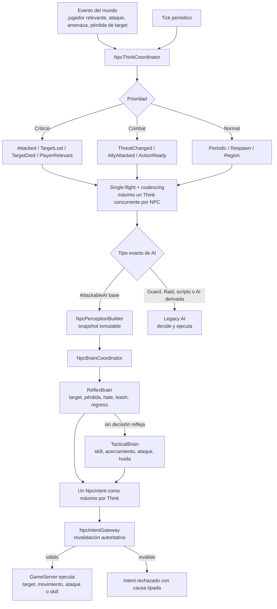
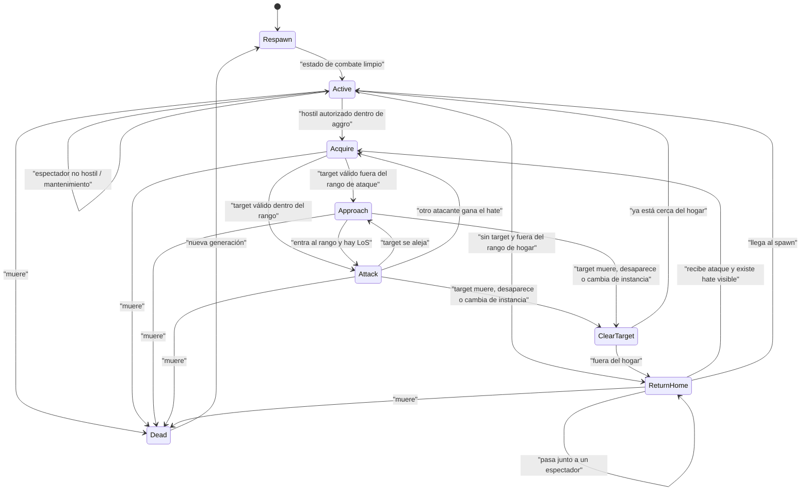
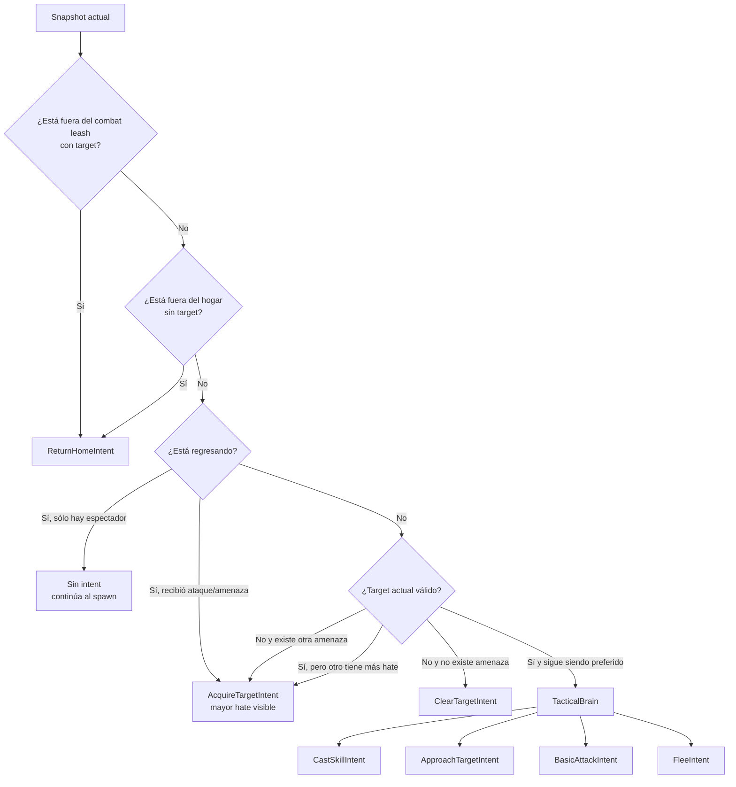
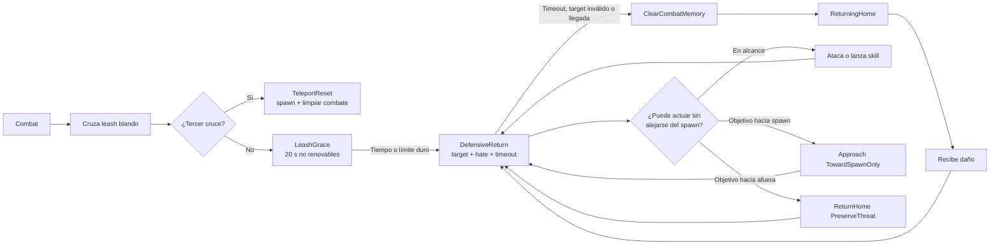

# Mapa de comportamiento NPC

Este documento representa el comportamiento ejecutado actualmente en desarrollo. Distingue la infraestructura compartida, el flujo `Intent` de los `AttackableAI` base y las ramas especializadas que todavía conserva el motor Legacy.

## 1. Mapa general de ejecución



La autoridad sigue siendo el GameServer. El Brain sólo elige una intención y no modifica directamente el mundo.

## 2. Máquina de estados simplificada del mob base



## 3. Orden real de decisión del Brain

El orden es importante porque sólo se devuelve una intención por ciclo:



Consecuencia: adquirir o cambiar de target consume un Think. Acercarse o atacar se decide en el siguiente Think.

## 4. Caso reproducido con dos personajes

```mermaid
sequenceDiagram
    participant P1 as Personaje 1
    participant M as Mob
    participant P2 as Personaje 2
    participant B as Brain / Gateway
    participant S as Spawn

    P1->>M: entra al aggro y atrae la mob
    B->>M: Acquire P1 / Approach / Attack
    P1-->>M: se teletransporta
    B->>M: ClearTarget
    B->>M: ReturnHome
    M->>S: camina al spawn
    M-->>P2: pasa cerca; P2 sólo observa
    Note over M,P2: Se ignora correctamente al espectador
    P2->>M: inflige daño
    B->>M: Acquire P2 y cancela la trayectoria de regreso
    B->>M: Approach / Attack P2
    P1->>M: vuelve e inflige más daño
    B->>M: P1 pasa a ser highest threat
    B->>M: Acquire P1
    Note over B,M: La ventana de represalia sigue activa
    B->>M: Approach / Attack P1
    alt P1 está en dirección al spawn
        B->>M: Approach TowardSpawnOnly
    else P1 está hacia el exterior y fuera de alcance
        B->>M: ReturnHome PreserveThreat
        M->>S: continúa al spawn sin perseguir hacia afuera
    end
```

El defecto observado provenía de la combinación de tres reglas correctas por separado:

1. un ataque real puede interrumpir `ReturnHome`;
2. el objetivo con mayor hate debe reemplazar al actual;
3. estar fuera del `combat leash` obliga a regresar y limpiar memoria.

Antes de la corrección, la tercera regla se evaluaba antes que la continuidad del ataque que acababa de interrumpir el regreso. El resultado era una oscilación lógica:

```text
ReturnHome -> nuevo golpe -> AcquireTarget -> fuera del leash -> ReturnHome
```

No era un fallo de coalescing ni dos `Think` concurrentes. La política conserva un estado privado `DefensiveReturn`: los ataques y skills ya en alcance siguen permitidos y cualquier aproximación defensiva debe mantener o reducir la distancia al spawn. El hate puede conservarse durante el movimiento de regreso y un nuevo daño renueva el timeout legacy de dos minutos.

Una prueba posterior encontró dos casos de borde adicionales. El límite de combate producía una oscilación visible frente a un atacante de rango, y un cambio al objetivo de mayor hate podía cancelar el regreso antes de que la siguiente aproximación fuera autorizada. El leash ahora tiene un límite blando, una gracia fija de 20 segundos que no se renueva con cada golpe, y un límite duro de 500 unidades adicionales. Al tercer cruce del límite blando dentro del mismo combate se emite `ReturnHome(TeleportReset)`. El retarget defensivo usa `PreserveMovement` y una aproximación que deja de ser válida en el Gateway se convierte autoritativamente en `ReturnHome(PreserveThreat)` en vez de dejar al NPC sin acción.

## 5. Casuísticas incorporadas

| Caso | Ruta actual | Estado |
|---|---|---|
| Mob agresivo detecta jugador autorizado dentro de su aggro | Intent | Implementado y probado |
| Mob ignora a un espectador mientras vuelve al spawn | Intent, equivalencia Legacy | Implementado intencionalmente |
| Espectador golpea al mob durante el regreso | Wake crítico + `DefensiveReturn` | Implementado y probado |
| Segundo atacante supera el hate del target actual | `ThreatChanged` + selección determinista | Implementado y probado durante combate normal y represalia |
| Target se teletransporta, muere o desaparece | ClearTarget y regreso/actividad | Implementado y probado |
| Mob muere y respawnea | limpia target, hate y attack-by; aumenta generación | Implementado y probado |
| Mob llega al spawn y encuentra un hostil dentro del aggro | vuelve a Active y puede adquirirlo | Compatibilidad Legacy preservada |
| Ataque fuera del combat leash | Ataque en alcance o aproximación sólo hacia spawn | Implementado y probado |
| Primer cruce del leash blando | Combate normal durante una gracia fija de 20 s | Implementado y probado |
| Objetivo supera el límite duro | Regreso inmediato preservando hate | Implementado y probado |
| Tercer cruce repetido del leash | Teleport al spawn y limpieza total de combate | Implementado y probado; OTLP 2/2 ejecutado |
| Mayor hate cambia durante el regreso | Retarget sin cancelar movimiento; ataque o retorno garantizado | Implementado y probado |
| Guardia atacado directamente | Legacy Guard AI | Implementado y probado |
| Otro guardia asiste al compañero, incluso entre grupos/entradas | Scheduler reactivo + `AllyAttacked` + clan/faction call Legacy | Restaurado y aceptado en prueba local |
| Guardia detecta personaje con karma en ciudad | Legacy + autoridad GameServer | Implementado y probado |
| Guardia agota su persecución | Legacy timeout reset | Aborta ataque/follow, limpia combate y vuelve inmediatamente; 8 transiciones OTLP verificadas |
| Selección básica de ataque físico, aproximación y algunas skills | Intent TacticalBrain | Implementación parcial certificada |
| IA especializada, raids, minions, walkers y scripts | Legacy | Aún no migrada |
| Timeout de combate y política de cadáveres | Principalmente Legacy | Auditoría pendiente |
| Demora global de aggro tras respawn | Legacy `_globalAggro` | Migración pendiente |
| Olvido aleatorio de memoria de combate | Legacy | Migración pendiente |
| Estrategia completa de skills y coordinación de facción/minions | Legacy | Migración pendiente |

## 6. Política de retorno defensivo

La corrección no elimina el leash. Agrega una política explícita:



Configuración de desarrollo:

- `NPC_RETURN_DEFENSE_ENABLED=true`;
- `NPC_RETURN_DEFENSE_TIMEOUT_MS=120000`;
- `NPC_LEASH_GRACE_MS=20000`;
- `NPC_LEASH_MAX_EXCURSIONS=3`;
- `NPC_LEASH_HARD_EXTENSION=500`;
- el límite configurado del mob es blando; la extensión anterior define el límite duro absoluto;
- el tiempo de gracia comienza al cruzar el límite blando y no se renueva por daño;
- al alcanzar el máximo de excursiones se teletransporta al spawn y se limpia target/hate;
- un atacante con más hate reemplaza al anterior;
- un nuevo ataque/`ThreatChanged` renueva el timeout mientras la defensa ya está activa;
- `PlayerBecameRelevant` y `AllyAttacked` no abren el estado defensivo;
- el movimiento restringido se revalida en el GameServer y nunca usa follow dinámico;
- una revalidación fallida continúa el regreso en vez de dejar al NPC detenido;
- al expirar, perder el target o llegar a la zona del spawn se limpia el combate;
- raids, guards, minions y NPC especiales continúan en Legacy y no heredan automáticamente esta política.
