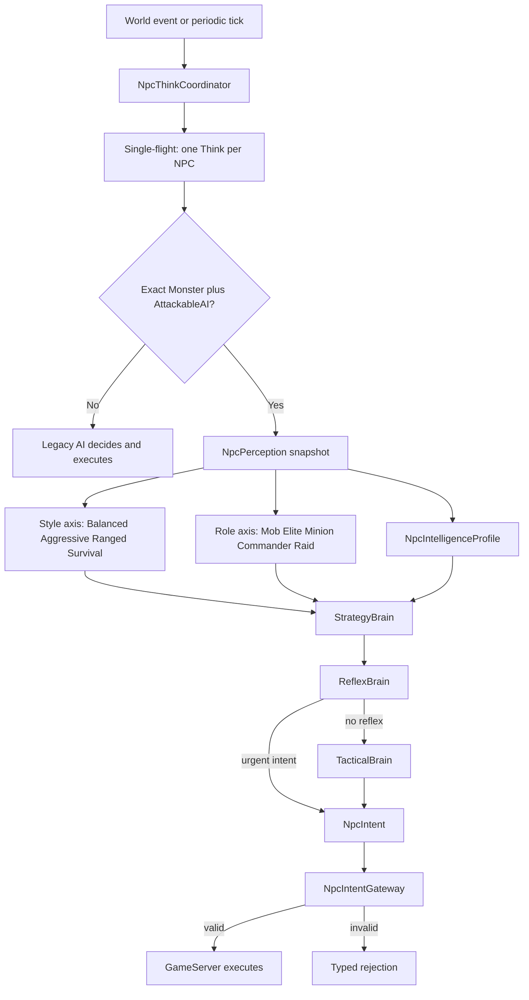

# NPC Strategy Phase 4C: role profiles

Status: design document. No Brain, compose, eligibility, or laboratory code is authorized until this document is accepted.

This is not Phase 5 (distributed Brain). It does not reopen the tag `npc-brain-phase4-complete`.

## Why this program exists

Legacy `AttackableAI` mixed every concern in one place: pick a target, walk, hit, flee, check range, cooldown, geodata, and skills. Changing “personality” could break combat, movement, or world rules.

The modernization splits **decide** from **execute**. The Brain may only request an action (`NpcIntent`). GameServer, through the Intent Gateway, is the only component that may validate and mutate the world (HP, position, skills, packets).

Think of a restaurant: the Brain is the waiter who orders a dish; the Gateway is the kitchen. If there is no mana, the kitchen refuses. The waiter never cooks.

Each layer answers one question:

| Layer | Question | Example |
|---|---|---|
| Scheduler (Phase 2.5) | May this NPC think now? | Player entered aggro → wake |
| Perception (Phase 2) | What do I see? | HP 28%, target at 450, skill ready |
| Strategy (Phase 4 / 4C) | How should I fight, and what am I in the hierarchy? | Survival elite: heal earlier and press harder |
| Reflex | Is something urgent? | Target dead, leash, flee |
| Tactical | Which concrete action? | Stun, approach, auto-attack |
| Intent | What do I request? | Cast 4072 on player X |
| Gateway | Does the world allow it? | Alive? range? MP? geodata? |
| GameServer | Execute | Damage, movement, client packets |

Strategy never invents new action types. It only changes **weights and thresholds** (how much to prefer attack, approach, skill, heal, or flee). That is why a Strategy Disabled rollback looks almost the same in the client: Reflex, Tactical, Gateway, skills, and bow range stay in place.

## Pipeline



Physical NPCs stay in GameServer (ADR-003). The Brain receives a copied snapshot, never a live `Creature`. `L2Dn.Npc.Brain` may reference only `L2Dn.Npc.Contracts` among L2Dn assemblies.

## Each component

### Scheduler — `NpcThinkCoordinator`

Decides **when** an NPC may think. It does not choose the attack.

Wakes are prioritized (Critical / Combat / Normal), coalesced, and bounded. At most one Think runs per NPC (`MaximumConcurrentThinkPerNpc = 1`).

Example: ten `Attacked` events on the same Orc become one Think, not ten parallel brains.

### Perception — `NpcPerception`

An immutable read model of world facts at that Think: HP, target, range, ready skills, leash, generation, `NpcKind`, clan ids, capabilities.

Example: “I am template 20130, HP 40%, target 80 units away, skill 4072 ready, FIGHTER.” The Brain cannot ask the live actor for a second opinion mid-decision.

### Intelligence profile — `NpcIntelligenceProfile`

Capabilities and defaults from the datapack AI type: melee vs caster, whether flee is allowed, preferred range, leash. This is **not** Strategy. Default live profiles keep `FleeAllowed=false`; Survival/Aggressive flee overrides only matter when intelligence permits flee.

Example: Undine is a data-defined FIGHTER with a magic skill. Intelligence says “fighter”; Strategy RangedControl then prefers the 4001 opener at range.

### Strategy — `StrategyBrain`

Turns style + (in 4C) role into effective scores and thresholds. No I/O, no GameServer objects, no Gateway bypass.

Example: Balanced scores basic attack 60 / approach 80 / offensive skill 90. AggressivePressure raises those to 75 / 90 / 105 and lowers flee sensitivity.

### Reflex — `ReflexBrain`

Urgent policy: invalid target, death, leash, return home, flee when allowed. It can emit an intent without Tactical.

Example: the player kites past the combat leash → `ReturnHome`. Strategy weights do not keep the mob chasing forever.

### Tactical — `TacticalBrain`

Picks the highest eligible scored action among attack, approach, skill, heal, flee, subject to fighter/mage safety rules (no infinite Dagger Storm in melee, physical contact skills may compete, no intent while `Casting`).

Example: Orc 20130 with stun ready at melee: `Stun → BasicAttack`, then autos until reuse. That cadence is Tactical, not a new Strategy action.

### Intent — `NpcIntent`

The only Brain output: one typed request per Think (acquire, approach, basic attack, cast, return, flee, clear target). It carries actor, generation, sequence, and revision. It cannot deal damage.

### Gateway — `NpcIntentGateway`

Revalidates live world state immediately before execution: generation, lifecycle, target, range, geodata, cooldown, mana, movement.

Example: Brain asks to cast 4072; the target died in the same tick → typed `dead_actor`, not an exception. Stun is accepted only when Gateway executes **and** the target is actually action-blocked.

### GameServer

Owns HP, position, effects, packets, spawn, death, Champion rolls, minion spawn/follow, clan-help, raid flags. Losing the Brain must not split the world (ADR-001, ADR-006).

### Legacy AI

Still owns Guard, `RaidBoss` / `GrandBoss`, derived AIs, scripted actors, and squad coordination (clan call, minion assist) until a dedicated vertical is certified. Sharing `AttackableAI` is not enough: eligibility is `typeof(Monster)` and `typeof(AttackableAI)` exactly.

## What is already closed

| Phase | Result |
|---|---|
| 2 Perception | Immutable snapshot of world facts |
| 2.5 Scheduler | Reactive wakes, single-flight, bounded queues |
| 3 Brain + Intents | Decide vs execute. Intent is **global** for base `Monster` + `AttackableAI` (a wolf in Dion already uses it) |
| 4 Strategy styles | Four combat styles on Talking Island. Tag `npc-brain-phase4-complete` |

Phase 4 certified **how a lone base monster fights**, not **what it is in a hierarchy**.

Live Phase 4 evidence is **one or two players**. Synthetic R1–R5 (5,000 NPCs, 16 workers) loads the scheduler/Brain CPU path; it does not simulate a populated island, geodata contention, or clan-help storms.

## What Phase 4 did not create

The original Phase 4 goal included differentiating **mob, elite, minion, commander, raid**. The delivered increment only created the **style** axis:

| Style | Meaning | Talking Island example |
|---|---|---|
| `Balanced` | Phase 3 identity | Stone Golem 20016 |
| `AggressivePressure` | More melee/skill, less flee | Orc 20130, Orc Captain 20098 |
| `RangedControl` | Kiting / ranged magic | Orc Archer 20006, Undine 20110 |
| `Survival` | Heal earlier | Enku Orc Shaman 20292 |

Datapack **names are not roles**. “Orc Captain” and “Werewolf Chieftain” are still `type="Monster"`. A name containing “Elite” does not change the C# class. Champion is a **random** GameServer stat roll, not a deterministic policy. A minion is a `Monster` with `setLeader()`, not a `Minion` class. `RaidBoss` is a subclass and **cannot** enter Intent.

Today a Golem and a “captain” can share the same style. There is no policy for “I am a minion” or “I am a raid”.

## Phase 4C model: style × role

Two independent axes. Role **modifies** style. The design does not explode into twenty archetypes (`EliteAggressive`, `RaidSurvival`, …).

```text
effectiveProfile = styleProfile + roleDelta
```

`Mob` is the identity delta (all zeros). That is what Talking Island already runs.

```mermaid
flowchart LR
  style["Style: Balanced / AggressivePressure / RangedControl / Survival"]
  role["Role: Mob / Elite / Minion / Commander / Raid"]
  compose["StrategyBrain compose"]
  out["Effective scores and thresholds"]
  style --> compose
  role --> compose
  compose --> out
```

Worked examples:

- Orc 20130 today = `AggressivePressure × Mob` (current certified behavior).
- The same Orc as Commander = same stun cadence, but more approach and less flee **as an individual**. It still does not spawn minions or issue clan calls; those remain Legacy.
- Orc Archer 20006 as `RangedControl × Elite` = still bows at ~500, but presses harder and yields later.
- Private 20377 as `Balanced × Minion` = stays in the fight (higher approach, lower flee). Following the leader remains `MinionList`.
- Madness Beast 25378 as `AggressivePressure × Raid` = **contract only**. `RaidBoss` stays on Legacy until a raid vertical exists.

### Style scores already in code

From `NpcStrategyProfileResolver`:

| Style | BasicAttack | Approach | OffensiveSkill | Heal | Flee | Heal HP% | Flee HP override | Preferred range |
|---|---:|---:|---:|---:|---:|---:|---:|---:|
| Balanced | 60 | 80 | 90 | 100 | 100 | 35 | — | — |
| AggressivePressure | 75 | 90 | 105 | 85 | 70 | 25 | 5% | — |
| RangedControl | 45 | 95 | 110 | 100 | 100 | 35 | — | 600 |
| Survival | 45 | 75 | 80 | 120 | 115 | 50 | 30% | — |

### Draft role deltas

These numbers are the design proposal for the later code increment. They are not live.

| Role | BasicAttack | Approach | OffensiveSkill | Heal | Flee | Heal HP% | Notes |
|---|---:|---:|---:|---:|---:|---:|---|
| Mob | 0 | 0 | 0 | 0 | 0 | 0 | Identity. No extra telemetry flags |
| Elite | +10 | +5 | +15 | 0 | −20 | −10 pp | Harder 1v1. Not Champion RNG |
| Minion | 0 | +15 | −5 | 0 | −30 | 0 | Stay in the pile. No follow/assist |
| Commander | 0 | +10 | +10 | 0 | −25 | 0 | Hold and press. No clan call |
| Raid | 0 | +5 | +20 | +10 | −40 | 0 | Boss contract. Not Intent-eligible |

Composition example: `AggressivePressure × Commander` basic attack = 75 + 0 = 75; approach = 90 + 10 = 100; flee score = 70 − 25 = 45.

Role is **declared** in the template registry. It is not inferred from the XML display name. `NpcKind.RaidBoss` / `RaidMinion` may later *suggest* a default, but runtime stays an explicit whitelist (same rule as Phase 4 styles). The unused heuristic `NpcStrategyProfileResolver.Resolve(identity, intelligence)` stays offline.

Proposed env shape for the later increment:

```text
templateId:style:role
20130:aggressive_pressure:mob
20098:aggressive_pressure:commander
20377:balanced:minion
```

Unknown role or malformed entry must warn and **not** silently become Balanced-as-Mob in a way that hides the error. Last-wins on duplicate template ids, with a warning, matching Phase 4.

## What each role is — and is not

| Role | Is | Is not |
|---|---|---|
| Mob | Default base monster policy | A new actor class |
| Elite | Declared harder individual | Champion random buff; XML name “Elite”; a new C# type |
| Minion | Combat weights for a follower | `Minion` class; leader follow; `MinionList.onAssist` |
| Commander | Combat weights for a hold-the-line individual | `FortCommander`; clan-help; spawning privates |
| Raid | Written boss policy | Enabling `RaidBoss` on Intent; grand-boss scripts; raid curse |

Champion remains a GameServer multiplier on respawn. Mixing it into Strategy would make replay non-deterministic. Elite must be a registry declaration.

Minions already **pass** the Intent type check (`new Monster(...)` + base `AttackableAI`). Phase 4C may assign them Minion weights. That does **not** certify squad AI.

`RaidBoss` / `GrandBoss` fail `typeof(Monster)` and stay Legacy. A Raid delta in this document is a contract for a future raid vertical, not a license to open eligibility.

## Ownership

| Concern | Owner |
|---|---|
| Style and role weights / thresholds | Strategy Brain |
| Target validity, leash, return, flee reflex | Reflex Brain |
| Concrete action among eligible candidates | Tactical Brain |
| Range, geodata, cooldown, mana, movement, execution | GameServer / Intent Gateway |
| Champion stats, minion spawn/follow, clan-help, raid flags | GameServer |
| Guard, raid actor, squad coordination, scripted AI | Legacy until a dedicated vertical |

## Laboratory (design only — no XML in this increment)

Talking Island spawn XML has no `<minions>` masters and no raids. The later code increment should add separated lanes, using the same aggro/clan-help isolation as `StrategyValidationLab.xml`.

| Lane | Role | Proposed templates | Intent? |
|---|---|---|---|
| Existing north | Mob control | Stone Golem 20016 `balanced:mob` | Yes (already certified) |
| Existing east+ | Commander | Orc Captain 20098 `aggressive_pressure:commander` | Yes (still `Monster`) |
| New elite | Elite | A declared lab `Monster` `*:elite`, Champion disabled | Yes |
| New minion | Commander + Minion | 20376 leader + 20377 privates | Yes as `Monster`; follow stays Legacy |
| New raid | Raid contract | e.g. 25378 Madness Beast | **No.** Profile on paper; actor stays Legacy |

Arrival for the existing lab remains `-95336, 240478, -3264`. New lanes must sit outside Orc Captain’s 1000 aggro and clan-help radii.

## Pieces this increment creates

Only documentation:

- this file
- a pointer from `NpcStrategyPhase4.md`

## Pieces the later code increment will create

Not authorized until this document is accepted.

| Piece | Where | Purpose |
|---|---|---|
| `NpcStrategyRole` enum | `NpcStrategyModels.cs` | Mob, Elite, Minion, Commander, Raid |
| Immutable role deltas | `NpcStrategyProfileResolver` or sibling | Cached `roleDelta` table |
| Compose in `StrategyBrain` | `StrategyBrain.cs` | `style + role` → effective scores/thresholds |
| Registry parse `id:style:role` | `NpcStrategyOptions.cs` | Explicit whitelist; reject unknown role |
| Bounded OTLP `role` tag | Strategy telemetry | Cardinality = five roles, no template ids |
| Brain tests | `L2Dn.Npc.Brain.Tests` | Matrix samples: each style × Mob identity; one case per other role; Raid compose without execution |
| Data/lab tests | `NpcDataLoadingTests` | Lab groups and Monster-only Intent actors |
| Lab spawns | `StrategyValidationLab.xml` | Elite / minion / raid-contract lanes |
| Compose env | `docker-compose.dev-code.yml` | New triples only for lab templates; TI area wave stays `:mob` |

Intent eligibility in `NpcBrainEligibility` **does not change**. No `RaidBoss` on Intent. No Phase 5 transport. No LLM, memory, or World Director.

## Completion gates for the later code increment

1. Brain still references only `L2Dn.Npc.Contracts` among L2Dn assemblies.
2. `Balanced × Mob` matches Phase 4 Balanced / Phase 3 scores exactly.
3. Role deltas are deterministic and immutable; no datapack or DB read on the Think path.
4. Unknown registry entries never silently enable a role.
5. Raid role can be composed in tests and must not execute through Gateway for `RaidBoss` actors.
6. Contracts / Brain / GameServer.Model suites stay green; focused NPC data tests cover the lab.
7. Shadow then a 1–2 player lab pass before any area-wave role expansion.
8. Drops, overflow, and `MaximumConcurrentThinkPerNpc > 1` remain reopeners.

## Out of scope

- Distributed Brain (Phase 5), gRPC, remote workers
- Long-term memory, personality, generative models (ADR-007: LLMs stay outside the combat loop)
- Faction / squad / commander **coordination**, raid mechanics, World Director (ADR-010)
- Expanding Intent beyond exact `Monster` + `AttackableAI`
- Treating Champion RNG as Elite
- Inferring role from XML display names
- High-concurrency certification (still uncovered; see Phase 4 live concurrency scope)
