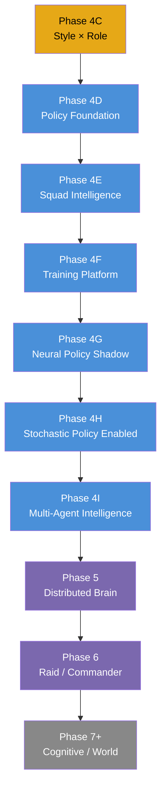
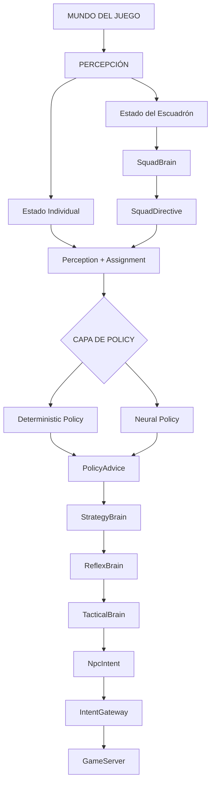
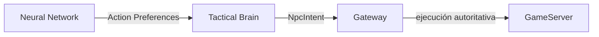
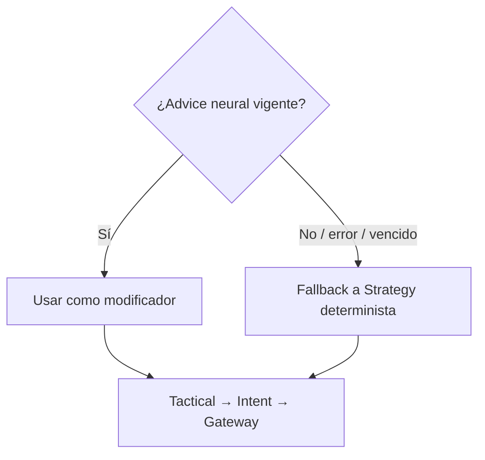
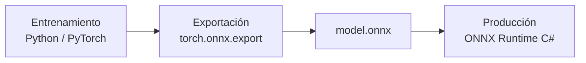

# Roadmap Maestro — Inteligencia de NPCs L2Dn

Estado: **diseño aceptado**. Fecha: 2026-08-12.

Este documento redefine el roadmap del programa de modernización de IA de NPCs a partir del checkpoint `npc-brain-phase4-complete`. La arquitectura existente (Phases 2–4B) no se modifica; se aprovecha como cimiento para introducir inteligencia aprendida como una nueva capa.

---

## Motivación del cambio

El roadmap anterior preveía:

```text
4C  Roles
 ↓
 5  Distributed Brain
 ↓
 6  Specialized Brains
 ↓
 7  Cognitive AI
```

**Problema**: distribuir el Brain antes de descubrir cómo será el Brain inteligente que queremos ejecutar no tiene sentido. La forma del compute determina dónde debe vivir.

**Nuevo principio**: primero demostrar inteligencia; después distribuirla.

---

## Roadmap aprobado



| Fase | Nombre | Alcance | Estado |
|---|---|---|---|
| **4C** | Style × Role | Completar el eje de rol: Mob, Elite, Minion, Commander, Raid | Diseño aceptado, código pendiente |
| **4D** | Policy Foundation | Capa de política intercambiable, observation schema, action masking, PolicyAdvice, model registry, fallback | Diseño |
| **4E** | Squad Intelligence | SquadContext, SquadDirective, CombatAssignment, SquadThinkCoordinator, SquadBrain determinista | Diseño |
| **4F** | Training Platform | Episodes, dataset, replay, feature extraction, entorno de entrenamiento Python, evaluación | Diseño |
| **4G** | Neural Policy Shadow | Behavior cloning PyTorch → ONNX, ONNX Runtime C#, Shadow comparison | Diseño |
| **4H** | Stochastic Policy Enabled | Decisiones probabilísticas, sampling con seed, temperature, SkillLevel, A/B testing | Diseño |
| **4I** | Multi-Agent Intelligence | MARL, CTDE, parameter sharing, self-play, coordinación emergente | Diseño |
| **5** | Distributed Brain | Batch inference GPU, workers externos, gRPC, region affinity | Visión |
| **6** | Raid / Commander | EncounterBrain, RaidBrain, CommanderBrain, fases de raid | Visión |
| **7+** | Cognitive / World | Memoria, LLM, World Director, quests dinámicas, personalidad | Visión especulativa |

---

## Arquitectura objetivo



### Jerarquía de dirección (visión final)

```text
World Director                    ← Phase 7+
    ↓
Region / Faction Directors        ← Phase 7+
    ↓
Encounter Director                ← Phase 6
    ↓
Squad Directors                   ← Phase 4E / 4I
    ↓
NPC Brains                        ← Phase 3 / 4D / 4G / 4H
```

---

## Principios arquitectónicos invariantes

Estos principios rigen TODAS las fases del roadmap:

### 1. Autoridad del GameServer (ADR-001)
La red neuronal NUNCA modifica el GameServer directamente. Todo cambio físico pasa por el Intent Gateway.

### 2. Neural Policy como recomendación, no como ejecución (ADR-012 nuevo)
La red neuronal produce **preferencias sobre acciones** (`NpcPolicyAdvice`), no intents directos. Tactical sigue seleccionando la acción concreta. Gateway sigue validando el mundo real.



### 3. Action Masking antes de la policy (ADR-013 nuevo)
Antes de que la policy elija, se enmascaran acciones inválidas (cooldown, MP, HP). Dos barreras: Action Mask → Tactical → Gateway.

### 4. Reflex NUNCA depende de inferencia neural
El Reflex Brain responde inmediatamente. La Neural Policy actualiza recomendaciones de forma asíncrona.

### 5. Fallback obligatorio a determinístico (ADR-006, ADR-014 nuevo)
Si la red tarda demasiado, falla, o el advice venció: fallback a Strategy determinista. El NPC NUNCA se congela.



### 6. Sin I/O en el hot path
Modelo precargado al startup. Sin lectura de disco, red, o base de datos durante Think.

### 7. Single-flight por NPC y por Squad
`MaximumConcurrentThinkPerNpc = 1`. `MaximumConcurrentSquadThinkPerSquad = 1`.

### 8. Model governance obligatorio
Cada modelo requiere: PolicyId, ModelVersion, FeatureSchemaVersion, ActionSchemaVersion, Checksum. Schema incompatible = rechazo + fallback.

### 9. Rollback con un flag
`NPC_POLICY_MODE=Disabled` restaura el comportamiento determinista certificado.

### 10. Observaciones sin identidad técnica
Nunca ObjectId ni PlayerId como input neural. Solo estado conceptual (HP ratio, distance, casting, etc.).

---

## Tecnología de inferencia

| Componente | Tecnología | Justificación |
|---|---|---|
| Entrenamiento | Python / PyTorch | Ecosistema estándar de ML |
| Exportación | `torch.onnx.export` | Formato interoperable |
| Inferencia en producción | ONNX Runtime C# | Bindings nativos .NET, API `OrtValue`, CPU y GPU |
| Entrenamiento multi-agente | RLlib (Ray) | `MultiAgentEnv`, parameter sharing, CTDE |
| Primer modelo | MLP (128→128→128→64→logits) | Suficiente para demostrar pipeline |
| GPU | Diferida hasta Phase 5 | CPU suficiente para redes pequeñas individuales |



---

## Frecuencias de Think propuestas

Hipótesis de diseño, no SLO finales. Requieren medición.

| Nivel | Frecuencia propuesta | Propósito |
|---|---|---|
| Reflex | Event-driven / inmediato | Supervivencia, leash, target inválido |
| Tactical | 50–100 ms | Selección de acción concreta |
| Individual Policy | 100–250 ms / eventos | Recomendación neural |
| Squad Brain | 250–500 ms / eventos | Coordinación de escuadrón |
| Encounter Strategy | 500 ms–2 s | Dirección de encuentro (futuro) |

---

## Gates de seguridad no negociables

Estos gates aplican a TODAS las fases del roadmap.

| Gate | Requisito |
|---|---|
| Autoridad | Neural Network nunca modifica GameServer |
| Gateway | Todo cambio físico pasa por Gateway |
| Reflex | Nunca depende obligatoriamente de inferencia |
| Network | Sin llamada remota en Critical path |
| Database | Sin DB en Think |
| Disk | Modelo precargado; sin lectura durante Think |
| Single-flight | 1 Think concurrente/NPC, 1 Think concurrente/Squad |
| Neural failure | Debe caer a determinístico |
| Invalid model | No puede iniciar Enabled |
| Stale advice | Ignorar y fallback |
| Reproducibilidad | Seed fija en tests |
| Rollback | Un flag vuelve a determinístico |
| Model version | Siempre observable en telemetría |
| Intent rejects | No debe aumentar anormalmente con Neural |
| Critical latency | No degradación significativa respecto a Phase 4 baseline |

---

## Secuencia de experimentos

| # | Fase | Experimento | Objetivo |
|---|---|---|---|
| 1 | 4G | 1 Orc: Deterministic Brain vs Neural Brain Shadow | Demostrar pipeline ONNX completo y medir acuerdo semántico |
| 2 | 4E | 5 NPCs (Commander + 2 Frontliners + Archer + Shaman): SquadBrain determinista | Demostrar coordinación de escuadrón, directivas y assignments |
| 3 | 4I | Sustituir SquadBrain determinista por Neural Squad Policy Shadow | Primer paso hacia MARL real |

---

## Orden de implementación inmediato

```text
AHORA →  Phase 4C: Style × Role
            ↓ terminar y certificar
         Phase 4D: Policy Foundation
            ↓ diseño cuidadoso de observation, advice, masking, fallback, governance
         Phase 4E: Squad Intelligence Foundation
            ↓ determinista primero
         Phase 4F: Training Platform
            ↓ dataset, replay, primer modelo
         ...continuar según roadmap
```

---

## Documentos de detalle por fase

Cada fase tiene su propio documento con especificación completa:

| Documento | Fase |
|---|---|
| [`01_Fase_4C_Style_x_Role.md`](01_Fase_4C_Style_x_Role.md) | Phase 4C |
| [`02_Fase_4D_Policy_Foundation.md`](02_Fase_4D_Policy_Foundation.md) | Phase 4D |
| [`03_Fase_4E_Squad_Intelligence.md`](03_Fase_4E_Squad_Intelligence.md) | Phase 4E |
| [`04_Fase_4F_Training_Platform.md`](04_Fase_4F_Training_Platform.md) | Phase 4F |
| [`05_Fase_4G_Neural_Policy_Shadow.md`](05_Fase_4G_Neural_Policy_Shadow.md) | Phase 4G |
| [`06_Fase_4H_Stochastic_Policy.md`](06_Fase_4H_Stochastic_Policy.md) | Phase 4H |
| [`07_Fase_4I_Multi_Agent_Intelligence.md`](07_Fase_4I_Multi_Agent_Intelligence.md) | Phase 4I |
| [`08_Fase_5_Distributed_Brain.md`](08_Fase_5_Distributed_Brain.md) | Phase 5 |
| [`09_Fase_6_Raid_Commander.md`](09_Fase_6_Raid_Commander.md) | Phase 6 |
| [`10_Fase_7_Cognitive_World.md`](10_Fase_7_Cognitive_World.md) | Phase 7+ |
| [`11_Criterios_Aceptacion_y_Testing.md`](11_Criterios_Aceptacion_y_Testing.md) | Criterios de aceptación y testing (todas las fases) |

## ADRs nuevos

| ADR | Decisión |
|---|---|
| [`ADR-012`](../ADR/ADR-012-neural-policy-advisory-only.md) | Neural Policy produce recomendaciones, no intents directos |
| [`ADR-013`](../ADR/ADR-013-action-masking-before-policy.md) | Action masking antes de la selección de policy |
| [`ADR-014`](../ADR/ADR-014-mandatory-deterministic-fallback.md) | Fallback obligatorio a comportamiento determinista |

## Concepto central

El resultado al que apunta este roadmap no es simplemente "un mob más inteligente". Es un sistema donde:

- **Mobs individuales** pueden ser variables y adaptativos
- **Grupos** pueden comprender localmente una pelea, asignarse tareas, proteger miembros importantes, flanquear, reagruparse, retirarse y volver a presionar
- **Sin sacrificar** la autoridad determinista del GameServer
- **Sin sacrificar** la respuesta rápida del Reflex Brain
- **Sin dependencia obligatoria** de inferencia neural para la operación básica
