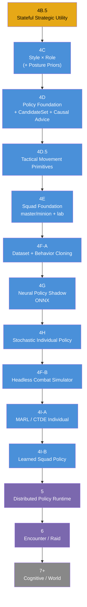
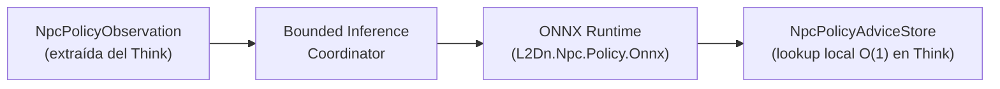
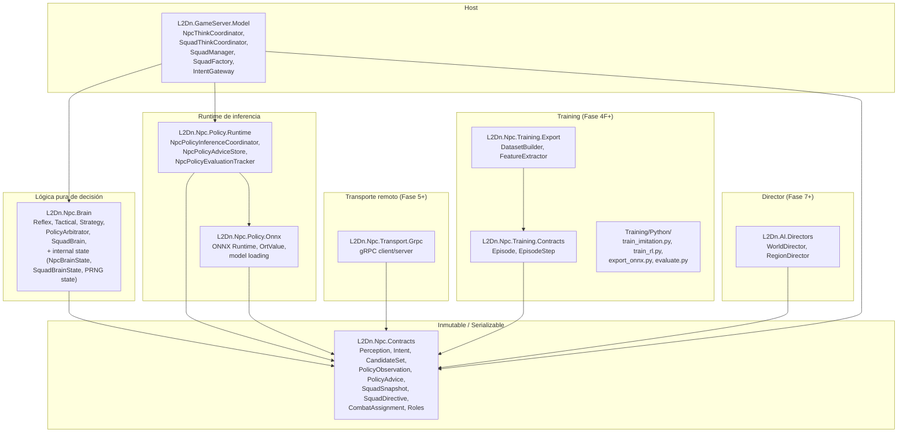

# Roadmap Maestro — Inteligencia de NPCs L2Dn

Estado: **diseño — revisión 3**. Fecha: 2026-08-13.

Este documento redefine el roadmap del programa de modernización de IA de NPCs a partir del checkpoint `npc-brain-phase4-complete`. La arquitectura existente (Phases 2–4B) no se modifica; se aprovecha como cimiento para introducir inteligencia aprendida como una nueva capa.

**Revisión 3**: inserta Phase 4B.5 (Stateful Strategic Utility) entre 4B y 4C. La Strategy actual es un Static Tactical Bias Profile; 4B.5 lo convierte en un sistema de posturas dinámicas con utility, hysteresis y commitment. Esto produce un experto determinista mucho más rico para todo lo que viene después.

---

## Motivación del cambio

El roadmap anterior preveía distribuir el Brain antes de descubrir cómo será el Brain inteligente. La forma del compute determina dónde debe vivir.

**Principio**: primero demostrar inteligencia; después distribuirla.

---

## Roadmap aprobado (revisión 3)



| Fase | Nombre | Cambio vs rev 1 |
|---|---|---|
| **4B.5** | Stateful Strategic Utility | **NUEVA** — Posturas dinámicas (Pressure/Recover/ControlRange/Disengage), utility evaluator, hysteresis, commitment, tie-break explícito |
| **4C** | Style × Role | Sin hot override; registry inmutable; Role afecta PosturePriors además de tácticos |
| **4D** | Policy Foundation | CandidateSet desde Tactical; causal metadata; PolicyArbitrator (ADR-017); Policy.Runtime |
| **4D.5** | Tactical Movement Primitives | Reposition/Flank/Formation intents semánticos |
| **4E** | Squad Foundation | Solo master/minion + lab; Disabled/Shadow/Enabled; CombatAssignment modifica StrategyContext |
| **4F-A** | Dataset + Behavior Cloning | Replay/dataset/imitation; reward offline; experto con posturas dinámicas |
| **4G** | Neural Policy Shadow | ONNX en `L2Dn.Npc.Policy.Onnx`; paired evaluation IDs; expert = Tactical winner |
| **4H** | Stochastic Individual Policy | NpcAiDifficultyTier; seed determinista; CandidateSet → PolicyArbitrator → Sampler |
| **4F-B** | Headless Combat Simulator | Simulador real para RL, separado de replay |
| **4I-A** | MARL / CTDE Individual | Shared policies individuales con percepción local |
| **4I-B** | Learned Squad Policy | Neural SquadPolicy separada de CTDE individual |
| **5** | Distributed Policy Runtime | Transmite Observation vectorizada; devuelve Advice; circuit breaker |
| **6** | Encounter / Raid | Sin hot-switch a Legacy mid-fight; separa mechanics de intelligence |
| **7+** | Cognitive / World | WorldDirector en assembly separado; Policy Gate con límites |

---

## Arquitectura corregida del pipeline

Esta es la arquitectura correcta, alineada con el código actual de `feature/npc-strategy-brain`:

```mermaid
flowchart TD
    PERCEP["NpcPerception"] --> SCTX["STRATEGY EVALUATION CONTEXT\n(internal Brain)"]

    SCTX --> SELIG["POSTURE ELIGIBILITY\n(hard constraints)"]
    SELIG --> SUTIL["STRATEGIC UTILITY EVALUATOR\nweighted average normalized (0-1000)\n+ Style priors"]
    SUTIL --> SGATE["STABILITY GATE\nhysteresis + commitment"]
    SGATE --> SDIR["STRATEGY DIRECTIVE\nPosture + Biases + Range + Reason"]

    SDIR --> REFLEX["REFLEX BRAIN\nEmergency Flee (IntelligenceProfile threshold)\nleash / invalid target\n(NUNCA depende de neural NI strategy)"]

    REFLEX -->|"Intent encontrado"| GW["IntentGateway"]
    REFLEX -->|"No Reflex Intent"| TCB["TACTICAL CANDIDATE BUILDER\n(TacticalActionEvaluator refactorizado)"]

    TCB --> CANDIDATES["NpcTacticalCandidateSet\nAttack score=75 eligible=yes\nApproach score=90 eligible=yes\nSkill score=105 eligible=yes\nHeal score=85 eligible=no\nFlee score=70 eligible=no"]

    CANDIDATES --> ARB["POLICY ARBITRATOR"]

    SQUAD_DIR["SquadDirective\n+ CombatAssignment"] -->|"si existe"| ARB
    NEURAL_ADV["NpcPolicyAdvice\n(del AdviceStore)"| -->|"si válido y causal"| ARB

    ARB -->|"Disabled: scores deterministas\nShadow: comparar\nEnabled: aplicar neural"| SELECTION["ACTION SELECTION\nargmax / sampling"]

    SELECTION --> BUILDER["TACTICAL INTENT BUILDER"]
    BUILDER --> INTENT["NpcIntent"]
    INTENT --> GW
    GW --> GS["GameServer"]
```

### Inferencia neural es ASÍNCRONA y SEPARADA del pipeline



### Diferencia crítica vs revisión 1

| Rev 1 (incorrecta) | Rev 2 (corregida) | Por qué |
|---|---|---|
| Policy → Strategy → Reflex → Tactical | Strategy → Reflex → Tactical Candidates → Policy Overlay → Selection | El código real ejecuta Reflex ANTES de Tactical. Policy no puede modificar Reflex. |
| `NpcPolicyActionMask` + `ActionMasker` (nuevos) | CandidateSet de `TacticalActionEvaluator` (existente) | Una sola fuente de verdad. `TacticalActionEvaluator` ya sabe qué es elegible. |
| Advice con TTL solamente | Advice con NpcKey (incluye Generation) + StateRevision + WorldTick | Un advice asíncrono necesita saber para qué encarnación y estado fue calculado. NpcKey ya contiene Generation; no se duplica. |
| `PreferredTarget` en Advice | Target Candidate Slots (V2) o sin target selection (V1) | La red no puede devolver ObjectId. |

---

## Fronteras de ensamblado corregidas



### Regla: `L2Dn.Npc.Brain` solo referencia `L2Dn.Npc.Contracts` y `System.*`

Esto se preserva. ONNX, gRPC, training y LLM gateways NUNCA entran a Brain.

---

## Lo que pertenece a Contracts vs Brain

| Contracts (inmutable, serializable) | Brain (internal, runtime state) |
|---|---|
| `NpcPolicyObservationV1` | `NpcBrainState` |
| `NpcPolicyAdvice` (con causal metadata) | `NpcPolicyRuntimeState` |
| `NpcPolicyAction` | `SquadBrainState` |
| `NpcPolicyMetadata` | PRNG state |
| `NpcTacticalCandidateSet` | Last advice reference |
| `NpcStrategyRole` | Last directive reference |
| `SquadSnapshot` | Inference queue state |
| `SquadDirective` (con causal metadata) | |
| `NpcCombatAssignment` | |

> **Regla**: si es "estado privado del escuadrón" o "contexto de evaluación con runtime state", pertenece a Brain como `internal`. No a Contracts.

---

## Causalidad obligatoria en Advice y Directive

### NpcPolicyAdvice

```text
NpcKey                                ← ya contiene ObjectId + Generation (no duplicar)
BasedOnStateRevision                  ← debe ser == CurrentStateRevision (V1 estricto)
PolicyEvaluationId                    ← ID único para Shadow correlation

GeneratedAtWorldTick
ExpiresAtWorldTick

ModelVersion
FeatureSchemaVersion
ActionSchemaVersion

ActionPreferences                     ← logits por candidato elegible (Opción A, ADR-017)
Confidence                            ← solo telemetría, NO barrera de seguridad
```

> **Regla V1**: `Advice.BasedOnStateRevision == CurrentStateRevision` (exacto). Si la revisión semántica cambió, el advice es stale.

### SquadDirective

```text
SquadKey
SquadGeneration                       ← generación del squad (no del NPC)
MembershipRevision                    ← cambia cuando entran/salen miembros
SquadStateRevision                    ← cambia por hechos semánticos (HP, deaths, threats)
DirectiveSequence                     ← número monótono creciente

BasedOnSquadStateRevision             ← debe ser == SquadStateRevision actual (V1 estricto)

IssuedAtWorldTick
ExpiresAtWorldTick

Objective
Formation
PriorityTargetSlot (no ObjectId)
AssignmentMap
```

Un minion que murió y respawneó NO ejecuta una directiva de su encarnación anterior.

---

## Target Selection

### V1: sin target selection neural

La policy decide **tipo de acción**. Target selection continúa determinista.

### V2 (futuro): Target Candidate Slots

```text
Observation:
  TargetCandidate[0]: distance=300, hp=20%, casting=true, role=healer
  TargetCandidate[1]: distance=100, hp=80%, casting=false, role=fighter

Policy output:
  PreferredTargetSlot=0

Runtime (efímero):
  slot 0 → EntityKey X  (válido solo para esta ObservationRevision)

Gateway revalida.
```

La red NUNCA conoce ObjectId, PlayerId, ni nombre.

---

## Seed determinista reproducible

No usar aleatoriedad irrecuperable en producción.

```text
NpcDecisionSeed = Hash(
  ServerRunSeed,            ← reproducibilidad entre ejecuciones (guardado en replay)
  NpcKey,                   ← ya contiene ObjectId + Generation
  DecisionSequence,         ← contador monótono por NPC
  PolicyVersion
)
```

- **Jugadores** ven comportamiento variable
- **Nosotros** reproducimos exactamente la decisión en replay/debug

---

## Shadow comparison con paired evaluation IDs

Al encolar una solicitud neural Shadow:

```text
PolicyEvaluationId = 123
ObservationRevision = 812
Observation + CandidateMask
ExpertAction = OffensiveSkill  ← decisión determinista guardada
```

Neural responde después:

```text
PolicyEvaluationId = 123
NeuralAction = OffensiveSkill
```

Comparación: `123 vs 123`. No contra el Think actual (que puede estar en otra revisión).

---

## Principios arquitectónicos invariantes

| # | Principio | ADR |
|---|---|---|
| 1 | GameServer es autoridad del mundo | ADR-001 |
| 2 | Neural Policy produce recomendaciones, no intents | ADR-012 |
| 3 | Action Mask tiene una sola fuente: TacticalActionEvaluator (no duplicar) | ADR-013 rev |
| 4 | Fallback a determinístico es INVARIANTE, no configurable | ADR-014 rev |
| 5 | Reflex NUNCA depende de inferencia neural NI de Strategy | ADR-006 ext |
| 6 | Sin I/O en Think (modelo precargado) | ADR-004 ext |
| 7 | Single-flight por NPC y por Squad | — |
| 8 | Brain solo referencia Contracts | ADR-008 |
| 9 | Causalidad obligatoria: NpcKey (con Generation) + StateRevision exacta en todo Advice/Directive | ADR-015 rev |
| 10 | Observaciones sin identidad técnica | — |
| 11 | Rollback con un flag | — |
| 12 | Remote Brain devuelve Advice, nunca Intent | ADR-016 |
| 13 | Reward calculado offline, no en replay bruto | — |
| 14 | Raid fallback: deterministic encounter policy, no hot-switch a Legacy | — |
| 15 | PolicyArbitrator: Neural elige directamente entre candidatos elegibles (Opción A) | ADR-017 |
| 16 | Brain NUNCA invoca INpcPolicy; solo consume NpcPolicyAdvice? inyectado | — |
| 17 | Reflex Intent != null → no generar policy evaluation | — |
| 18 | Reflex Emergency Flee usa SOLO EmergencyFleeHpThreshold de IntelligenceProfile (no de Strategy) | — |
| 19 | Utility internals (Considerations, Curves, PriorTable) son Brain internal, no Contracts | — |
| 20 | Utility scores: media ponderada normalizada (0-1000), weights int, long accumulator | — |

---

## Gates de seguridad no negociables

| Gate | Requisito |
|---|---|
| Autoridad | Neural Network nunca modifica GameServer |
| Gateway | Todo cambio físico pasa por Gateway |
| Reflex | Nunca depende obligatoriamente de inferencia ni de Strategy |
| Reflex Flee | Emergency Flee usa SOLO EmergencyFleeHpThreshold de IntelligenceProfile |
| ActionMask | Una sola fuente (TacticalActionEvaluator), no dos |
| Causalidad | Advice rechazado si NpcKey o BasedOnStateRevision no coinciden (exacto en V1) |
| Reflex → no evaluation | Si Reflex produce Intent, no se genera policy evaluation |
| Brain isolation | Brain no invoca INpcPolicy; solo consume NpcPolicyAdvice? |
| Network | Sin llamada remota en Critical path |
| Database | Sin DB en Think |
| Disk | Modelo precargado; sin lectura durante Think |
| Single-flight | 1 Think concurrente/NPC, 1 Think concurrente/Squad |
| Neural failure | Invariante: cae a determinístico (no configurable) |
| Invalid model | No puede iniciar Enabled |
| Stale/mismatched advice | Ignorar y fallback |
| Reproducibilidad | Seed determinista (Hash-based PRNG) |
| Rollback | Un flag vuelve a determinístico |
| Model version | Siempre observable en telemetría |
| Intent rejects | No debe aumentar anormalmente con Neural |
| Remote | Workers devuelven Advice, nunca Intent |
| Raid | Sin hot-switch a Legacy mid-encounter |

---

## Documentos de detalle por fase

| Documento | Fase |
|---|---|
| [`01b_Fase_4B5_Stateful_Strategic_Utility.md`](01b_Fase_4B5_Stateful_Strategic_Utility.md) | 4B.5 |
| [`01_Fase_4C_Style_x_Role.md`](01_Fase_4C_Style_x_Role.md) | 4C |
| [`02_Fase_4D_Policy_Foundation.md`](02_Fase_4D_Policy_Foundation.md) | 4D |
| [`02b_Fase_4D5_Tactical_Movement.md`](02b_Fase_4D5_Tactical_Movement.md) | 4D.5 |
| [`03_Fase_4E_Squad_Intelligence.md`](03_Fase_4E_Squad_Intelligence.md) | 4E |
| [`04a_Fase_4FA_Dataset_BehaviorCloning.md`](04a_Fase_4FA_Dataset_BehaviorCloning.md) | 4F-A |
| [`05_Fase_4G_Neural_Policy_Shadow.md`](05_Fase_4G_Neural_Policy_Shadow.md) | 4G |
| [`06_Fase_4H_Stochastic_Policy.md`](06_Fase_4H_Stochastic_Policy.md) | 4H |
| [`04b_Fase_4FB_Headless_Simulator.md`](04b_Fase_4FB_Headless_Simulator.md) | 4F-B |
| [`07a_Fase_4IA_MARL_CTDE.md`](07a_Fase_4IA_MARL_CTDE.md) | 4I-A |
| [`07b_Fase_4IB_Learned_Squad_Policy.md`](07b_Fase_4IB_Learned_Squad_Policy.md) | 4I-B |
| [`08_Fase_5_Distributed_Brain.md`](08_Fase_5_Distributed_Brain.md) | 5 |
| [`09_Fase_6_Raid_Commander.md`](09_Fase_6_Raid_Commander.md) | 6 |
| [`10_Fase_7_Cognitive_World.md`](10_Fase_7_Cognitive_World.md) | 7+ |
| [`11_Criterios_Aceptacion_y_Testing.md`](11_Criterios_Aceptacion_y_Testing.md) | Testing (todas) |

## ADRs

| ADR | Decisión |
|---|---|
| [`ADR-012`](../ADR/ADR-012-neural-policy-advisory-only.md) | Neural Policy produce preferencias sobre acciones, no intents directos |
| [`ADR-013`](../ADR/ADR-013-action-masking-before-policy.md) | Action Mask: una sola fuente (TacticalActionEvaluator existente) |
| [`ADR-014`](../ADR/ADR-014-mandatory-deterministic-fallback.md) | Fallback determinista es invariante, no configurable |
| [`ADR-015`](../ADR/ADR-015-causal-advice-metadata.md) | Causalidad obligatoria en Advice y Directive (NpcKey con Generation, StateRevision exacta V1) |
| [`ADR-016`](../ADR/ADR-016-remote-returns-advice-not-intent.md) | Remote Brain devuelve Advice, nunca Intent |
| [`ADR-017`](../ADR/ADR-017-policy-arbitration-semantics.md) | PolicyArbitrator: Opción A — Neural elige directamente entre candidatos elegibles |
