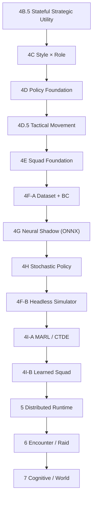

# Plan de Implementación — Inteligencia de NPCs L2Dn

Estado: **plan de implementación (síntesis ejecutable)**. Fecha: 2026-08-18.
Fuente de verdad de diseño: [`00_Roadmap_Maestro.md`](00_Roadmap_Maestro.md) (revisión 3), documentos por fase y ADRs 001–017.

Este documento NO reemplaza el roadmap maestro ni los documentos por fase. Los **mapea al estado real del código** y los convierte en una secuencia de ejecución con entregables, dependencias y criterios de salida.

---

## 1. Resumen ejecutivo

El programa de modernización de IA de NPCs ya tiene una base certificada en producción (Fases 2 → 4B). El trabajo restante es una **pila de capas incrementales** que va desde posturas de combate dinámicas (4B.5) hasta inteligencia aprendida (4G–4I) y su distribución (5+) y escalado a raids y mundo (6–7+).

Cada fase es un incremento desplegable con su propio modo de rollout (Disabled/Shadow/Enabled) y rollback de un flag. La regla de oro del programa: **primero demostrar inteligencia determinista rica, después aprenderla y distribuirla** — nunca al revés.

---

## 2. Situación actual (mapeo diseño ↔ código)

### 2.1 Implementado y certificado (presente en el código)

| Fase | Qué entrega | Dónde vive |
|---|---|---|
| **2 — Percepción** | Snapshot inmutable de hechos del mundo | `L2Dn.Npc.Contracts` (`NpcPerceptionSnapshot`, deltas, comparers) |
| **2.5 — Scheduler** | Wakes reactivos, single-flight, colas acotadas | `NpcThinkCoordinator` en `L2Dn.GameServer.Model` |
| **3 — Brain + Intents** | Separación decidir/ejecutar; `NpcIntent` tipado | `L2Dn.Npc.Brain` (`NpcBrainCoordinator`, `INpcBrain`) + `NpcIntentGateway` |
| **4 / 4B — Estrategia estática V1** | 4 estilos de combate (Balanced / AggressivePressure / RangedControl / Survival) | `StrategyBrain`, `ReflexBrain`, `TacticalBrain`, `TacticalActionEvaluator`, `NpcStrategyProfileResolver` |

Estado: tag **`npc-brain-phase4-complete`**, rollout certificado en Talking Island (laboratorio `StrategyValidationLab.xml`), modos Disabled/Shadow/Enabled funcionales, R1–R5 sintético y `NpcBrainReplayRunner` operativos.

### 2.2 Diseño aprobado, SIN implementar

| Fase | Nombre | Evidencia de que falta |
|---|---|---|
| **4B.5** | Stateful Strategic Utility | No existen `NpcStrategicPosture`, `NpcStrategyDirective`, `NpcReflexPolicy`, `PostureStabilityGate` |
| **4C** | Style × Role | No existe `NpcStrategyRole` ni deltas de rol |
| **4D** | Policy Foundation | No existen `NpcTacticalCandidateSet`, `NpcPolicyObservation`, `NpcPolicyAdvice`, `PolicyArbitrator` |
| **4D.5** | Tactical Movement Primitives | No existen intents semánticos de movimiento (Flank/Formation/Scatter) |
| **4E** | Squad Intelligence | No existen `SquadDirective`, `SquadThinkCoordinator`, `CombatAssignment` |
| **4F-A** | Dataset + Behavior Cloning | No existen contratos de training ni exportador |
| **4G** | Neural Policy Shadow (ONNX) | No existe `L2Dn.Npc.Policy.Onnx` |
| **4H** | Stochastic Individual Policy | No existe sampler ni `NpcAiDifficultyTier` |
| **4F-B** | Headless Combat Simulator | No existe simulador |
| **4I-A / 4I-B** | MARL / CTDE y Squad aprendida | No existen |
| **5 / 6 / 7** | Distributed / Raid / Cognitive | No existen |

### 2.3 Ensamblados planificados que aún no existen

`L2Dn.Npc.Policy.Runtime`, `L2Dn.Npc.Policy.Onnx`, `L2Dn.Npc.Transport.Grpc`, `L2Dn.Npc.Training.Contracts`, `L2Dn.Npc.Training.Export`, `L2Dn.AI.Directors` y `Training/Python/`. La solución actual solo contiene `L2Dn.Npc.Contracts` y `L2Dn.Npc.Brain` del programa NPC.

---

## 3. Invariantes que gobiernan toda fase

1. **GameServer es autoridad del mundo** (ADR-001); el Brain solo produce `NpcIntent`, nunca muta estado.
2. **Neural produce recomendaciones, no intents** (ADR-012); el fallback determinista es **invariante, no configurable** (ADR-014).
3. **Una sola fuente de elegibilidad** de acciones: `TacticalActionEvaluator` → `CandidateSet` (ADR-013).
4. **Reflex es independiente**: nunca depende de Strategy adaptativa, Neural ni Squad durante Think; `NpcReflexPolicy` inmutable al spawn (ADR-006 ext).
5. **Causalidad obligatoria**: `NpcKey` (con Generation) + `StateRevision` exacta en todo Advice/Directive (ADR-015).
6. **`L2Dn.Npc.Brain` solo referencia `L2Dn.Npc.Contracts`** (ADR-008); `Policy.Runtime` no depende de `Policy.Onnx` (interfaz `INpcPolicyInferenceEngine`).
7. **Sin I/O en Think**: modelo precargado, sin DB/red/disco en el hot path (ADR-004).
8. **Remote devuelve Advice, nunca Intent** (ADR-016); **PolicyArbitrator Opción A**: la neural elige entre candidatos elegibles (ADR-017).
9. **Reproducibilidad**: seed determinista (Hash-based PRNG); reward calculado offline.
10. **Rollback con un flag** en cada fase (Disabled = comportamiento de la fase anterior exacto).

Los gates de seguridad no negociables están tabulados en [`00_Roadmap_Maestro.md`](00_Roadmap_Maestro.md).

### Validación transversal (pirámide de testing)

Cada fase se valida con una pirámide de 4 niveles: **(1)** tests sintéticos automatizados (`NpcScenarioBuilder`), **(2)** laboratorios de spawn temáticos, **(3)** validación masiva en Shadow Mode + OpenTelemetry, y **(4)** herramientas GM en vivo (`//admin_npc_ai_status`, `//admin_npc_ai_lab`). Ver [`02_Estrategia_Validacion_Testing.md`](02_Estrategia_Validacion_Testing.md). La pirámide arranca ya sobre la Fase 4 certificada y acompaña todas las fases posteriores.

---

## 4. Secuencia de fases

> El programa tiene **dos líneas de training**: la vía de imitación (4F-A → 4G → 4H) y la vía de refuerzo (4F-B → 4I). 4F-B se ejecuta tras 4H porque requiere el simulador y el runtime de policy ya estabilizados.

---

## 5. Detalle por fase

### Fase 4B.5 — Stateful Strategic Utility (próxima a implementar)

- **Objetivo**: que un NPC individual cambie racionalmente de **postura** durante el combate (Pressure / ControlRange / Recover / Disengage), con utility normalizada (0–1000), hysteresis, commitment y movimientos mínimos (MaintainRange / Retreat).
- **Entregables clave**: `NpcReflexPolicy` (Contracts, resuelto al spawn), `NpcStrategicPosture` + `NpcStrategyDirective` + `NpcPostureTransitionReason` (Contracts); en Brain: `StrategicUtilityEvaluator`, `NpcUtilityCurve`, `PostureStabilityGate`, `NpcTieBreakPolicy`, `NpcAdaptiveShadowState`, replay stateful y telemetría.
- **Modo de rollout**: `NPC_STRATEGY_ADAPTIVE_MODE = Disabled | Shadow | Enabled`.
- **Depende de**: Fase 4B (certificada).
- **Criterios de salida**: equivalencia Disabled = Phase 4B exacta (Decision/Intent), hysteresis sin oscilación, commitment respetado, utilidades 0–1000 sin saturación, P99 < 1 ms, zero I/O, R1–R5 sin drops, laboratorio + rollout por waves. (Detalle: [`01_Fase_4B5_Stateful_Strategic_Utility.md`](Fases/01_Fase_4B5_Stateful_Strategic_Utility.md), subfases 4B.5.0–4B.5.17.)

### Fase 4C — Style × Role

- **Objetivo**: segundo eje estructural **Role** (Mob / Elite / Minion / Commander / Raid) que modifica style via deltas signed (`effectiveProfile = style + roleDelta`).
- **Entregables**: `NpcStrategyRole` enum, deltas inmutables, composición en `StrategyBrain`, parseo de registro `id:style:role`, tag OTLP acotado a 5 valores.
- **Depende de**: 4B.5 (los deltas de rol operan sobre PosturePriors 0–1000).
- **Criterios de salida**: `Balanced × Mob` idéntico a Phase 4; composición determinista; rol desconocido → warning + rechazo (no default silencioso); Raid compone en tests pero **no** ejecuta por Gateway; elegibilidad `Monster` + `AttackableAI` intacta.

### Fase 4D — Policy Foundation

- **Objetivo**: introducir el contrato de política sin red aún: `TacticalActionEvaluator` refactorizado a `BuildCandidates()` → `NpcTacticalCandidateSet`, `PolicyArbitrator` (Opción A), `NpcPolicyObservationV1` sin identidad, `NpcPolicyAdvice` con causalidad, y el runtime `L2Dn.Npc.Policy.Runtime` (coordinator + advice store) consumiendo `INpcPolicyInferenceEngine`.
- **Depende de**: 4C. **Decisión abierta previa**: `TargetHpRatio` en ObservationV1 → o bien V1 no lo incluye, o bien se crea Perception Schema V2 antes de 4D (ver §7).
- **Criterios de salida**: Disabled = Phase 4C exacta; advice stale/mismatch rechazado (NpcKey + StateRevision exacta); Reflex ignora la policy; Brain nunca invoca `INpcPolicy`; fallback invariante.

### Fase 4D.5 — Tactical Movement Primitives

- **Objetivo**: intents de movimiento semánticos `FlankTarget`, `FormationSlot`, `CircleTarget`, `Scatter` (MaintainRange/Retreat ya vienen de 4B.5).
- **Criterios**: Brain nunca produce coordenadas absolutas; GeoEngine valida; fallback de posición si todo bloqueado.

### Fase 4E — Squad Intelligence Foundation

- **Objetivo**: escuadrón **master + minion** (`MinionList`), `SquadSnapshot`/directiva con causalidad, `SquadThinkCoordinator` single-flight, `CombatAssignment` que modifica el `StrategyEvaluationContext`.
- **Depende de**: 4D.5 (movimiento de formación).
- **Criterios**: ausencia de squad = Phase 4C exacta; muerte de commander → directiva observable; `NPC_SQUAD_MODE=Disabled` = 4C; clan-help **fuera** de alcance (fase futura).

### Fase 4F-A — Dataset + Behavior Cloning

- **Objetivo**: captura pasiva de replay (hechos crudos, **sin** reward), `FeatureExtractor` que reutiliza el código de producción (sin train/serve skew), y `train_imitation.py` → `export_onnx.py`.
- **Depende de**: 4E (el experto con posturas dinámicas y squad es un mejor supervisor).
- **Criterios**: captura < 2% impacto TPS; split por episodio (sin leakage); hold-out templates; métricas por clase.

### Fase 4G — Neural Policy Shadow (ONNX)

- **Objetivo**: inferencia ONNX en `L2Dn.Npc.Policy.Onnx` como **shadow puro** (cero efecto en gameplay), con comparación pareada por `PolicyEvaluationId`.
- **Criterios**: modelo precargado, cero I/O en Think; Reflex responde antes que la inferencia; shadow nunca ejecuta decisión neural; fallback limpio.

### Fase 4H — Stochastic Individual Policy (Enabled)

- **Objetivo**: activar la política con muestreo estocástico reproducible (seed Hash-based), temperatura y `NpcAiDifficultyTier`.
- **Criterios**: seed determinista → misma secuencia; candidato inelegible nunca muestreado; T=0.01 ≈ argmax; ratio de rechazo del Gateway comparable al determinista (< 5%).

### Fase 4F-B — Headless Combat Simulator

- **Objetivo**: simulador determinista con función de transición `S(t)+A(t)→S(t+1)` reutilizando lógica real, wrapper Gymnasium/RLlib.
- **Depende de**: 4H (runtime de policy estable). Alimenta la vía RL.

### Fases 4I-A / 4I-B — MARL/CTDE y Squad aprendida

- **4I-A**: políticas individuales compartidas con percepción local descentralizada (CTDE), self-play con opponent pool.
- **4I-B**: `Neural SquadBrain` separada; fallback a comportamiento individual 4C si la policy falla.

### Fase 5 — Distributed Policy Runtime

- Objetivo: workers remotos que reciben Observation vectorizada y devuelven **Advice**, con circuit breaker. Transporte `L2Dn.Npc.Transport.Grpc`; `GrpcInferenceEngine` implementa `INpcPolicyInferenceEngine`.

### Fase 6 — Encounter / Raid

- Objetivo: coordinación de encuentros/raids; **sin hot-switch a Legacy mid-fight** (fallback a política determinista de encounter); separa mechanics de intelligence.

### Fase 7+ — Cognitive / World

- Objetivo: `WorldDirector` en assembly separado operando por directivas/políticas (ADR-010), con Policy Gate de límites. LLM solo fuera del loop de combate (ADR-007).

---

## 6. Ruta crítica y paralelismo

- **Ruta crítica**: 4B.5 → 4C → 4D → 4D.5 → 4E → 4F-A → 4G → 4H → 4F-B → 4I-A → 4I-B → 5 → 6 → 7.
- **Paralelizable**:
  - Diseño de 4C puede avanzar en paralelo a la implementación de 4B.5 (ya está diseñado).
  - 4F-B (simulador) puede **arrancarse en paralelo** con 4F-A/4G/4H, siempre que se integre antes de 4I-A.
  - Tooling de telemetría/replay de 4B.5 es reutilizable por todas las fases posteriores.
- **Punto de decisión temprano**: disponibilidad de `TargetHpRatio` para 4D (ver §7) — resolver antes de cerrar 4C.

---

## 7. Decisiones abiertas y riesgos

| # | Decisión / riesgo | Dónde se resuelve |
|---|---|---|
| 1 | `TargetHpRatio` en ObservationV1: Perception Schema V2 vs. V1 sin salud de target | Antes de 4D (4B.5 §21) |
| 2 | Calibración de `MinimumPostureDurationTicks` y priors de postura | Durante 4B.5 con datos reales |
| 3 | Certificación de alta concurrencia (más de 1–2 jugadores) sigue abierta | Requiere pruebas de carga dedicadas, no cubiertas por R1–R5 |
| 4 | `RaidBoss`/squad/clan-help permanecen en Legacy hasta fases 4E/6 | Frontera de elegibilidad intacta hasta entonces |
| 5 | Shared vs. separate policies (4I) es experimento, no contrato | Se decide con datos en 4I-A |

---

## 8. Arranque inmediato — Fase 4B.5

La siguiente unidad de trabajo es 4B.5, con 17 subfases ya especificadas (4B.5.0 → 4B.5.17) en [`01_Fase_4B5_Stateful_Strategic_Utility.md`](Fases/01_Fase_4B5_Stateful_Strategic_Utility.md). Orden de ejecución sugerido:

1. **Congelar baseline** Static V1 (4B.5.0) + tests de equivalencia Decision/Intent.
2. **`NpcReflexPolicy`** inmutable al spawn (4B.5.1) — preserva overrides de Phase 4B (AP→5%, Survival→30%).
3. **Movimientos mínimos** MaintainRange/Retreat como tactical candidates (4B.5.2).
4. **Posture + utility + stability gate** (4B.5.3–4B.5.9) con tie-break explícito (4B.5.10).
5. **Shadow longitudinal** (4B.5.11), replay stateful (4B.5.12), telemetría (4B.5.13).
6. **R1–R5 → laboratorio → rollout por waves → checkpoint** (4B.5.14–4B.5.17).

**En paralelo (validación, nivel 1)**: construir `NpcScenarioBuilder` y los tests de arquetipos testeables hoy (Melee, Ranged/Kiting, Hate multi-target, Leash) para congelar la Fase 4 contra regresiones antes de mover 4B.5. Ver [`02_Estrategia_Validacion_Testing.md`](02_Estrategia_Validacion_Testing.md) §3.

Gate de congelación: cumplir los 22 criterios de aceptación 4B5-A1…A22 y la Definition of Done (arquitectura, compatibilidad, seguridad, rendimiento, estabilidad) antes de declarar la fase completa.
