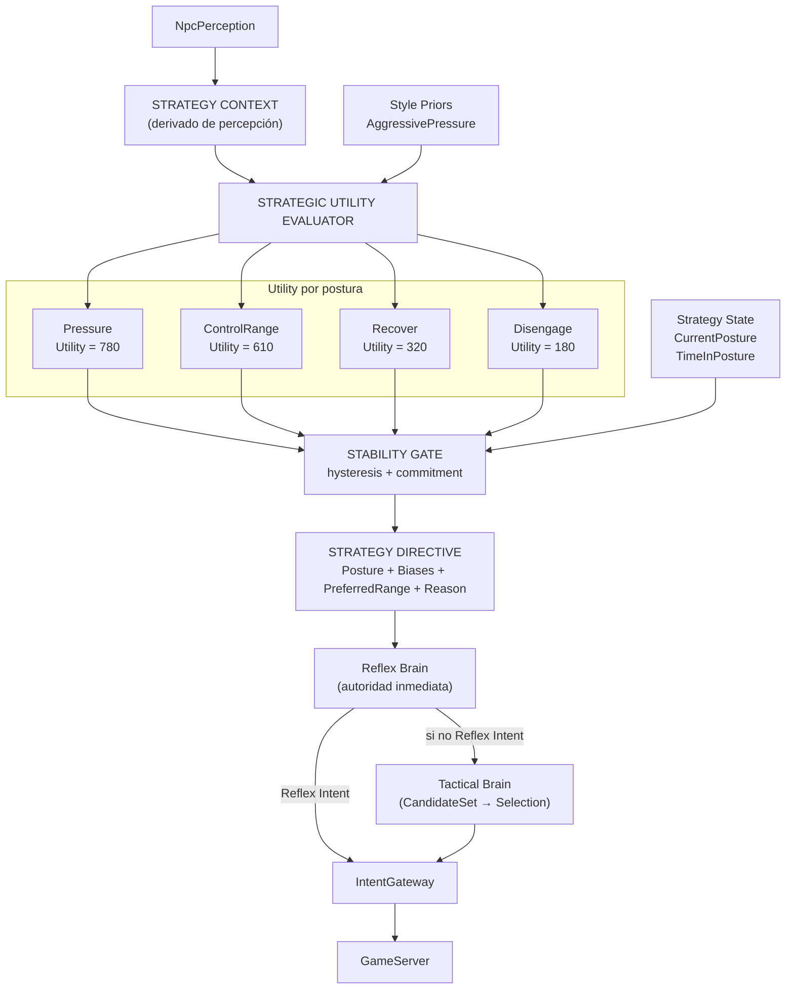

# Fase 4B.5 — Stateful Strategic Utility & Stability

**Estado:** Diseño
**Fecha:** 2026-08-13
**Revisión:** 1
**Prerequisitos:** Phase 4B (Static Strategy V1) certificada en `npc-brain-phase4-complete`

---

## 1. Motivación

### El problema

`StrategyBrain` actual recibe `NpcPerceptionSnapshot`, `NpcIntelligenceProfile` y `NpcStrategyProfile`, pero la percepción prácticamente no interviene en la decisión estratégica. Lo que ejecuta es:

```text
Leer perfil estático → scores constantes → flee threshold → preferred range → entregar modifiers
```

Por ejemplo, `AggressivePressure`:

```text
BasicAttack = 75
Approach    = 90
OffensiveSkill = 105
Heal        = 85
Flee        = 70
```

Estos valores son los mismos con HP al 100% que al 22%, con skill ready o unavailable, al inicio del combate o 40 segundos después.

### Lo que falta

No existe un concepto de **postura estratégica dinámica**. Un AggressivePressure sigue siendo AggressivePressure independientemente de la situación. No puede:

```text
PRESSURE → me están castigando → RECOVER → me recuperé → CONTROL_RANGE → enemigo vulnerable → COMMIT
```

### Por qué antes de 4C

1. **Style × Role con posturas** es mucho más expresivo que Style × Role con scores fijos.
2. **Behavior Cloning** (4F-A) necesita un experto determinista rico. Si entrenamos neural sobre scores fijos, la red aprende a imitar inteligencia simple.
3. **Squad** (4E) se integra mucho mejor: una directiva de squad modifica el contexto estratégico, no directamente un score táctico.

### Lo que NO cambia

- Phase 4B queda intacta como checkpoint histórico de Static Strategy V1.
- Reflex sigue siendo autoridad inmediata.
- IntentGateway sigue siendo autoridad de validación.
- Single-flight, replay, telemetría OTLP, R1-R5 — todo se preserva.

---

## 2. Conceptos fundamentales

### Cuatro ejes de decisión (roadmap completo)

| Concepto | Pregunta | Cuándo cambia | Fase |
|---|---|---|---|
| **Style** | ¿Cómo suelo combatir? | Al spawn (inmutable) | 4A/4B |
| **Posture** | ¿Qué quiero conseguir AHORA? | Durante combate (dinámico) | **4B.5** |
| **Role** | ¿Qué soy estructuralmente? | Al spawn (inmutable) | 4C |
| **Combat Assignment** | ¿Qué tarea me asignó mi grupo? | Cuando squad emite directiva | 4E |

### Style vs Posture

```text
STYLE (permanente)                    POSTURE (dinámica)
"cómo suelo comportarme"              "qué estoy intentando ahora"

AggressivePressure                    Neutral
RangedControl                         Pressure
Survival                              ControlRange
Balanced                              Recover
                                      Disengage
```

Style se convierte en **prior**: predisposición inicial sobre las utilidades de cada postura.

```text
AggressivePressure:
  Pressure prior     = 650
  ControlRange prior = 350
  Recover prior      = 250
  Disengage prior    = 100

Survival:
  Pressure prior     = 300
  ControlRange prior = 350
  Recover prior      = 600
  Disengage prior    = 450
```

Ambos estilos pueden entrar en cualquier postura cuando la situación lo justifique. El estilo deja de ser una jaula.

---

## 3. Arquitectura



### Regla: Strategy Directive NO genera Intent

Strategy produce una **directiva** (biases + postura + rango preferido). Tactical decide la acción concreta. Gateway autoriza. La directiva es consejo estratégico.

---

## 4. Piezas a crear

### En `L2Dn.Npc.Contracts`

| Nombre | Archivo propuesto | Propósito |
|---|---|---|
| `NpcStrategicPosture` | `Strategy/NpcStrategicPosture.cs` | Enum: `Neutral`, `Pressure`, `ControlRange`, `Recover`, `Disengage` |
| `NpcStrategyContext` | `Strategy/NpcStrategyContext.cs` | Contexto inmutable derivado de la percepción para evaluación estratégica |
| `NpcStrategyDirective` | `Strategy/NpcStrategyDirective.cs` | Resultado de la evaluación: postura + biases + rango + razón |
| `NpcPostureTransitionReason` | `Strategy/NpcPostureTransitionReason.cs` | Enum: `Initial`, `LowHealth`, `HealthRecovered`, `TargetInsideRange`, `TargetOutsideRange`, `HealAvailable`, `NoHealAvailable`, `FleeCondition`, `Timeout`, `SkillReady` |
| `NpcUtilityConsideration` | `Strategy/Utility/NpcUtilityConsideration.cs` | Estructura: InputSelector + ResponseCurve + Weight |
| `NpcUtilityCurvePoint` | `Strategy/Utility/NpcUtilityCurvePoint.cs` | Punto de curva piecewise-linear: `{Input, Utility}` (int 0-1000) |
| `NpcPosturePrior` | `Strategy/NpcPosturePrior.cs` | Prior de utilidad base por postura (inmutable, derivado de Style) |
| `NpcTieBreakPolicy` | `Tactical/NpcTieBreakPolicy.cs` | Política explícita de desempate para candidatos con scores iguales |

### En `L2Dn.Npc.Brain`

| Nombre | Archivo propuesto | Propósito |
|---|---|---|
| `StrategicUtilityEvaluator` | `Strategy/StrategicUtilityEvaluator.cs` | Evalúa utilidad de cada postura usando considerations + response curves |
| `PostureStabilityGate` | `Strategy/PostureStabilityGate.cs` | Hysteresis + commitment: evita oscilación de posturas |
| `StrategyContextBuilder` | `Strategy/StrategyContextBuilder.cs` | Construye `NpcStrategyContext` desde `NpcPerceptionSnapshot` |
| `NpcStrategyState` | `Strategy/NpcStrategyState.cs` | Estado interno: CurrentPosture, PostureEnteredTick, PreviousPosture, TransitionReason, DecisionSequence |
| `StrategicDirectiveBuilder` | `Strategy/StrategicDirectiveBuilder.cs` | Construye `NpcStrategyDirective` desde postura ganadora + Style + Role (futuro) |

### Refactorización de existentes

| Nombre | Cambio |
|---|---|
| `StrategyBrain` | Orquesta: ContextBuilder → UtilityEvaluator → StabilityGate → DirectiveBuilder |
| `TacticalActionEvaluator` | Recibe `NpcStrategyDirective` en lugar de `NpcStrategyProfile` directamente. Los biases de la directiva modifican scores. Tie-break explícito. |
| `NpcBrainState` | Agrega `NpcStrategyState` (internal) |

---

## 5. NpcStrategyContext

Derivado localmente de la percepción. Sin I/O, sin GameServer mutable.

```text
// Self
SelfHpRatio              int 0-1000 (e.g. 340 = 34%)
SelfMpRatio              int 0-1000
InCombat                 bool
CombatDurationTicks      int

// Target (derivado de percepción existente)
HasTarget                bool
TargetDistance            int (game units)
PreferredRange           int (del intelligence profile)
TargetWithinRange        bool
TargetClose              bool (distance < preferred/2)
TargetFar                bool (distance > preferred * 1.5)

// Capabilities
OffensiveSkillReady      bool
HealReady                bool
CanFlee                  bool

// Environment
VisibleHostileCount      int
NearbyAllyCount          int

// Current strategy state
CurrentPosture           NpcStrategicPosture
TimeInPostureTicks       int
```

### Limitación conocida

`TargetHpRatio` no está actualmente en `VisibleEntity` del snapshot. Fase 4B.5 **no inventa** conocimiento que el mob no tiene en Contracts. Inicialmente se trabaja con los hechos existentes. Si se necesita target HP, se amplía Perception explícitamente en una subfase.

---

## 6. Utility System

### Escala

Utilidades como enteros `0..1000`:

```text
0    = ninguna utilidad
500  = media
1000 = máxima
```

### Response Curves (curvas de respuesta)

Piecewise-linear (lineal por tramos). Rápido, explicable, determinista.

```text
Ejemplo: HP → RecoverUtility

HP 100% ──── 0
HP  75% ──── 0
HP  50% ──── 200
HP  30% ──── 600
HP  10% ──── 1000

Curva: [(1000, 0), (750, 0), (500, 200), (300, 600), (100, 1000)]
```

### Considerations (características que contribuyen a la utilidad)

Cada postura tiene una lista de considerations:

```text
Posture: Recover
  Consideration: SelfHpRatio     → RecoverHpCurve      × Weight 1.0
  Consideration: HealReady       → BooleanBoostCurve    × Weight 0.8
  Consideration: SelfMpRatio     → RecoverMpCurve       × Weight 0.3
```

```text
Posture: Pressure
  Consideration: SelfHpRatio     → PressureHpCurve      × Weight 0.6
  Consideration: OffensiveSkillReady → BooleanBoostCurve × Weight 0.7
  Consideration: TargetClose     → BooleanBoostCurve     × Weight 0.5
```

### Cálculo

```text
PostureUtility = StylePrior + Σ(Consideration.Curve(input) × Weight)
```

Fixed-point, determinista, reproducible.

---

## 7. Stability Gate (Hysteresis + Commitment)

### Problema que resuelve

Sin estabilidad:

```text
HP 34% → Recover
HP 36% → Pressure
HP 34% → Recover
HP 36% → Pressure
```

Resultado: `Heal Attack Heal Attack Heal Attack` — parece estúpido.

### Switch Margin

```text
Current: Pressure    Utility = 700
New:     Recover     Utility = 720

Recover debe superar: Pressure + SwitchMargin
700 + 100 = 800

720 < 800 → NO cambiar
```

### Minimum Posture Duration

```text
MinimumPostureDurationTicks = configurable (hipótesis: ~500ms equivalente)
```

Una vez que entra en `Recover`, no puede salir instantáneamente por una variación mínima.

**Excepción**: Reflex/Safety siempre tiene autoridad superior. Si el NPC debe huir o target muere, Reflex actúa independientemente de la postura.

### Range Tolerance

```text
PreferredRange = 600
RangeTolerance = ±60

Distance 590..610 → NO provocar cambio de postura por "fuera de rango"
```

Evita: `approach stop approach stop approach stop`.

---

## 8. NpcStrategyDirective

La postura ganadora se traduce en biases tácticos:

```text
Posture: Recover
  AttackBias         = -15
  ApproachBias       = -20
  OffensiveSkillBias = -10
  HealBias           = +35
  FleeBias           = +25
  PreferredRange     = 500  (mayor que normal → retroceder)
  Reason             = LowHealth
```

```text
Posture: Pressure
  AttackBias         = +10
  ApproachBias       = +15
  OffensiveSkillBias = +20
  HealBias           = -10
  FleeBias           = -20
  PreferredRange     = 200  (menor → acercarse)
  Reason             = Initial
```

Los biases **modifican** los scores base de TacticalActionEvaluator. El candidato ganador sigue siendo elegido por score máximo (con tie-break explícito).

---

## 9. Tie-Break explícito

### Problema actual

`Prefer()` usa `candidate.Score > current.Score` (no `>=`). Dos acciones con score 100 → gana la que apareció primero en el código. El orden del código se convierte en política de desempate accidental.

### Solución

```text
Score
  ↓
TieBreakPolicy (explícita)
  ↓
Winner
```

`NpcTieBreakPolicy`:

```text
PreferOffensive    → entre empates, prefiere Attack > Skill > Approach > Heal > Flee
PreferDefensive    → entre empates, prefiere Heal > Flee > Approach > Attack > Skill
PreferMobility     → entre empates, prefiere Approach > Flee > Attack > Skill > Heal
```

Configurable por Style o hardcoded por ahora. Lo importante es que sea **explícito y testeable**.

---

## 10. Strategy State (interno)

```text
internal NpcStrategyState:
  CurrentPosture               NpcStrategicPosture
  PostureEnteredWorldTick      long
  PreviousPosture              NpcStrategicPosture
  LastTransitionReason         NpcPostureTransitionReason
  StrategicDecisionSequence    int (monótono, para seed)
  UtilityScores                int[5] (último cálculo, para telemetría/replay)
```

Vive en `NpcBrainState` como `internal`. No en Contracts.

---

## 11. Ejemplo completo

### Orc — Style: AggressivePressure

**Inicio del combate:**

```text
HP: 100%  Target: 200 units  Skill: Ready

Utilities:
  Pressure     = 650(prior) + 600(hp healthy) + 350(skill ready) + 250(target close) = 1850 → clamp 1000
  ControlRange = 350(prior) + 200(target close penalty) = 550
  Recover      = 250(prior) + 0(hp healthy) = 250
  Disengage    = 100(prior) + 0 = 100

Winner: Pressure (1000)
Directive: Attack+15, Skill+20, Approach+15, Heal-10, Flee-20
```

**Recibe daño — HP 24%:**

```text
Utilities:
  Pressure     = 650 + 0(hp critical penalty) + 350(skill ready) = 1000 → pero HP curve reduce
  Pressure     = 650 + (-300)(hp low curve) + 350 = 700
  Recover      = 250 + 600(hp low) + 200(heal ready) = 1050 → clamp 1000

Stability: Current=Pressure(700), Challenger=Recover(1000)
  Switch threshold: 700 + 100(margin) = 800
  1000 > 800 → ✅ TRANSICIÓN

New Posture: Recover
Reason: LowHealth
Directive: Attack-15, Skill-10, Heal+35, Flee+25, Range=500
```

**Se cura — HP 65%:**

```text
Utilities:
  Pressure     = 650 + 200(hp moderate) + 350(skill) = 1200 → clamp 1000
  Recover      = 250 + 100(hp moderate) + 0(heal on cooldown) = 350

Stability: Current=Recover(350), Challenger=Pressure(1000)
  Switch threshold: 350 + 100 = 450
  1000 > 450 → ✅ TRANSICIÓN

New Posture: Pressure
Reason: HealthRecovered
```

**Resultado observable**: El Orc presiona, recibe daño, se cura, vuelve a presionar. Parece que interpreta el combate.

---

## 12. Subfases de implementación

| Subfase | Implementación | Dependencia |
|---|---|---|
| 4B.5.0 | Congelar Static Strategy V1 como baseline | — |
| 4B.5.1 | `NpcStrategyContext` + `StrategyContextBuilder` | 4B.5.0 |
| 4B.5.2 | `NpcStrategicPosture` enum + `NpcPosturePrior` por Style | 4B.5.1 |
| 4B.5.3 | `NpcUtilityConsideration` + `NpcUtilityCurvePoint` + `StrategicUtilityEvaluator` | 4B.5.2 |
| 4B.5.4 | `NpcStrategyState` (internal en Brain) | 4B.5.3 |
| 4B.5.5 | `PostureStabilityGate` (hysteresis + commitment + range tolerance) | 4B.5.4 |
| 4B.5.6 | `NpcStrategyDirective` + `StrategicDirectiveBuilder` | 4B.5.5 |
| 4B.5.7 | `NpcTieBreakPolicy` en TacticalActionEvaluator | 4B.5.6 |
| 4B.5.8 | Stateful replay (postura + utilities + transiciones + razones + directiva + intent) | 4B.5.7 |
| 4B.5.9 | Shadow: Static V1 ejecuta / Stateful V2 compara | 4B.5.8 |
| 4B.5.10 | Telemetría OTLP (postura, transiciones, hysteresis, márgenes) | 4B.5.9 |
| 4B.5.11 | R1-R5 con Strategy Adaptive Enabled | 4B.5.10 |
| 4B.5.12 | Laboratorio real (Talking Island, templates conocidos) | 4B.5.11 |
| 4B.5.13 | Rollout controlado (waves 1-3) | 4B.5.12 |
| 4B.5.14 | Checkpoint + rollback verificado | 4B.5.13 |

---

## 13. Modos de rollout

```text
NPC_STRATEGY_ADAPTIVE_MODE:
  Disabled  → Static Strategy V1 exactamente como Phase 4B
  Shadow    → Static V1 ejecuta / Stateful V2 evalúa → comparación
  Enabled   → Stateful V2 ejecuta
```

Rollback: `NPC_STRATEGY_ADAPTIVE_MODE=Disabled` → vuelve exactamente a Phase 4B.

### Shadow

```text
PreState S
   ┌─────────────┴──────────────┐
   ▼                             ▼
Static V1                   Stateful V2
   │                             │
   ▼                             ▼
Decision A                  Decision B
persist A                   discard B
compare A vs B              emit telemetry
```

Estado de V2 se descarta tras la comparación. Replay offline puede mantener V2 longitudinalmente.

---

## 14. Relación con 4C (Style × Role)

Después de 4B.5, Role (4C) se convierte en algo mucho más potente:

```text
ANTES (4C sin 4B.5):
  Elite: Attack +10, Skill +15, Flee -20

DESPUÉS (4C con 4B.5):
  Elite:
    PressurePrior  +100
    RecoverPrior   -50
    DisengagePrior -100
    Commitment     +50 (más difícil de cambiar de postura)
    + Attack +10, Skill +15, Flee -20  (tácticos)
```

Role afecta **qué postura prefiere** además de modificar tácticos.

---

## 15. Relación con Squad (4E)

Sin 4B.5:

```text
SquadDirective: PressureHealer → AttackScore +15 (modificador directo a tácticos)
```

Con 4B.5:

```text
SquadDirective: PressureHealer
  ↓
CombatAssignment modifica StrategyContext
  ↓
Utility Evaluator (con Assignment context)
  ↓
Posture: Pressure (si HP lo permite)
  ↓
Directive
  ↓
Tactical
```

El NPC puede **interpretar** la orden. Si su HP es 8%, Strategy puede decir `Recover` aunque el Squad diga `Pressure`. Y Reflex sigue conservando autoridad.

---

## 16. Lo que NO incluye

- Role (4C)
- Squad / Commander / Raid (4E+)
- Neural Network / ONNX / RL / MARL
- LLM / memoria larga
- Target modeling / player profiling
- Remote workers / gRPC
- GOAP / HTN / Behavior Trees
- TargetHpRatio (si no está en VisibleEntity actualmente)
- Aprendizaje adaptativo (Dynamic Scripting o similar)

Solo: **un NPC individual capaz de cambiar racionalmente su postura durante un combate, de forma determinista.**

---

## 17. Criterios de aceptación

| ID | Criterio | Tipo | Qué demuestra |
|---|---|---|---|
| 4B5-A1 | `NPC_STRATEGY_ADAPTIVE_MODE=Disabled` produce comportamiento bit-a-bit idéntico a Phase 4B | Comportamiento | Que Static V1 es el baseline exacto |
| 4B5-A2 | Un NPC `AggressivePressure` con HP<25% y Heal disponible transiciona a `Recover` | Comportamiento | Que la postura cambia con la situación |
| 4B5-A3 | Un NPC en `Recover` con HP>70% y skill ready transiciona a `Pressure` o `ControlRange` | Comportamiento | Que la recuperación lleva a re-engagement |
| 4B5-A4 | Oscilación HP 34%↔36% con threshold en 35% NO produce alternancia Recover↔Pressure | Comportamiento | Que la hysteresis funciona |
| 4B5-A5 | Una postura recién adquirida no se abandona antes de `MinimumPostureDurationTicks` (excepto Reflex) | Comportamiento | Que el commitment funciona |
| 4B5-A6 | `Survival` en la misma situación de HP bajo tiene `RecoverUtility >= AggressivePressure.RecoverUtility` | Comportamiento | Que el estilo es prior, no jaula |
| 4B5-A7 | Todo cambio de postura registra `NpcPostureTransitionReason` | Contrato | Que cada transición es explicable |
| 4B5-A8 | Replay determinista: misma secuencia de percepciones → mismas posturas, utilidades, transiciones, directivas, intents | Comportamiento | Reproducibilidad total |
| 4B5-A9 | Dos candidatos con score idéntico se resuelven por `NpcTieBreakPolicy`, no por orden de código | Contrato | Que el desempate es explícito |
| 4B5-A10 | Strategy V2 P99 < 1 ms, preferiblemente < 0.5 ms | Rendimiento | Que no degrada el hot path |
| 4B5-A11 | Zero network I/O, zero DB I/O, zero disk I/O en Strategy evaluation | Rendimiento | Sin I/O en Think |
| 4B5-A12 | Hot-path allocations ≈ V1 | Rendimiento | Sin regresión de GC |
| 4B5-A13 | Single-flight: 1 Think concurrente/NPC, 0 drops | Rendimiento | R1-R5 preservados |
| 4B5-A14 | Critical P95 no > +25% vs V1 sin explicación | Rendimiento | SLO preservado |
| 4B5-A15 | Utility scores son enteros 0-1000 (fixed-point) | Contrato | Determinismo y reproducibilidad |
| 4B5-A16 | Response curves son piecewise-linear (lineal por tramos) | Contrato | Rápido, explicable, determinista |
| 4B5-A17 | Reflex sigue teniendo autoridad superior a Strategy Posture | Integración | Que Reflex no se debilita |

### Tests concretos

**Contracts:**

| Test | Propiedad | Input → Output esperado |
|---|---|---|
| `Posture_HasExactlyFiveValues` | Cardinalidad | Enum.GetValues → {Neutral, Pressure, ControlRange, Recover, Disengage} |
| `StrategyContext_IsImmutable` | Sin mutación | readonly struct → compilación falla si se modifica |
| `StrategyDirective_IsImmutable` | Sin mutación | readonly struct → compilación falla si se modifica |
| `UtilityCurve_PiecewiseLinear_Interpolation` | Cálculo correcto | Input=400, Points=[(300,600),(500,200)] → Utility=400 (interpolación lineal) |
| `UtilityCurve_OutOfRange_Clamps` | Sin extrapolación | Input=0 con curva mínima 100 → Utility del primer punto |
| `TransitionReason_HasExpectedValues` | Enum completo | ≥ 10 razones documentadas |
| `TieBreakPolicy_HasExplicitOrder` | Desempate declarado | PreferOffensive → orden: Attack > Skill > Approach > Heal > Flee |
| `PosturePrior_PerStyle_SumsCorrectly` | Priors razonables | AggressivePressure.PressurePrior > Survival.PressurePrior |

**Brain:**

| Test | Propiedad | Input → Output esperado |
|---|---|---|
| `Disabled_IdenticalToPhase4B` | Baseline exacto | Disabled + 100 percepciones → bit-a-bit idéntico a Phase 4B |
| `AggressivePressure_HighHp_Pressure` | Postura correcta | HP=100%, skill ready → Posture=Pressure |
| `AggressivePressure_LowHp_HealReady_Recover` | Transición | HP=24%, heal ready → Posture=Recover |
| `Survival_SameState_HigherRecoverUtility` | Style como prior | Survival vs AP, misma situación → Survival.RecoverUtility ≥ AP.RecoverUtility |
| `Hysteresis_OscillatingHp_StablePosture` | Sin oscilación | HP=[34,36,34,36,34,36,34,36,50,70] → máximo 2 transiciones, no 8 |
| `Commitment_MinDuration_Respected` | Permanencia | Postura Recover recién adquirida + HP sube a 60% antes de MinDuration → permanece Recover |
| `Commitment_ReflexOverrides` | Reflex autoridad | En commitment Recover + target muere → Reflex ClearTarget (ignora commitment) |
| `RangeTolerance_NoOscillation` | Tolerancia de rango | Distance=[590,610,595,605,598] con PreferredRange=600±60 → postura no oscila |
| `TieBreak_ExplicitPolicy_NotCodeOrder` | Desempate | Attack=100, Skill=100 con PreferOffensive → Attack gana |
| `TieBreak_NotCodeOrder_Verified` | Desempate | Mismo test con orden de evaluación invertido → mismo resultado |
| `Directive_Recover_IncreasesHealBias` | Biases correctos | Posture=Recover → HealBias > 0, AttackBias < 0 |
| `Directive_Pressure_IncreasesAttackBias` | Biases correctos | Posture=Pressure → AttackBias > 0, HealBias < 0 |
| `TransitionReason_AlwaysPresent` | Explicabilidad | Cualquier cambio de postura → TransitionReason != null |
| `Replay_DeterministicPostureSequence` | Reproducibilidad | 100 percepciones secuenciales → posturas idénticas en 100 repeticiones |
| `ContextBuilder_NoHeapAllocation` | Performance | Construir StrategyContext → cero allocations |
| `UtilityEvaluator_SubMillisecond` | Performance | 1000 evaluaciones → P99 < 0.5 ms |

**Temporal (secuencias):**

| Test | Propiedad | Input → Output esperado |
|---|---|---|
| `Sequence_GradualHpDrop_SmoothTransition` | Inteligencia temporal | HP=[100,90,80,70,60,50,40,30,20,10] → Pressure estable, luego Recover estable |
| `Sequence_HpRecovery_ReEngagement` | Re-engagement | HP=[30,40,50,60,70,80] tras Recover → transición a Pressure o ControlRange |
| `Sequence_CombatDuration_PostureStable` | Estabilidad a largo plazo | 200 ticks de combate estable → máximo 4-5 transiciones, no 50 |

**Property-based:**

| Test | Propiedad | Verificación |
|---|---|---|
| `AsHpDecreases_RecoverUtilityNeverDecreases` | Monotonía | ∀ hp1 < hp2: RecoverUtility(hp1) ≥ RecoverUtility(hp2) |
| `AtSameState_SurvivalRecoverUtility_GEQ_AggressivePressureRecoverUtility` | Style como prior | ∀ estado: Survival.Recover ≥ AP.Recover |
| `AtSameState_AggressivePressurePressureUtility_GEQ_SurvivalPressureUtility` | Style como prior | ∀ estado: AP.Pressure ≥ Survival.Pressure |
| `UtilityScores_AlwaysInRange_0_1000` | Acotación | ∀ evaluación: ∀ postura: 0 ≤ utility ≤ 1000 |
| `AllPostures_Reachable_FromAllStyles` | No jaulas | ∀ style: ∃ estado que produce cada postura como ganadora |

---

## 18. Telemetría

| Métrica | Tipo | Qué mide |
|---|---|---|
| `l2dn.npc.strategy.posture.selected` | Counter por postura | Distribución de posturas |
| `l2dn.npc.strategy.posture.transition` | Counter por transición | Frecuencia de cambios |
| `l2dn.npc.strategy.posture.dwell_ticks` | Histogram | Cuánto permanece en cada postura |
| `l2dn.npc.strategy.transition.suppressed` | Counter | Cambios evitados por hysteresis |
| `l2dn.npc.strategy.utility.margin` | Histogram | Diferencia entre ganador y segundo |
| `l2dn.npc.strategy.context.evaluate_us` | Histogram | Costo del contexto (microsegundos) |
| `l2dn.npc.strategy.evaluate_us` | Histogram | Costo total de evaluación |

Tags: `style` (4 valores), `posture` (5 valores). No ObjectId ni TemplateId.

---

## 19. Configuración

| Variable | Tipo | Default | Propósito |
|---|---|---|---|
| `NPC_STRATEGY_ADAPTIVE_MODE` | enum | `Disabled` | Disabled / Shadow / Enabled |
| `NPC_STRATEGY_SWITCH_MARGIN` | int | `100` | Margen mínimo para cambiar de postura |
| `NPC_STRATEGY_MIN_POSTURE_TICKS` | int | TBD | Ticks mínimos en una postura |
| `NPC_STRATEGY_RANGE_TOLERANCE` | int | `60` | Tolerancia de rango para hysteresis |

---

## 20. Rollback

`NPC_STRATEGY_ADAPTIVE_MODE=Disabled` → comportamiento bit-a-bit idéntico a Phase 4B. Sin residuo.

---

## 21. Performance gate

```text
Strategy V2 P99 < 1 ms (preferiblemente < 0.5 ms)
Zero network I/O
Zero DB I/O
Zero disk I/O
Hot-path allocations ≈ V1
Single-flight: 1 concurrent/NPC
Drops: 0
Critical P95: no > +25% vs V1
```

---

## 22. Relación con fases adyacentes

| Fase | Relación |
|---|---|
| **4B** | Preserva como baseline. Disabled = Phase 4B exacta. |
| **4C** | Consume de 4B.5: Role afecta PosturePriors además de tácticos. |
| **4D** | PolicyArbitrator recibe StrategyDirective como input adicional. Neural Policy aprende posturas. |
| **4E** | CombatAssignment modifica StrategyContext, no scores directamente. |
| **4F-A** | Dataset incluye posturas, utilidades, transiciones → experto mucho más rico. |
| **4G** | Shadow compara decisiones con contexto de postura. |
