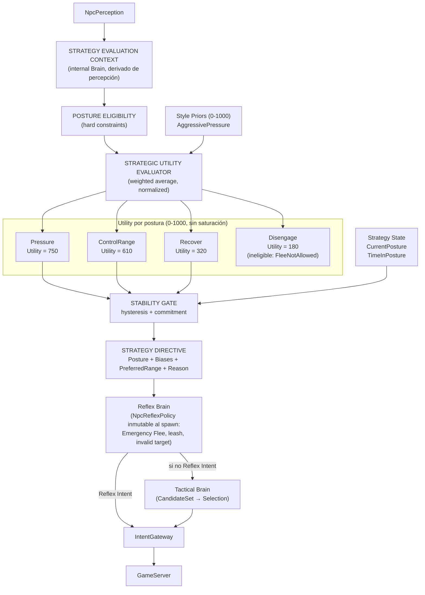

# Fase 4B.5 — Stateful Strategic Utility & Stability

**Estado:** Diseño
**Fecha:** 2026-08-13
**Revisión:** 2
**Prerequisitos:** Phase 4B (Static Strategy V1) certificada en `npc-brain-phase4-complete`

---

## 1. Motivación

### El problema

`StrategyBrain` actual recibe `NpcPerceptionSnapshot`, `NpcIntelligenceProfile` y `NpcStrategyProfile`, pero la percepción prácticamente no interviene en la decisión estratégica. Lo que ejecuta es:

```text
Leer perfil estático → scores constantes → flee threshold → preferred range → entregar modifiers
```

Estos valores son los mismos con HP al 100% que al 22%, con skill ready o unavailable, al inicio del combate o 40 segundos después.

### Lo que falta

No existe un concepto de **postura estratégica dinámica**. Un AggressivePressure sigue siendo AggressivePressure independientemente de la situación.

### Revisión 2

Corrige 8 P0 de la tercera auditoría:

1. Shadow longitudinal (V2 mantiene estado persistente entre Thinks)
2. Utility normalizada sin saturación (media ponderada, no suma + clamp)
3. Weights fixed-point reales (int, no double)
4. Neutral es especial (non-combat), no compite en utility
5. Posture Eligibility (hard constraints, no bajar scores artificialmente)
6. MaintainRange/Retreat adelantados a 4B.5 (sin ellos ControlRange/Disengage no pueden ejecutarse)
7. Reflex Emergency Flee separado de Strategic Disengage
8. Contracts boundary corregida (utility internals en Brain, solo Posture/Directive/Reason en Contracts)

---

## 2. Conceptos fundamentales

### Cuatro ejes de decisión (roadmap completo)

| Concepto | Pregunta | Cuándo cambia | Fase |
|---|---|---|---|
| **Style** | ¿Cómo suelo combatir? | Al spawn (inmutable) | 4A/4B |
| **Posture** | ¿Qué quiero conseguir AHORA? | Durante combate (dinámico) | **4B.5** |
| **Role** | ¿Qué soy estructuralmente? | Al spawn (inmutable) | 4C |
| **Combat Assignment** | ¿Qué tarea me asignó mi grupo? | Cuando squad emite directiva | 4E |

### Style vs Posture

```text
STYLE (permanente)                    POSTURE (dinámica, solo en combate)
"cómo suelo comportarme"              "qué estoy intentando ahora"

AggressivePressure                    Pressure
RangedControl                         ControlRange
Survival                              Recover
Balanced                              Disengage
```

**Neutral** es especial: no combate, no compite con utility (ver sección 7).

Style se convierte en **prior**: predisposición inicial, no jaula.

---

## 3. Arquitectura



### Regla: Strategy Directive NO genera Intent

Strategy produce una **directiva** (biases + postura + rango preferido). Tactical decide la acción concreta. Gateway autoriza.

---

## 4. Piezas a crear — Fronteras corregidas

### En `L2Dn.Npc.Contracts` (solo contratos serializables entre assemblies)

| Nombre | Propósito |
|---|---|
| `NpcStrategicPosture` | Enum: `Neutral`, `Pressure`, `ControlRange`, `Recover`, `Disengage` |
| `NpcStrategyDirective` | Resultado: postura + biases + rango preferido + razón (readonly record struct) |
| `NpcPostureTransitionReason` | Enum: `Initial`, `CombatStarted`, `CombatEnded`, `LowHealth`, `HealthRecovered`, `TargetInsideRange`, `TargetOutsideRange`, `HealAvailable`, `NoHealAvailable`, `FleeCondition`, `SkillReady`, `Timeout` |
| `NpcPostureUtilities` | `readonly record struct(int Pressure, int ControlRange, int Recover, int Disengage)` — snapshot diagnóstico para replay/telemetría |
| `NpcReflexPolicy` | `readonly record struct(int EmergencyFleeHpPercent, bool FleeAllowed, int LeashRange)` — inmutable, resuelto al spawn desde IntelligenceProfile + Static Strategy V1 |

### En `L2Dn.Npc.Brain` (internal — algoritmo y estado privado)

| Nombre | Propósito |
|---|---|
| `NpcStrategyEvaluationContext` | Contexto derivado de percepción para evaluación (internal, no Contracts) |
| `NpcStrategyState` | Estado: CurrentPosture, PostureEnteredTick, PreviousPosture, TransitionReason, DecisionSequence |
| `NpcAdaptiveShadowState` | Estado V2 persistente durante sesión Shadow |
| `NpcUtilityConsideration` | InputSelector + ResponseCurve + Weight (int 0-1000) |
| `NpcUtilityCurve` | Puntos piecewise-linear: `(int Input, int Utility)` |
| `NpcPosturePriorTable` | Priors por Style (int 0-1000) |
| `NpcPostureCandidateSet` | Candidatos con eligibility + utility (análogo a NpcTacticalCandidateSet) |
| `StrategicUtilityEvaluator` | Media ponderada normalizada |
| `PostureStabilityGate` | Hysteresis + commitment |
| `PostureEligibilityEvaluator` | Hard constraints (FleeAllowed, etc.) |
| `StrategyContextBuilder` | Construye contexto desde percepción |
| `StrategicDirectiveBuilder` | Construye directiva desde postura ganadora |

> **Regla**: `NpcUtilityConsideration`, `NpcUtilityCurve`, `NpcPosturePriorTable` y `PostureStabilityGate` son **implementación del algoritmo**. No pertenecen a Contracts. Solo `NpcStrategicPosture`, `NpcStrategyDirective`, `NpcPostureTransitionReason` y `NpcPostureUtilities` cruzan la frontera.

---

## 5. NpcStrategyEvaluationContext (internal Brain)

Derivado localmente de la percepción. Sin I/O, sin GameServer mutable.

```text
// Self
SelfHpRatio              int 0-1000
SelfMpRatio              int 0-1000
InCombat                 bool
CombatDurationTicks      int

// Target (derivado de percepción existente)
HasTarget                bool
TargetDistance            int (game units)
PreferredRange           int (del intelligence profile)
TargetWithinRange        bool (distance dentro de PreferredRange ± RangeTolerance)
TargetClose              bool (distance < preferred / 2)
TargetFar                bool (distance > preferred * 3/2)

// Capabilities
OffensiveSkillReady      bool
HealReady                bool
CanFlee                  bool (del NpcIntelligenceProfile)

// Environment
VisibleHostileCount      int
NearbyAllyCount          int

// Current strategy state (para stability gate)
CurrentPosture           NpcStrategicPosture
TimeInPostureTicks       int
```

### Limitación conocida

`TargetHpRatio` no está en `VisibleEntity` del snapshot actual. **4B.5 no inventa conocimiento que la percepción no posee.** Si se necesita target HP, se amplía Perception explícitamente como prerequisito de 4D (ver sección 21).

---

## 6. Utility System — Media ponderada normalizada

### Escala

Utilidades como enteros `0..1000`. **Sin saturación artificial.**

### El problema de la fórmula anterior (rev 1)

```text
PostureUtility = Prior + Σ(Curve(input) × Weight)  →  clamp 0..1000

Ejemplo: 650 + 600 + 350 + 250 = 1850 → clamp 1000
```

Múltiples posturas saturan a 1000 → empates → TieBreakPolicy gobierna.

### Fórmula corregida: media ponderada

```text
                    Prior × PriorWeight + Σ(Curve_i(input_i) × Weight_i)
PostureUtility = ─────────────────────────────────────────────────────────
                           PriorWeight + Σ(Weight_i)
```

Siempre produce resultado en `0..1000` naturalmente. Sin clamp.

### Fixed-point real

Todos los weights y curve outputs son `int 0..1000`. Cálculo con `long accumulator`:

```csharp
long numerator = (long)prior * priorWeight;
long denominator = priorWeight;

foreach (var c in considerations)
{
    int curveOutput = c.Curve.Evaluate(input);  // int 0..1000
    numerator += (long)curveOutput * c.Weight;   // int 0..1000
    denominator += c.Weight;
}

int utility = (int)(numerator / denominator);    // int 0..1000, sin overflow
```

Zero allocation. Determinista. Reproducible.

### Ejemplo corregido

```text
Posture: Pressure
  Prior           = 650 × Weight 1000
  HP healthy      = 900 × Weight 1000
  Skill ready     = 800 × Weight  700
  Target close    = 700 × Weight  500

Numerator = 650×1000 + 900×1000 + 800×700 + 700×500
          = 650000 + 900000 + 560000 + 350000
          = 2460000

Denominator = 1000 + 1000 + 700 + 500 = 3200

Utility = 2460000 / 3200 = 768
```

```text
Pressure     = 768
ControlRange = 612
Recover      = 445
Disengage    = 280
```

Información relativa preservada. Sin saturación. Sin empates artificiales.

### Response Curves (piecewise-linear)

```text
Ejemplo: HP → RecoverCurve

HP 1000 (100%) ──── 0
HP  750  (75%) ──── 0
HP  500  (50%) ──── 200
HP  300  (30%) ──── 600
HP  100  (10%) ──── 1000

Puntos: [(1000, 0), (750, 0), (500, 200), (300, 600), (100, 1000)]
```

Interpolación lineal entre puntos. Input y output: int.

---

## 7. Neutral — Postura especial, no competitiva

`Neutral` NO participa en utility evaluation.

```text
NO COMBAT / NO TARGET
      ↓
Posture = Neutral (automático)

COMBAT STARTED
      ↓
Utility evaluation
      ↓
Pressure / ControlRange / Recover / Disengage

COMBAT ENDED
      ↓
Posture = Neutral (automático)
```

### Reglas

- `Neutral` es el estado por defecto fuera de combate.
- Al entrar en combate: transición automática a la postura con mayor utility.
- Al salir de combate: transición automática a `Neutral`.
- `Neutral` nunca tiene un utility score. No compite.
- `TransitionReason` es `CombatStarted` o `CombatEnded`.

---

## 8. Posture Eligibility — Hard constraints

No todas las posturas están siempre disponibles. La elegibilidad es un hard constraint, no un ajuste de scores.

```text
NpcPostureCandidate:
  Posture              NpcStrategicPosture
  Utility              int 0-1000
  Eligible             bool
  IneligibilityReason  NpcPostureIneligibilityReason?
```

### Reglas de eligibilidad

| Postura | Elegible si | Ineligible si |
|---|---|---|
| **Pressure** | Siempre | — |
| **ControlRange** | `HasTarget` | No target |
| **Recover** | `HealReady` OR `CanFlee` | Sin heal ni flee |
| **Disengage** | `CanFlee` (del `NpcIntelligenceProfile`) | `FleeNotAllowed` |

```text
NpcPostureIneligibilityReason:
  FleeNotAllowed
  NoTarget
  NoRecoveryOption
```

La postura ganadora debe ser **elegible**. Si la postura con mayor utility es ineligible, se toma la siguiente elegible. Si ninguna es elegible (extremadamente raro), Pressure (siempre elegible) gana.

---

## 9. Reflex Emergency Flee vs Strategic Disengage

### Hallazgo

El código actual de `ReflexBrain` recibe `strategy.EffectiveFleeHpPercent` para decidir Flee. Los perfiles existentes realmente tienen overrides diferentes:

```text
AggressivePressure → FleeHp override = 5%
Survival           → FleeHp override = 30%
Balanced           → default (IntelligenceProfile)
RangedControl      → default (IntelligenceProfile)
```

Decir "Reflex nunca depende de Strategy" rompe backward compatibility, porque Phase 4B **sí** usa ese override.

### Solución: NpcReflexPolicy

Se introduce `NpcReflexPolicy`: resuelta **una sola vez** al crear/configurar el NPC (spawn-time), a partir de datos estáticos.

```text
NpcIntelligenceProfile
+
Static Strategy V1 (Style overrides)
        ↓
NpcReflexPolicy (inmutable durante la encarnación)
        ↓
EmergencyFleeHpPercent    (resuelto al spawn, no en Think)
FleeAllowed               (del IntelligenceProfile)
LeashRange                (del IntelligenceProfile)
```

`ReflexBrain` solo consume `NpcReflexPolicy`. Nunca:

- Dynamic Posture (Strategy V2)
- Neural Policy / PolicyAdvice
- Squad Directive / CombatAssignment

### Invariant corregido

> **Reflex nunca depende de Strategy adaptativa, Neural Policy ni Squad durante Think.** Su política de emergencia es **inmutable durante la encarnación del NPC**.

Esto preserva:

```text
Adaptive Disabled = Phase 4B exacta
  → NpcReflexPolicy.EmergencyFleeHpPercent
    = strategy.FleeHpPercentOverride ?? intelligence.FleeHpPercent
  → idéntico a lo que Phase 4B produce hoy

Adaptive Enabled = Strategy V2
  → NpcReflexPolicy sigue siendo la misma (resuelta al spawn)
  → la postura dinámica NO modifica el threshold de emergency flee
  → Strategic Disengage es un bias táctico, no una regla de Reflex
```

### Ubicación

```text
NpcReflexPolicy → L2Dn.Npc.Contracts (readonly record struct)
```

Es un contrato inmutable que Reflex consume. No contiene lógica de evaluación.

### Separación limpia

```text
REFLEX EMERGENCY FLEE
────────────────────
"debo escapar AHORA por seguridad"

Fuente: NpcReflexPolicy.EmergencyFleeHpPercent (inmutable, resuelto al spawn)
Condición: HP < threshold AND FleeAllowed
Autoridad: ABSOLUTA, ignora postura/commitment/squad
No depende de: Strategy adaptativa, Neural, Squad, Posture dinámica

vs

STRATEGIC DISENGAGE
───────────────────
"creo que retirarme es tácticamente conveniente"

Fuente: Posture = Disengage
Mecanismo: StrategyDirective → Tactical → Retreat/MaintainRange candidates
Autoridad: Sujeta a Tactical evaluation y Gateway
```

### Jerarquía resultante

```text
1. Reflex Emergency Flee     → HP < NpcReflexPolicy.EmergencyFleeHpPercent → inmediato
2. Strategy Disengage        → Posture=Disengage          → via Tactical candidates
3. Strategy Recover/Retreat  → Posture=Recover, Range↑    → via Tactical candidates
```

---

## 10. Movement Primitives adelantadas a 4B.5

### Problema

4B.5 declara posturas que requieren movimientos que no existen:

- `ControlRange` → "mantener distancia preferida" → no existe `MaintainRange`
- `Recover` → "alejarse para curar" → no existe `Retreat`
- `Disengage` → "retirarse" → no existe `Retreat`

### Solución: adelantar MaintainRange y Retreat

**Dentro de 4B.5** (movimientos mínimos necesarios):

```text
MaintainRange(preferredRange, tolerance)
  → si target < preferred - tolerance → retroceder
  → si target > preferred + tolerance → acercar
  → si dentro de banda → no moverse

Retreat(distance)
  → alejarse del target una distancia estimada
  → dirección: opuesta al target
  → GeoEngine valida
  → si bloqueado → alternativas ±30°, ±60°, ±90°
  → si todas bloqueadas → mantener posición
```

**Se mantienen en 4D.5** (necesarios principalmente para Squad):

```text
FlankTarget(side, distance)
FormationSlot(slotId, referenceFrame)
CircleTarget(direction, radius)
Scatter
```

### Implementación en 4B.5

Ambos movimientos se expresan como **Tactical candidates** adicionales, no como intents directos desde Strategy:

```text
StrategyDirective → Tactical
  ↓
TacticalActionEvaluator.BuildCandidates()
  incluye: MaintainRange, Retreat (si directiva lo sugiere)
  ↓
CandidateSet → Selection → Intent → Gateway
```

---

## 11. Strategy Directive

La postura ganadora se traduce en biases tácticos:

```text
Posture: Recover
  AttackBias         = -150  (int, escala ±1000)
  ApproachBias       = -200
  OffensiveSkillBias = -100
  HealBias           = +350
  FleeBias           = +250
  RetreatBias        = +200  (nuevo, para MaintainRange/Retreat)
  PreferredRange     = 500
  Reason             = LowHealth
```

```text
Posture: Pressure
  AttackBias         = +100
  ApproachBias       = +150
  OffensiveSkillBias = +200
  HealBias           = -100
  FleeBias           = -200
  RetreatBias        = -150
  PreferredRange     = 200
  Reason             = Initial
```

```text
Posture: ControlRange
  AttackBias         = +50
  ApproachBias       = -100
  OffensiveSkillBias = +150
  HealBias           = 0
  FleeBias           = 0
  RetreatBias        = +100
  PreferredRange     = intelligence.PreferredRange (sin modificar)
  Reason             = TargetInsideRange
```

Los biases son `int` (escala ±1000). Sin floats.

### Rango de Tactical Scores

```text
TACTICAL_SCORE_MIN = 0
TACTICAL_SCORE_MAX = 1000

effectiveScore = Clamp(
    baseScore + roleDelta + directiveBias,
    0,
    1000)
```

Ejemplo con Recover directive:

```text
Attack:  baseScore=60, roleDelta=+10, directiveBias=-150  →  Clamp(-80, 0, 1000) = 0
Heal:    baseScore=100, roleDelta=0, directiveBias=+350   →  Clamp(450, 0, 1000) = 450
Flee:    baseScore=100, roleDelta=-20, directiveBias=+250 →  Clamp(330, 0, 1000) = 330
```

Scores negativos no existen. Un score clamped a 0 significa "no considerar esta acción" sin necesidad de eliminarla del CandidateSet (eligibility hace eso). El rango estable `[0, 1000]` garantiza que el expert label para Behavior Cloning (4F-A) opera sobre una escala normalizada y predecible.

---

## 12. Tie-Break explícito

### Problema actual

`Prefer()` usa `candidate.Score > current.Score`. Empate → orden del código gana.

### Solución

```text
Score → TieBreakPolicy → Winner
```

`NpcTieBreakPolicy` (internal Brain):

```text
PreferOffensive    → Attack > OffensiveSkill > Approach > MaintainRange > Heal > Retreat > Flee
PreferDefensive    → Heal > Retreat > Flee > MaintainRange > Approach > Attack > OffensiveSkill
PreferMobility     → Approach > MaintainRange > Retreat > Flee > Attack > OffensiveSkill > Heal
```

Configurable por Style. Explícito y testeable.

---

## 13. Strategy State (internal Brain)

```text
internal NpcStrategyState:
  CurrentPosture               NpcStrategicPosture
  PostureEnteredWorldTick      long
  PreviousPosture              NpcStrategicPosture
  LastTransitionReason         NpcPostureTransitionReason
  StrategicDecisionSequence    int (monótono, para seed)
```

**Las utility scores NO se persisten en el state.** Son resultado diagnóstico del Think. Se emiten como `NpcPostureUtilities` (readonly record struct) para telemetría/replay y se descartan.

---

## 14. Shadow longitudinal

### Problema de rev 1

```text
Shadow descarta estado V2 en cada Think
→ nunca valida hysteresis/commitment longitudinalmente
```

### Solución: NpcAdaptiveShadowState

```text
NpcBrainState real                  NpcAdaptiveShadowState
     ↓                                   ↓
Static V1                          Stateful V2
     ↓                                   ↓
GAMEPLAY                           NO GAMEPLAY
                                        ↓
                                   telemetría + comparación
```

V2 mantiene un `NpcAdaptiveShadowState` **persistente durante toda la sesión Shadow**, independiente del `NpcBrainState` real.

```text
internal NpcAdaptiveShadowState:
  V2StrategyState              NpcStrategyState  (misma estructura)
  CreatedAtWorldTick           long
  TotalThinksShadowed          int
  TotalPostureTransitions      int
  LastComparisonResult         ShadowComparisonOutcome
```

### Lifecycle

```text
NPC spawn → crear NpcAdaptiveShadowState (Posture=Neutral)
NPC Think (Shadow mode):
  1. V1 evalúa → Decision A → persist → GAMEPLAY
  2. V2 evalúa con NpcAdaptiveShadowState → Decision B → persist shadow state
  3. Comparar A vs B → telemetría
NPC death/despawn → descartar shadow state
```

### Percepción

V2 recibe la **misma percepción que V1** (del mundo real producido por V1). No es un universo contrafactual perfecto, pero **sí permite validar el estado estratégico longitudinal**: hysteresis, commitment, dwell time, transition stability.

Replay offline proporciona evaluación contrafactual más controlada.

---

## 15. Stability Gate (Hysteresis + Commitment)

### Switch Margin

```text
Current: Pressure    Utility = 700
New:     Recover     Utility = 720

Recover debe superar: Current + SwitchMargin
700 + 100 = 800

720 < 800 → NO cambiar
```

`SwitchMargin`: int (default 100).

### Minimum Posture Duration

```text
MinimumPostureDurationTicks: int (configurable)
```

Una vez en `Recover`, no puede salir antes de MinDuration.

**Excepción**: Reflex Emergency Flee siempre tiene autoridad superior.

### Range Tolerance

```text
PreferredRange = 600
RangeTolerance = 60

Distance 540..660 → NO provocar cambio de postura por "fuera de rango"
```

---

## 16. Style como Prior (escala 0-1000)

Style produce priors fijos. Son la predisposición, no la decisión.

```text
AggressivePressure:
  Pressure prior     = 650
  ControlRange prior = 350
  Recover prior      = 250
  Disengage prior    = 100

Survival:
  Pressure prior     = 300
  ControlRange prior = 350
  Recover prior      = 600
  Disengage prior    = 450

RangedControl:
  Pressure prior     = 400
  ControlRange prior = 700
  Recover prior      = 300
  Disengage prior    = 200

Balanced:
  Pressure prior     = 500
  ControlRange prior = 500
  Recover prior      = 400
  Disengage prior    = 250
```

Escala: `int 0..1000`. Estos son **fuente de verdad** para la escala.

En Phase 4C, Role aplica **deltas signed** sobre estos priors:

```text
effectivePosturePrior = Clamp(Style.PosturePrior + Role.PosturePriorDelta, 0, 1000)
```

Sin el clamp, `Raid.DisengagePriorDelta = -200` sobre `AggressivePressure.DisengagePrior = 100` produce -100, rompiendo la invariante `[0,1000]` del weighted average.

---

## 17. Relación con 4C — Escalas sincronizadas

### Style Prior: `int 0..1000` (fuente de verdad, definido en 4B.5)

### Role Delta: `int signed` (definido en 4C)

```text
Elite:
  PressurePriorDelta      = +100
  ControlRangePriorDelta  = +50
  RecoverPriorDelta       = -50
  DisengagePriorDelta     = -100
  SwitchMarginDelta       = +50    (int, unidad: utility points)
  MinDurationDelta        = +100   (int, unidad: ticks)

Mob:
  Todos = 0 (identidad)
```

### Composición

```text
effectivePosturePrior    = Clamp(Style.Prior + Role.PriorDelta, 0, 1000)
effectiveSwitchMargin    = Max(0, baseSwitchMargin + Role.SwitchMarginDelta)
effectiveMinDuration     = Max(0, baseMinDuration + Role.MinDurationDelta)
effectiveTacticalScore   = Clamp(Style.TacticalBase + Role.TacticalDelta + Directive.Bias, 0, 1000)
```

> **Invariante**: `effectivePosturePrior ∈ [0, 1000]`, `effectiveSwitchMargin ≥ 0`, `effectiveMinDuration ≥ 0`. El weighted average solo produce resultados correctos si todos sus inputs están en `[0, 1000]`.

`CommitmentDelta` de rev 1 se reemplaza por `SwitchMarginDelta` + `MinDurationDelta` (conceptos diferentes, no ambiguos).

---

## 18. Subfases de implementación

| Subfase | Implementación | Dependencia |
|---|---|---|
| 4B.5.0 | Congelar Static Strategy V1 como baseline | — |
| 4B.5.1 | `NpcReflexPolicy` (readonly record struct en Contracts) + resolver al spawn desde IntelligenceProfile + Static Strategy V1. ReflexBrain consume NpcReflexPolicy en lugar de strategy.EffectiveFleeHpPercent | 4B.5.0 |
| 4B.5.2 | `MaintainRange` + `Retreat` como Tactical candidates (movimiento mínimo) | 4B.5.1 |
| 4B.5.3 | `NpcStrategicPosture` + `NpcPostureTransitionReason` + `NpcStrategyDirective` en Contracts | 4B.5.2 |
| 4B.5.4 | `NpcStrategyEvaluationContext` + `StrategyContextBuilder` (internal Brain) | 4B.5.3 |
| 4B.5.5 | `NpcUtilityConsideration` + `NpcUtilityCurve` + `NpcPosturePriorTable` (internal Brain) | 4B.5.4 |
| 4B.5.6 | `StrategicUtilityEvaluator` (media ponderada normalizada, fixed-point) | 4B.5.5 |
| 4B.5.7 | `PostureEligibilityEvaluator` + `NpcPostureCandidateSet` | 4B.5.6 |
| 4B.5.8 | `NpcStrategyState` + `PostureStabilityGate` (hysteresis + commitment) | 4B.5.7 |
| 4B.5.9 | `StrategicDirectiveBuilder` (postura → biases tácticos) | 4B.5.8 |
| 4B.5.10 | `NpcTieBreakPolicy` en TacticalActionEvaluator | 4B.5.9 |
| 4B.5.11 | `NpcAdaptiveShadowState` (Shadow longitudinal) | 4B.5.10 |
| 4B.5.12 | Stateful replay (postura + utilities + transiciones + razones + directiva + intent) | 4B.5.11 |
| 4B.5.13 | Telemetría OTLP (postura, transiciones, hysteresis, márgenes, Shadow comparison) | 4B.5.12 |
| 4B.5.14 | R1-R5 con Strategy Adaptive Enabled | 4B.5.13 |
| 4B.5.15 | Laboratorio real (Talking Island, templates conocidos) | 4B.5.14 |
| 4B.5.16 | Rollout controlado (waves 1-3) | 4B.5.15 |
| 4B.5.17 | Checkpoint + rollback verificado | 4B.5.16 |

---

## 19. Modos de rollout

```text
NPC_STRATEGY_ADAPTIVE_MODE:
  Disabled  → Static Strategy V1 exactamente como Phase 4B
  Shadow    → Static V1 ejecuta / Stateful V2 evalúa con estado longitudinal
  Enabled   → Stateful V2 ejecuta
```

Rollback: `NPC_STRATEGY_ADAPTIVE_MODE=Disabled` → vuelve exactamente a Phase 4B.

---

## 20. Ejemplo completo

### Orc — Style: AggressivePressure

**Inicio del combate** (transición de Neutral):

```text
HP: 100%  Target: 200 units  Skill: Ready  CanFlee: true

Eligibility:
  Pressure     ✅
  ControlRange ✅ (HasTarget)
  Recover      ✅ (HealReady)
  Disengage    ✅ (CanFlee)

Utilities (media ponderada):
  Pressure     = (650×1000 + 900×1000 + 800×700 + 700×500) / (1000+1000+700+500) = 768
  ControlRange = (350×1000 + 600×800 + 200×500) / (1000+800+500) = 300400/2300 = 612  (hypothetical)
  Recover      = (250×1000 + 0×1000 + 800×200) / (1000+1000+200) = 410000/2200 = 186
  Disengage    = (100×1000 + 50×500) / (1000+500) = 125000/1500 = 83

Winner: Pressure (768)
TransitionReason: CombatStarted
Directive: Attack+100, Skill+200, Approach+150, Heal-100, Flee-200, Retreat-150, Range=200
```

**Recibe daño — HP 24%, Heal ready:**

```text
Utilities:
  Pressure     = (...HP curve penalty...) = 420
  ControlRange = 380
  Recover      = (...HP low boost + Heal ready...) = 780
  Disengage    = (...HP low boost...) = 550

Stability: Current=Pressure(420), Challenger=Recover(780)
  Switch threshold: 420 + 100(margin) = 520
  780 > 520 → ✅ TRANSICIÓN

New Posture: Recover
Reason: LowHealth
Directive: Attack-150, Heal+350, Retreat+200, Range=500
```

**Se cura — HP 65%:**

```text
Utilities:
  Pressure     = (...HP moderate...) = 710
  Recover      = (...HP moderate, heal on cooldown...) = 350

Stability: Current=Recover(350), Challenger=Pressure(710)
  Switch threshold: 350 + 100 = 450
  710 > 450 → ✅ TRANSICIÓN (si pasó MinDuration)

New Posture: Pressure
Reason: HealthRecovered
```

---

## 21. Prerequisitos y dependencias

### TargetHpRatio (4D dependency)

`NpcPolicyObservationV1` en 4D declara `CurrentTarget.HpRatio`. Pero `NpcPerceptionSnapshot` actual no contiene HP del target.

**4B.5 NO requiere TargetHpRatio.** Funciona con hechos existentes: `SelfHpRatio`, `TargetDistance`, `SkillReady`, `HealReady`, etc.

**4D debe resolver esto** con una de:

```text
A) ObservationV1 no contiene TargetHpRatio (V1 decide acción, no evalúa salud del target)
B) Perception Schema V2 (antes de 4D): agrega target vitals explícitos
```

La decisión se toma antes de implementar 4D, no bloquea 4B.5.

---

## 22. Lo que NO incluye

- Role (4C)
- Squad / Commander / Raid (4E+)
- Neural Network / ONNX / RL / MARL
- LLM / memoria larga
- Target modeling / player profiling
- Remote workers / gRPC
- GOAP / HTN / Behavior Trees
- FlankTarget / FormationSlot / CircleTarget / Scatter (4D.5)
- Aprendizaje adaptativo

Solo: **un NPC individual capaz de cambiar racionalmente su postura durante un combate, de forma determinista, con movimientos mínimos (MaintainRange/Retreat) que permitan ejecutar lo que promete.**

---

## 23. Criterios de aceptación

| ID | Criterio | Tipo | Qué demuestra |
|---|---|---|---|
| 4B5-A1 | `NPC_STRATEGY_ADAPTIVE_MODE=Disabled` produce comportamiento bit-a-bit idéntico a Phase 4B | Comportamiento | Que Static V1 es el baseline exacto |
| 4B5-A2 | NPC `AggressivePressure` con HP<25% y Heal disponible transiciona a `Recover` | Comportamiento | Postura cambia con situación |
| 4B5-A3 | NPC en `Recover` con HP>70% y skill ready transiciona a `Pressure` o `ControlRange` | Comportamiento | Re-engagement funcional |
| 4B5-A4 | Oscilación HP 34%↔36% NO produce alternancia Recover↔Pressure | Comportamiento | Hysteresis funciona |
| 4B5-A5 | Postura recién adquirida no se abandona antes de `MinimumPostureDurationTicks` (excepto Reflex Emergency) | Comportamiento | Commitment funciona |
| 4B5-A6 | `Survival` en misma situación: `RecoverUtility >= AggressivePressure.RecoverUtility` | Comportamiento | Style es prior, no jaula |
| 4B5-A7 | Todo cambio de postura registra `NpcPostureTransitionReason` | Contrato | Explicabilidad |
| 4B5-A8 | Replay determinista: misma secuencia → mismas posturas, utilidades, transiciones, directivas, intents | Comportamiento | Reproducibilidad total |
| 4B5-A9 | Dos candidatos con score idéntico se resuelven por `NpcTieBreakPolicy`, no por orden de código | Contrato | Desempate explícito |
| 4B5-A10 | Strategy V2 P99 < 1 ms, preferiblemente < 0.5 ms | Rendimiento | No degrada hot path |
| 4B5-A11 | Zero network I/O, zero DB I/O, zero disk I/O | Rendimiento | Sin I/O en Think |
| 4B5-A12 | Hot-path allocations ≈ V1 | Rendimiento | Sin regresión de GC |
| 4B5-A13 | Critical P95 no > +25% vs V1 | Rendimiento | SLO preservado |
| 4B5-A14 | Utility scores son enteros 0-1000 (media ponderada normalizada, sin saturación) | Contrato | Determinismo + información preservada |
| 4B5-A15 | Weights son int 0-1000, cálculo con long accumulator | Contrato | Fixed-point real |
| 4B5-A16 | Reflex Emergency Flee usa SOLO `NpcReflexPolicy.EmergencyFleeHpPercent` (inmutable, resuelta al spawn desde IntelligenceProfile + Static Strategy V1). No depende de Strategy adaptativa, Neural ni Squad durante Think | Integración | Reflex inmutable durante encarnación |
| 4B5-A16b | `Adaptive Disabled` + `AggressivePressure` produce `NpcReflexPolicy.EmergencyFleeHpPercent = 5%` (idéntico a Phase 4B `strategy.FleeHpPercentOverride`) | Backward compat | Phase 4B exacta |
| 4B5-A17 | `Neutral` solo existe fuera de combate; no compite en utility evaluation | Contrato | Semántica clara |
| 4B5-A18 | Postura ineligible nunca es seleccionada (e.g. Disengage con FleeNotAllowed) | Contrato | Hard constraints |
| 4B5-A19 | Shadow mode mantiene estado V2 longitudinal durante toda la sesión | Comportamiento | Valida hysteresis/commitment en Shadow |
| 4B5-A20 | `MaintainRange` produce movimiento correcto (retroceder/acercar según distancia vs preferred) | Comportamiento | Movement mínimo funcional |
| 4B5-A21 | `Retreat` con todas direcciones bloqueadas → NPC mantiene posición, no se congela | Comportamiento | Fallback de movimiento |
| 4B5-A22 | `NpcUtilityConsideration` y `NpcUtilityCurve` están en Brain internal, no en Contracts | Arquitectura | Frontera correcta |

---

## 24. Telemetría

| Métrica | Tipo | Qué mide |
|---|---|---|
| `l2dn.npc.strategy.posture.selected` | Counter por postura | Distribución de posturas |
| `l2dn.npc.strategy.posture.transition` | Counter por transición | Frecuencia de cambios |
| `l2dn.npc.strategy.posture.dwell_ticks` | Histogram | Cuánto permanece en cada postura |
| `l2dn.npc.strategy.transition.suppressed` | Counter | Cambios evitados por hysteresis |
| `l2dn.npc.strategy.utility.margin` | Histogram | Diferencia entre ganador y segundo |
| `l2dn.npc.strategy.posture.ineligible` | Counter por razón | Posturas descartadas por hard constraints |
| `l2dn.npc.strategy.evaluate_us` | Histogram | Costo total evaluación (microsegundos) |
| `l2dn.npc.strategy.shadow.agreement` | Counter | V1 y V2 eligen misma acción |
| `l2dn.npc.strategy.shadow.divergence` | Counter | V1 y V2 eligen acción diferente |

Tags: `style` (4 valores), `posture` (5 valores). No ObjectId ni TemplateId.

---

## 25. Configuración

| Variable | Tipo | Default | Propósito |
|---|---|---|---|
| `NPC_STRATEGY_ADAPTIVE_MODE` | enum | `Disabled` | Disabled / Shadow / Enabled |
| `NPC_STRATEGY_SWITCH_MARGIN` | int | `100` | Margen mínimo para cambiar de postura (utility points) |
| `NPC_STRATEGY_MIN_POSTURE_TICKS` | int | TBD | Ticks mínimos en una postura |
| `NPC_STRATEGY_RANGE_TOLERANCE` | int | `60` | Tolerancia de rango (game units) |
| `NPC_STRATEGY_PRIOR_WEIGHT` | int | `1000` | Peso del prior en la media ponderada |

---

## 26. Rollback

`NPC_STRATEGY_ADAPTIVE_MODE=Disabled` → comportamiento bit-a-bit idéntico a Phase 4B. Sin residuo.

---

## 27. Relación con fases adyacentes

| Fase | Relación |
|---|---|
| **4B** | Preserva como baseline. Disabled = Phase 4B exacta. |
| **4C** | Consume 4B.5: Role aplica deltas signed sobre PosturePriors (escala 0-1000). SwitchMarginDelta y MinDurationDelta separados. |
| **4D** | PolicyArbitrator recibe StrategyDirective como input. Neural Policy aprende posturas. 4D resuelve TargetHpRatio availability. |
| **4D.5** | Recibe MaintainRange/Retreat de 4B.5. Agrega FlankTarget, FormationSlot, CircleTarget, Scatter. |
| **4E** | CombatAssignment modifica StrategyEvaluationContext, no scores directamente. NPC interpreta órdenes. |
| **4F-A** | Dataset incluye posturas, utilidades, transiciones → experto mucho más rico. |
| **4G** | Shadow compara decisiones con contexto de postura. Expert label = Tactical winner con postura context. |
