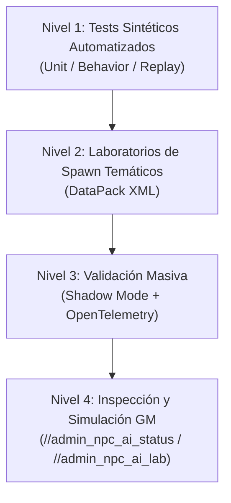

# Estrategia de Validación y Testing de IA de NPCs

Estado: **plan de validación — revisión 1, reconciliado con el código**. Fecha: 2026-08-18.
Complementa a [`01_Plan_Implementacion_NPC_AI.md`](01_Plan_Implementacion_NPC_AI.md) (secuencia de inteligencia) y a [`04_Criterios_Aceptacion_y_Testing.md`](04_Criterios_Aceptacion_y_Testing.md) (criterios por fase).

Este documento define **cómo se valida** la IA de NPCs en paralelo a su construcción. Es la capa transversal que acompaña a todas las fases del roadmap (4B.5 → 7+), y arranca **hoy** sobre lo ya certificado (Fases 2–4B).

---

## 1. Diagnóstico (confirmado contra el código)

Las pruebas actuales están limitadas a:
1. **Pruebas manuales** en Talking Island (`StrategyValidationLab.xml`).
2. **Inspección visual** de guardias de ciudad.

Limitaciones reales:
- **Arquetipos sin cobertura profunda**: arqueros con kiting, casters, healers/buffers, y sociales/facción (clan-help) no están validados a fondo.
- **Sin estrés de geodata**: el terreno plano de Talking Island no valida pathfinding bloqueado, muros, puertas ni desniveles (Cruma Tower / Catacumbas).
- **Sin estrés multi-objetivo**: la tabla de odio (`threat_entries`) no se verifica con varios jugadores alternando daño y CC (Root/Stun/Silence/Sleep).
- **Coste manual y baja reproducibilidad**: no hay garantía anti-regresión.

---

## 2. Pirámide de testing en 4 niveles



Cada nivel cubre una categoría de [`04_Criterios_Aceptacion_y_Testing.md`](04_Criterios_Aceptacion_y_Testing.md) (Contrato / Comportamiento / Integración / Arquitectura / Rendimiento / Gameplay / Rollback). N1 es la red de seguridad barata y determinista; N4 es la confirmación de juego real.

---

## 3. Nivel 1 — Tests sintéticos automatizados

### 3.1 `NpcScenarioBuilder` (nuevo)

Path correcto: **`L2Dn/Tests/L2Dn.Npc.Brain.Tests/`**. Hoy solo existen `NpcBrainTests.cs` y `NpcStrategyDecisionComparerTests.cs`; no hay builder.

```csharp
NpcScenarioBuilder.CreateArcher().WithTargetAtRange(150).WithTargetApproaching()
NpcScenarioBuilder.CreateHealer().WithAllyHp(25).WithEnemyAttacking()   // forward-looking (4E)
NpcScenarioBuilder.CreateMelee().WithRootDebuff().WithSkillReady()
```

### 3.2 Matriz de arquetipos — **estado de implementación real**

> Clave: un test sintético solo puede pasar si la inteligencia que ejercita ya existe. Los arquetipos 3 y parte del 4 son **forward-looking**.

| # | Arquetipo | Testeable hoy | Dependencia si falta |
|---|---|---|---|
| 1 | Melee / Asalto | ✅ Sí (Fase 4) | — |
| 2 | Ranged / Arqueros y Magos (kiting) | ✅ Sí (RangedControl + rango de arco) | — |
| 3 | Soporte / Healers / Shamans (curar **aliados**, buff) | ⚠️ Parcial | Autocura existe (Survival). Cura/buff a aliados requiere percepción de aliados → **4E** |
| 4 | CC / Debuffs (Root, Silence) | ⚠️ Parcial | La percepción ya expone `MovementDisabled` y `AllSkillsDisabled`; hay que **verificar/ampliar** que el Brain los respeta (no emitir movimiento inútil / no castear) |
| 5 | Disputa de odio multi-target | ✅ Sí (`threat_entries`) | — |
| 6 | Leash y retorno a spawn | ✅ Sí (Reflex `ReturnHomeIntent`) | — |

**Conclusión de secuenciación**: los tests de los arquetipos 1, 2, 5 y 6 se implementan **ya** (bloquean regresiones de la Fase 4 actual). Los arquetipos 3 (aliados) y parte del 4 (CC) se escriben como tests **marcados** que se activan al aterrizar 4E y el manejo explícito de CC.

---

## 4. Nivel 2 — Laboratorios de spawn temáticos

Path base real: **`L2Dn/L2Dn.GameServer/DataPack/spawns/`**, organizado por regiones. `StrategyValidationLab.xml` vive en `TalkingIsland/`. Se propone un subdirectorio dedicado **`Labs/`** para no mezclar validación con spawns de producción.

| Laboratorio | Archivo (nuevo) | Zona real existente | Propósito |
|---|---|---|---|
| Rango & Kiting | `Labs/Lab_Ranged_Combat.xml` | Campo abierto / Ruinas | Arqueros (Orc Archer 20006, Skeleton Archer), magos, control de distancia |
| Social & Facciones | `Labs/Lab_Social_Faction.xml` | Zona cerrada | Líder + minions + healer (clan-help/assist) |
| Geodata & Desniveles | `Labs/Lab_Geodata_Navigation.xml` | Cruma (`Dion/CrumaMarshlands.xml`) o Catacumbas (`Catacombs/*.xml`) | Muros, pilares, puertas, eje Z |
| Crowd Control | `Labs/Lab_Crowd_Control.xml` | Arena cerrada | Stun, root, poison, fear y recuperación |

> El lab de geodata debe **reutilizar coordenadas reales** de Cruma/Catacumbas ya pobladas, para heredar el geodata y las puertas existentes en lugar de simularlas.

---

## 5. Nivel 3 — Shadow Mode + OpenTelemetry

### 5.1 Variable de entorno (corrección de nomenclatura)

El código lee la config desde entorno via `NpcStrategyOptions.FromEnvironment`:

| Variable | Fase | Estado |
|---|---|---|
| `NPC_STRATEGY_MODE` = `Disabled`/…`Shadow`/…`Enabled` | Fase 4 (actual) | **Existe** |
| `NPC_STRATEGY_TEMPLATE_PROFILES` | Fase 4 (actual) | **Existe** |
| `NPC_STRATEGY_ADAPTIVE_MODE` | 4B.5+ | **No existe aún** (se introduce en 4B.5) |

> Al validar 4B.5 y posteriores, el flag es `NPC_STRATEGY_ADAPTIVE_MODE`, **no** `NPC_STRATEGY_MODE`. No confundir: uno es el modo de la estrategia estática V1; el otro, de la estrategia adaptativa V2.

### 5.2 Métricas (reconciliación: reutilizar, no duplicar)

El telemetry ya emite (confirmado en `NpcAiTelemetry.cs`):

| Propuesto en el plan | Métrica existente a reutilizar |
|---|---|
| `decision_mismatch` | `l2dn.npc.strategy.shadow.changed_decision` + `l2dn.npc.strategy.shadow.comparison` (y `l2dn.npc.brain.shadow.match/diff`) |
| `evaluation_duration_ms` (P95/P99) | `l2dn.npc.strategy.evaluation.duration` |
| `fallback_count` (por qué falló) | `l2dn.npc.strategy.fallback` |

Lo que **falta** y conviene añadir como tags (no métricas nuevas): etiqueta `archetype` / `template_kind` para poder desglosar discrepancias por tipo de mob. Hoy los tags se limitan a `style` y `mode`.

### 5.3 Resultado

Dejar el servidor en Shadow y jugar/explorar mazmorras registra toda discrepancia automáticamente, sin alterar el gameplay (el comparador `NpcStrategyDecisionComparer` ya existe y funciona).

---

## 6. Nivel 4 — Herramientas de inspección GM

### 6.1 Convención de comandos admin (corrección)

Los comandos GM se registran como `admin_xxx` en **`L2Dn/L2Dn.GameServer/Config/AdminCommands.xml`**, con handler `AdminXxx.cs` en **`L2Dn/L2Dn.GameServer.Scripts/Handlers/AdminCommandHandlers/`**, y se invocan como `//admin_xxx`. No existe aún ningún `AdminNpcAi.cs`.

Propuesta alineada a la convención:

- `//admin_npc_ai_status` → handler `AdminNpcAi.cs`. Muestra HTML/SysMessage con: perfil de IA (arquetipo/estilo/rol), postura estratégica (a partir de 4B.5), tabla de odio ordenada con distancias, último intent + duración en µs.
- `//admin_npc_ai_lab [nombre]` → teleporta al GM al lab y refresca spawns.

> La primera versión de `npc_ai_status` puede mostrarse **ya** (perfil + hate table + último intent). El campo "postura" se añade cuando 4B.5 introduzca `NpcStrategicPosture`. Existe la métrica `l2dn.npc.command.calls` para contar invocaciones si se quiere telemetría de uso.

---

## 7. Plan de implementación por fases (reconciliado con el roadmap)

| Fase de validación | Entregables | Dónde encaja en el roadmap de inteligencia |
|---|---|---|
| **V1 — Tests sintéticos** | `NpcScenarioBuilder` + tests arquetipos 1/2/5/6 (ya) y 3/4 (marcados) | Acompaña **4B.5** (los tests de postura de [`04_Criterios_Aceptacion_y_Testing.md`](04_Criterios_Aceptacion_y_Testing.md) usan este builder) y madura en 4C/4D |
| **V2 — Labs temáticos** | `Labs/Lab_*.xml` (4 labs) | Acompaña **4B.5** (rollout) y **4C** (carriles Elite/Minion/Raid) y **4E** (squad) |
| **V3 — Herramientas GM** | `AdminNpcAi.cs` + registros XML | Utilizable **ya**; el campo postura se completa en **4B.5** |
| **V4 — Shadow + OTel** | Entorno Docker con `NPC_STRATEGY_MODE=Shadow` + tags `archetype` + dashboards | Infraestructura de la Fase 4 **ya existente**; se extiende por cada fase (4B.5+ con `NPC_STRATEGY_ADAPTIVE_MODE`) |

### 7.1 Checklist de tareas

**V1**
- [ ] Crear `NpcScenarioBuilder` en `L2Dn/Tests/L2Dn.Npc.Brain.Tests/`.
- [ ] Tests arquetipos Ranged/Caster, Melee, Hate multi-jugador, Leash (testeables hoy).
- [ ] Tests marcados (skip/teoría) para Healer-aliativo y reacción a Root/Silence.

**V2**
- [ ] Crear `L2Dn/L2Dn.GameServer/DataPack/spawns/Labs/`.
- [ ] `Lab_Ranged_Combat.xml` (arqueros/magos por carriles).
- [ ] `Lab_Social_Faction.xml` (líder + minions + healer).
- [ ] `Lab_Geodata_Navigation.xml` (coordenadas Cruma/Catacumbas).
- [ ] `Lab_Crowd_Control.xml` (stun/root/poison/fear).

**V3**
- [ ] `AdminNpcAi.cs` + registrar `admin_npc_ai_status` y `admin_npc_ai_lab` en `AdminCommands.xml`.
- [ ] HTML con hate table, perfil, postura, últimos intents.

**V4**
- [ ] Entorno Docker con `NPC_STRATEGY_MODE=Shadow` (Fase 4) y, al aterrizar 4B.5, `NPC_STRATEGY_ADAPTIVE_MODE=Shadow`.
- [ ] Añadir tag `archetype` a la telemetría de shadow.
- [ ] Validar captura en `otel-collector-config.yml` + dashboard de discrepancias.
- [ ] Sesión en mazmorra + reporte de discrepancias.

---

## 8. Criterios de aceptación

1. **Cero regresiones**: `L2Dn.Npc.Brain.Tests` y `L2Dn.Npc.Contracts.Tests` al 100%.
2. **Cobertura de arquetipos**: ≥ 25 tests unitarios sobre los 6 arquetipos (los forward-looking, marcados como `Skip`/teoría con razón explícita hasta su fase).
3. **Visibilidad en vivo**: `//admin_npc_ai_status` muestra postura, hate table, perfil y último intent con precisión.
4. **Validación de geodata**: el lab de Cruma/Catacumbas demuestra ausencia de bucles infinitos de movimiento ante esquinas y puertas cerradas.
5. **Reutilización de telemetría**: las discrepancias se miden con las métricas existentes + tag `archetype`, sin duplicar nombres.

---

## 9. Riesgos y decisiones abiertas

| # | Riesgo / decisión | Resolución |
|---|---|---|
| 1 | Tests de arquetipos 3/4 escritos "a ciegas" antes de que exista la inteligencia | Escribirlos como teoría/skip con la fase de dependencia anotada |
| 2 | Lab de geodata sin geodata real | Reutilizar coordenadas ya pobladas de Cruma/Catacumbas |
| 3 | Confundir `NPC_STRATEGY_MODE` con `NPC_STRATEGY_ADAPTIVE_MODE` | Documentar ambos y su fase (ver §5.1) |
| 4 | Duplicar métricas de telemetría | Reutilizar las existentes y añadir tags, no métricas nuevas |
| 5 | `//npc_ai_status` rompe la convención `admin_` | Registrar como `admin_npc_ai_status` |
