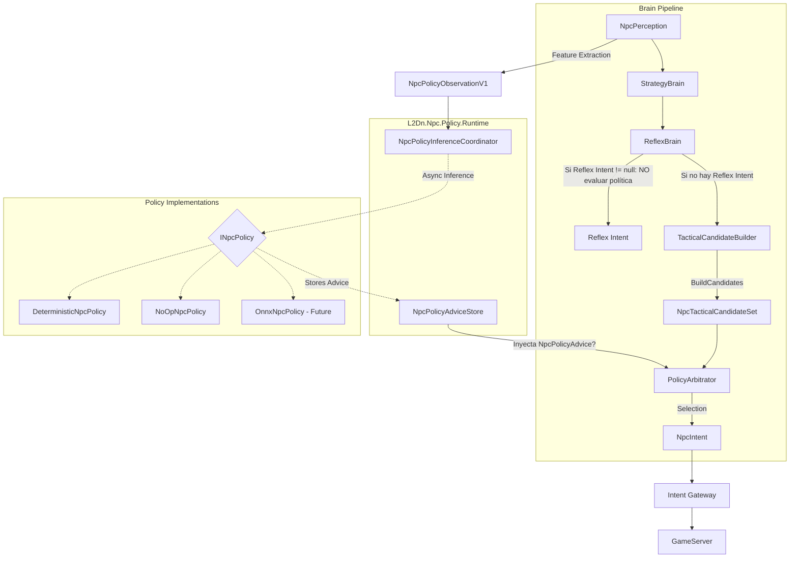

# Fase 4D — Policy Foundation

**Estado:** Diseño.
**Fecha:** Agosto 2026
**Revisión:** 2 (2026-08-13)

## 1. Objetivo
Introducir la **capa de política intercambiable** que permitirá más adelante conectar redes neuronales (LLM / ML) SIN modificar el pipeline existente. Esta capa se ubica después de la construcción de candidatos tácticos y antes de la selección final, proporcionando consejos probabilísticos que el cerebro táctico evalúa de manera segura.

## 2. Prerequisitos
- Fase 4C (Style × Role) completada y estabilizada.
- Entorno de Telemetría OTLP configurado.

## 3. Diagrama de Arquitectura



## 4. Piezas a crear

| Nombre | Ensamblado/Proyecto | Archivo propuesto | Propósito |
|---|---|---|---|
| `INpcPolicy` | `L2Dn.Npc.Contracts` | `INpcPolicy.cs` | Interfaz de política intercambiable |
| `NpcPolicyObservation` | `L2Dn.Npc.Contracts` | `NpcPolicyObservation.cs` | Representación explícita y versionada del estado |
| `NpcPolicyObservationV1` | `L2Dn.Npc.Contracts` | `NpcPolicyObservationV1.cs` | Primera versión de inputs estructurados |
| `NpcTacticalCandidate` | `L2Dn.Npc.Contracts` | `NpcTacticalCandidate.cs` | Representa un candidato (action, score determinista, eligible, ineligibilityReason) |
| `NpcTacticalCandidateSet` | `L2Dn.Npc.Contracts` | `NpcTacticalCandidateSet.cs` | Conjunto inmutable de candidatos (actúa como Action Masking implícito) |
| `NpcPolicyAdvice` | `L2Dn.Npc.Contracts` | `NpcPolicyAdvice.cs` | Recomendación con causalidad, biases y scores probabilísticos |
| `NpcPolicyAction` | `L2Dn.Npc.Contracts` | `NpcPolicyAction.cs` | Enumeración de acciones abstractas posibles |
| `NpcPolicyVersion` | `L2Dn.Npc.Contracts` | `NpcPolicyVersion.cs` | Versionado con Checksum |
| `NpcPolicyResult` | `L2Dn.Npc.Contracts` | `NpcPolicyResult.cs` | Resultado de la evaluación |
| `INpcPolicyInferenceEngine` | `L2Dn.Npc.Contracts` | `INpcPolicyInferenceEngine.cs` | Abstracción de motor de inferencia. `Policy.Runtime` consume esta interfaz; `Policy.Onnx` la implementa. Permite conectar ONNX local, gRPC remoto, NoOp o Mock sin modificar Runtime |
| `PolicyArbitrator` | `L2Dn.Npc.Brain` | `PolicyArbitrator.cs` | Selecciona la fuente de decisión según el modo: determinista para Disabled/fallback; neural logits sobre candidatos elegibles para Enabled; comparación paralela para Shadow. No combina ambas escalas aritméticamente (ADR-017 Opción A) |
| `NpcPolicyInferenceCoordinator` | `L2Dn.Npc.Policy.Runtime` | `NpcPolicyInferenceCoordinator.cs` | Coordinador de inferencia asíncrona |
| `NpcPolicyAdviceStore` | `L2Dn.Npc.Policy.Runtime` | `NpcPolicyAdviceStore.cs` | Almacén de advices inyectados al Brain |
| `NpcPolicyEvaluationTracker` | `L2Dn.Npc.Policy.Runtime` | `NpcPolicyEvaluationTracker.cs` | Seguimiento de latencia y correlaciones |
| `NpcPolicyRuntimeOptions` | `L2Dn.Npc.Policy.Runtime` | `NpcPolicyRuntimeOptions.cs` | Opciones de encolamiento y rendimiento |

### Composición en GameServer
El `GameServer` hace la composición final. El `Brain` recibe `NpcPolicyAdvice?` inyectado y **NUNCA** llama a `INpcPolicy` directamente. Esto elimina arquitectónicamente la posibilidad de que ONNX se convierta en una dependencia síncrona del ciclo de Think.
**Dependencias de ensamblado:**
- `Policy.Runtime` → `Contracts`
- `Policy.Onnx` → `Contracts`

## 5. Especificación Detallada

### NpcPolicyObservationV1
Contiene la abstracción del entorno estructurada. Su tamaño se define por `FeatureSchemaV1.Dimension` y sus campos escalares.
**Regla de oro: NUNCA poner ObjectId, PlayerId o Name como input.**
- **Self:** HP ratio, MP ratio, casting, moving, stunned, distance from home, combat duration, recent damage.
- **Environment:** nearby enemies count, nearest enemy distance, average enemy distance.
- **Intelligence:** Style, Role, FleeAllowed, PreferredRange.
- **CurrentTarget:**
  - `HasTarget` (bool)
  - `DistanceNormalized` (float, >= 0)
  - `IsCasting` (bool)
  - `IsMoving` (bool)
  - `IsDisabled` (bool)
  - `RelativeAngle` (float, 0-360)
  - `ThreatRatio` (float, 0-1)
  - `WithinPhysicalRange` (bool)

> **V1 no incluye `TargetHpRatio`.** Perception actual no contiene HP del target dentro de `VisibleEntity`, y el experto determinista (Tactical) que BC clonará no lo utiliza. `NpcPolicyObservationV2` lo incorporará cuando Perception lo exponga explícitamente, junto con `TargetCasting`, `TargetClassHint`, etc.

### NpcPolicyAdvice y Causalidad
El `NpcPolicyAdvice` incluye campos estrictos de causalidad para garantizar que un consejo estocástico no se aplique a un estado inválido:
- `NpcKey`: Identificador que **ya contiene ObjectId + Generation**.
- `BasedOnStateRevision`: Revisión del estado al momento de extraer la observación.
- `PolicyEvaluationId`: ID único para Shadow correlation.
- `GeneratedAtWorldTick`: Tick en que se generó.
- `ExpiresAtWorldTick`: Tick en que expira.
- `ModelVersion`: Versión del modelo.
- `FeatureSchemaVersion`: Versión del esquema de features.
- `ActionSchemaVersion`: Versión del esquema de acciones.
- `ActionPreferences`: Logits/scores por candidato elegible.

*(Nota: La versión 1 de la política decide exclusivamente la acción abstracta, NO el target ni la skill específica:*
- **V1:** BasicAttack, Approach, OffensiveSkill, Heal, Flee, Reposition
- **V2 (futuro):** + TargetCandidateSlots
- **V3 (futuro):** + SkillCandidateSlots

**ConfidenceScore:** Se mantiene exclusivamente para telemetría. NO debe usarse como barrera de seguridad, ya que las probabilidades de una red no están necesariamente calibradas.

### Action Masking mediante NpcTacticalCandidateSet
No existe un "Action Masker" aislado. `TacticalActionEvaluator` evalúa elegibilidad determinista (cooldowns, MP, rangos, disables) y expone `BuildCandidates()`, lo cual produce un `NpcTacticalCandidateSet` inmutable con `score`, `eligible` (bool) y `reason`.
- La política solo procesará o será validada contra el subset de candidatos que sean `eligible == true`. El CandidateSet *ES* la única fuente de la verdad para el Action Masking.

### Arbitraje e Independencia del Reflex (ADR-017)
1. **Reflex Brain:** Siempre evalúa primero (ej. targets muertos, out of leash). **Si Reflex genera un Intent (Intent != null), no se genera policy evaluation ni se consulta a la neural**, previniendo inferencias innecesarias.
2. Si Reflex no produce Intent, `TacticalCandidateBuilder` genera los candidatos.
3. El `PolicyArbitrator` toma el `NpcTacticalCandidateSet` y el `NpcPolicyAdvice` inyectado. Según el modo: **Disabled/fallback** → argmax sobre scores deterministas; **Enabled** → neural logits eligen directamente entre candidatos elegibles; **Shadow** → ambos evalúan en paralelo para comparación. No suma `deterministicScore + neuralScore`.
4. **Regla estricta de StateRevision (V1):** `Advice.BasedOnStateRevision == CurrentStateRevision` debe ser **EXACTO**. No existe un "delta configurable". Si la revisión semántica cambió, el advice es stale (obsoleto).
5. **Fallback:** Es invariante. Si la política falla, el advice expira o su revisión es obsoleta, el Arbitrator automáticamente recae sobre el `score` determinista mayor. No hay flag configurable para desactivar el fallback.

### Saturación del Inference Coordinator
El `NpcPolicyInferenceCoordinator` maneja la sobrecarga mediante una estrategia estricta:
- Bounded queue (cola delimitada).
- Single pending request / NPC (máximo de 1 petición concurrente por NPC).
- Latest wins (coalescing: si llega otra petición para el mismo NPC, sobrescribe la pendiente).
- Stale drop (descarta peticiones si la revisión queda obsoleta en cola).
- No blocking (nunca bloquea el pipeline determinista).

### ModelManifest
La validación y carga del modelo se acompaña de `model.manifest.json`:
```json
{
  "policyId": "...",
  "modelVersion": "...",
  "featureSchemaVersion": 1,
  "featureDimension": N,
  "actionSchemaVersion": 1,
  "actionCount": 6,
  "checksum": "...",
  "trainingDatasetVersion": "...",
  "createdAt": "..."
}
```
En startup, modelo y manifest se validan de forma conjunta. Si no coinciden, la política se marca como Disabled.

## 6. Ownership

| Componente | Equipo/Rol Responsable |
|---|---|
| `L2Dn.Npc.Contracts` (Policy) | Core Architecture Team |
| `L2Dn.Npc.Policy.Runtime` | AI Infrastructure Team |
| `L2Dn.Npc.Brain` (Arbitrator, Evaluator) | AI Engine Team |
| `TacticalCandidateBuilder` | Game Logic Team |

## 7. Lo que NO incluye
- Modificaciones al `ReflexBrain`.
- Implementación real de inferencia con ONNX (eso es Fase 4G).
- Target selection neural.
- `NpcPolicyContext` o estado mutable en `Contracts`. El runtime state (generaciones, cache local) es privado de `Brain`.

## 8. Criterios de aceptación

| ID | Criterio | Tipo | Qué demuestra |
|---|---|---|---|
| 4D-A1 | `DeterministicNpcPolicy` genera un advice que, al pasar por el `PolicyArbitrator`, produce idéntico resultado al sistema Phase 4C puro | Comportamiento | Transparencia semántica del pipeline |
| 4D-A2 | `NoOpNpcPolicy` produce advice obsoleto/nulo y fuerza el fallback determinista inmediato sin detener el combate | Comportamiento | Fallback invariante de latencia/fallo |
| 4D-A3 | Un advice con `BasedOnStateRevision` desactualizado es ignorado por el Arbitrator | Comportamiento | Protección de causalidad |
| 4D-A4 | La abstracción de features produce tensores de longitud exactamente `FeatureSchemaV1.Dimension` | Contrato | Formato rígido sin dimensiones hardcodeadas fijas y mágicas |
| 4D-A5 | Acciones con `eligible == false` en `NpcTacticalCandidateSet` NUNCA son seleccionadas sin importar el score neural | Integración | Hard constraints (cooldowns, disables) siempre ganan |

## 8b. Tests requeridos

### Contracts

| Test | Propiedad | Input → Output esperado |
|---|---|---|
| `CandidateSet_IsImmutable` | Inmutabilidad | Instancia creada → campos de solo lectura, sin setters |
| `Advice_CausalityFieldsRequired` | Contrato estricto | Creación sin NpcKey o BasedOnStateRevision → fallo |
| `ObservationV1_NoObjectIds` | Aislamiento | Reflection sobre campos → ningún PlayerId/ObjectId |

### Brain

| Test | Propiedad | Input → Output esperado |
|---|---|---|
| `Arbitrator_AppliesAdviceOnlyToEligibleCandidates` | Masking estricto | Advice maximiza Flee, pero Flee eligible=false → gana el siguiente mejor elegible |
| `Arbitrator_StaleRevision_TriggersFallback` | Causalidad temporal | Advice con Revision antigua → utiliza scores deterministas puros |
| `TacticalCandidateBuilder_BuildsCorrectMasks` | Validaciones deterministas | Muteado → Skills tienen eligible=false con ineligibilityReason=Silenced |

## 9. Telemetría
- `npc.brain.policy.evaluation_ms`: Tiempo gastado en el Evaluator/Arbitrator.
- `npc.brain.policy.fallback_rate`: Porcentaje de ciclos que cayeron en fallback por latencia o error.
- `l2dn.npc.policy.queue.depth`: Profundidad actual de la cola.
- `l2dn.npc.policy.queue.high_watermark`: Pico máximo de la cola.
- `l2dn.npc.policy.request.total`: Total de peticiones asíncronas iniciadas.
- `l2dn.npc.policy.request.coalesced`: Peticiones combinadas (latest wins) antes de ejecutarse.
- `l2dn.npc.policy.request.dropped_stale`: Peticiones descartadas sin ejecutar por obsolescencia.
- `l2dn.npc.policy.advice.applied`: Consejos evaluados y aplicados exitosamente.
- `l2dn.npc.policy.advice.stale`: Consejos rechazados por `BasedOnStateRevision` antiguo (`stale_advices`).
- `l2dn.npc.policy.advice.superseded`: Consejos descartados al recibir uno más nuevo.

## 10. Configuración
- `NPC_POLICY_MODE`: Valores posibles `Disabled`, `Shadow`, `Enabled`.
- `NPC_POLICY_ADVICE_TTL_TICKS`: Tiempo de vida en ticks antes de considerarse obsoleto.
- `NPC_POLICY_OBSERVATION_VERSION`: Versión del schema a emplear (ej. `V1`).

## 11. Rollback
- Ajustar `NPC_POLICY_MODE` a `Disabled`. El `PolicyArbitrator` simplemente devolverá el candidato determinista de mayor score sin procesar ningún advice.

## 12. Relación con fases adyacentes
- **Consume de:** Fase 4C (Roles y Estilos determinan parte del observation state).
- **Provee a:** Fase 4E (Escuadrones) y 4G (Shadow ONNX). El policy allocator será el punto de entrada para recomendaciones externas.

## 13. Experimentos / laboratorio
- Inyectar una política mock que siempre retorne máxima confianza para `Flee`, y verificar que un NPC en un `TacticalCandidateSet` donde `Flee` es elegible siempre huye, y donde `Flee` no es elegible, continúa atacando con normalidad.
