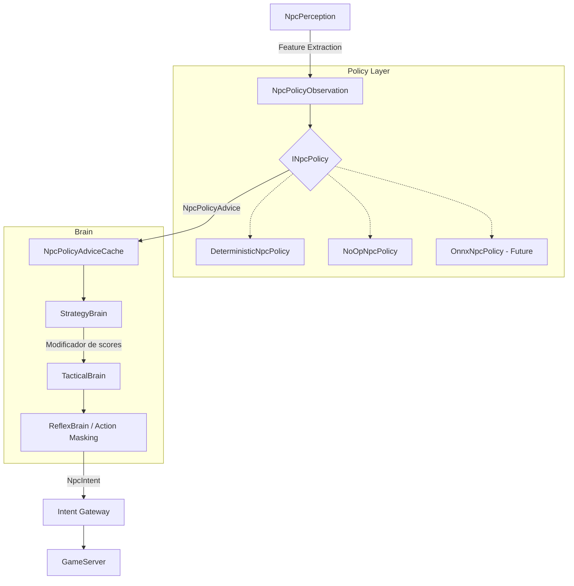

# Fase 4D — Policy Foundation

**Estado:** Diseño.
**Fecha:** Agosto 2026

## 1. Objetivo
Introducir la **capa de política intercambiable** que permitirá más adelante conectar redes neuronales (LLM / ML) SIN modificar el pipeline existente. Esta capa se ubica entre la percepción del NPC y la toma de decisiones, proporcionando consejos probabilísticos que el cerebro táctico puede usar o ignorar de manera segura.

## 2. Prerequisitos
- Fase 4C (Style × Role) completada y estabilizada.
- Entorno de Telemetría OTLP configurado.

## 3. Diagrama de Arquitectura

## 4. Piezas a crear

| Nombre | Ensamblado/Proyecto | Archivo propuesto | Propósito |
|---|---|---|---|
| `INpcPolicy` | `L2Dn.Npc.Contracts` | `INpcPolicy.cs` | Interfaz de política intercambiable |
| `NpcPolicyObservation` | `L2Dn.Npc.Contracts` | `NpcPolicyObservation.cs` | Representación explícita y versionada del estado |
| `NpcPolicyObservationV1` | `L2Dn.Npc.Contracts` | `NpcPolicyObservationV1.cs` | Primera versión con campos base, target, environment, history |
| `NpcPolicyContext` | `L2Dn.Npc.Contracts` | `NpcPolicyContext.cs` | Contexto de evaluación (perception + observation + state) |
| `NpcPolicyAdvice` | `L2Dn.Npc.Contracts` | `NpcPolicyAdvice.cs` | Recomendación con biases, expiración y confidence |
| `NpcPolicyAction` | `L2Dn.Npc.Contracts` | `NpcPolicyAction.cs` | Enumeración de acciones posibles para la policy |
| `NpcPolicyActionMask` | `L2Dn.Npc.Contracts` | `NpcPolicyActionMask.cs` | Máscara de acciones válidas antes de enviar a la policy/tactical |
| `NpcPolicyVersion` | `L2Dn.Npc.Contracts` | `NpcPolicyVersion.cs` | Versionado con Checksum |
| `NpcPolicyResult` | `L2Dn.Npc.Contracts` | `NpcPolicyResult.cs` | Resultado de la evaluación |
| `DeterministicNpcPolicy` | `L2Dn.Npc.Brain` | `DeterministicNpcPolicy.cs` | Implementación que replica el comportamiento de Strategy/Tactical |
| `NoOpNpcPolicy` | `L2Dn.Npc.Brain` | `NoOpNpcPolicy.cs` | Implementación nula para testing |
| `NpcPolicyEvaluator` | `L2Dn.Npc.Brain` | `NpcPolicyEvaluator.cs` | Coordinador de políticas |
| `NpcPolicyAdviceCache` | `L2Dn.Npc.Brain` | `NpcPolicyAdviceCache.cs` | Cache bounded de advices por NPC |
| `OnnxNpcPolicy` | `L2Dn.Npc.Brain` | `OnnxNpcPolicy.cs` | Esqueleto para ONNX Runtime |

## 5. Especificación Detallada

### NpcPolicyObservationV1
Contiene la abstracción del entorno. **Regla de oro: NUNCA poner ObjectId/PlayerId como input**.
- **Self:** HP ratio, MP ratio, casting, moving, stunned, distance from home, combat duration, recent damage received.
- **Current target:** distance, HP ratio, casting, moving, is melee/ranged, threat level.
- **Environment:** nearby enemies count, nearby allies count, nearest enemy distance, average enemy distance.
- **Intelligence:** Style, Role, FleeAllowed, PreferredRange.
- **History:** last action, last target change tick, damage received/dealt last 1s, recent ally death.

### NpcPolicyAdvice
- **Metadata:** ModelVersion, GeneratedAt (tick), ExpiresAt (tick).
- **Action biases:** AttackBias, SkillBias, HealBias, FleeBias, RepositionBias, ApproachBias.
- **Hints:** PreferredTarget hint, Confidence score.

### Integración y Action Masking
1. **Action Masking:** Antes de que la policy y el táctico elijan, determinar acciones válidas por cooldowns/MP.
2. `StrategyBrain` consulta la caché de Advice.
3. Si existe advice vigente, aplica los biases a los perfiles base.
4. Si falla o no hay advice → fallback a Strategy determinista.
5. El cerebro reflex (`ReflexBrain`) NUNCA depende de la policy.

## 6. Ownership

| Componente | Equipo/Rol Responsable |
|---|---|
| `L2Dn.Npc.Contracts` (Policy) | Core Architecture Team |
| `L2Dn.Npc.Brain` (Evaluator & Cache) | AI Engine Team |
| Action Masking | Game Logic Team |

## 7. Lo que NO incluye
- Implementación de inferencia real usando ONNX o modelos LLM de terceros (solo se crea el esqueleto/infraestructura).
- Modificaciones a los intents; solo afecta cómo `StrategyBrain` evalúa.

## 8. Criterios de aceptación

| ID | Criterio | Tipo | Qué demuestra |
|---|---|---|---|
| 4D-A1 | `DeterministicNpcPolicy` produce `NpcPolicyAdvice` cuyo efecto sobre `StrategyBrain` resulta en la misma decisión que Strategy sin policy, para TODOS los scenarios de Phase 4 | Comportamiento | Que la policy determinista es semánticamente transparente |
| 4D-A2 | `NoOpNpcPolicy` produce advice que el cache reconoce como vencido inmediatamente, causando fallback | Comportamiento | Que el mecanismo de fallback funciona sin policy real |
| 4D-A3 | Un `NpcPolicyAdvice` con `ExpiresAt < tick_actual` es ignorado y se usa Strategy determinista | Comportamiento | Que advice vencido = fallback, no NPC congelado |
| 4D-A4 | `NpcPolicyObservationV1` NUNCA contiene ObjectId, PlayerId, ni identificador técnico | Contrato | Que la red nunca puede aprender identidad técnica |
| 4D-A5 | `NpcPolicyObservationV1` se construye desde `NpcPerceptionSnapshot` en O(n) sin heap allocations más allá del struct | Rendimiento | Que la extracción de features no degrada el hot path |
| 4D-A6 | `NpcPolicyActionMask` enmascara correctamente: skill en cooldown, heal con HP alto, flee deshabilitado, sin MP, actor stunned | Comportamiento | Que la primera barrera funciona |
| 4D-A7 | Cache de advice bounded: no crece más allá de NPCs registrados, limpia generaciones obsoletas | Contrato | Que no hay memory leak de advice |
| 4D-A8 | `NpcPolicyVersion` con schema incompatible o checksum incorrecto causa rechazo + fallback + telemetría | Integración | Que un modelo corrupto no puede activarse silenciosamente |
| 4D-A9 | Reflex Brain produce misma decisión con policy Disabled, Enabled, o error de policy | Comportamiento | Que Reflex NUNCA depende de la policy |
| 4D-A10 | `L2Dn.Npc.Brain` sigue referenciando SOLO `L2Dn.Npc.Contracts` | Arquitectura | Que la frontera de dependencia no se viola |

> Especificación completa de tests: [`11_Criterios_Aceptacion_y_Testing.md`](11_Criterios_Aceptacion_y_Testing.md)

## 8b. Tests requeridos

### Contracts

| Test | Propiedad | Input → Output esperado |
|---|---|---|
| `ObservationV1_NoObjectIds` | Sin identidad técnica | Reflection sobre todos los campos → ningún ObjectId |
| `ObservationV1_AllFieldsNormalized` | Inputs numéricos válidos | HP ratio ∈ [0,1], distancias ≥ 0 |
| `ObservationV1_IsImmutable` | Sin mutación | Modificar campo → fallo de compilación (readonly struct) |
| `ActionMask_SkillOnCooldown_IsMasked` | Primera barrera | Skill cooldown > 0 → bit = false |
| `ActionMask_HealWithHighHP_IsMasked` | Heal innecesario filtrado | HP > threshold → heal bit = false |
| `ActionMask_FleeDisabledByIntelligence_IsMasked` | Respeta intelligence | FleeAllowed=false → flee bit = false |
| `ActionMask_AllActionsValid_NothingMasked` | No filtra sin razón | Todo cumplido → mask all-true |
| `PolicyAdvice_Expired_IsStale` | Fallback correcto | ExpiresAt=100, tick=101 → `IsStale == true` |
| `PolicyVersion_ChecksumMismatch_Rejected` | Modelo corrupto | Checksum alterado → `Rejected(ChecksumMismatch)` |

### Brain

| Test | Propiedad | Input → Output esperado |
|---|---|---|
| `DeterministicPolicy_Phase4Parity_AllScenarios` | Transparencia semántica | S1-S9: Policy Disabled vs DeterministicPolicy → misma decisión |
| `StaleAdvice_FallsBackToStrategy` | Fallback funcional | Advice vencido → Strategy sin modificar → misma decisión |
| `PolicyError_FallsBackToStrategy` | Tolerancia a fallos | Policy con excepción → fallback → decisión válida |
| `ReflexBrain_IgnoresPolicy_TargetDead` | Reflex independiente | Target muerto + advice "Attack" → ClearTarget |
| `ReflexBrain_IgnoresPolicy_OutsideLeash` | Reflex independiente | Fuera de leash + advice "Approach" → ReturnHome |
| `AdviceCache_BoundedSize_CleansStaleGenerations` | Sin memory leak | 1000 NPCs, 500 avanzan generación → cache ≤ 500 |

## 9. Telemetría
- `npc.brain.policy.evaluation_ms`: Tiempo gastado en el Evaluator.
- `npc.brain.policy.cache_hits` y `npc.brain.policy.cache_misses`.
- `npc.brain.policy.fallback_count`: Conteo de fallbacks de seguridad.

## 10. Configuración
- `NPC_POLICY_MODE`: Valores posibles `Disabled`, `Shadow` (calcula pero no usa), `Enabled`.
- `NPC_POLICY_ADVICE_TTL_TICKS`: TTL del advice.
- `NPC_POLICY_OBSERVATION_VERSION`: Versión del schema (ej. `V1`).
- `NPC_POLICY_MODEL_PATH`: Ruta al modelo ONNX (preparación).
- `NPC_POLICY_FALLBACK_ON_ERROR`: Booleano (default: `true`).

## 11. Rollback
- Ajustar `NPC_POLICY_MODE` a `Disabled`.
- Revertir los cambios en `StrategyBrain` a la versión anterior si el action masking impacta críticamente el TPS.

## 12. Relación con fases adyacentes
- **Consume de:** Fase 4C (Role & Style configuran la observación).
- **Provee a:** Fase 5 (Integración ML/ONNX real).

## 13. Experimentos / laboratorio
- En un entorno de testing, inyectar políticas mock (`NoOpNpcPolicy`) y medir overhead del `NpcPolicyEvaluator`.
- Validar mediante el GameServer que los schemas incompatibles o checksums incorrectos en los modelos generen un rechazo controlado.
