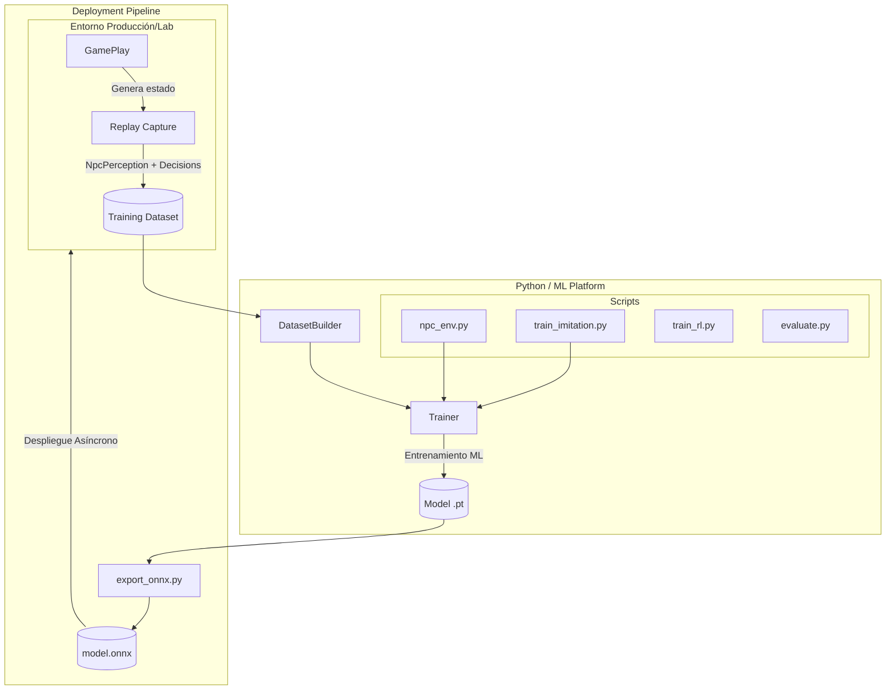

# Fase 4F — Training & Simulation Platform

## 1. Encabezado
**Estado:** Diseño
**Fecha:** Agosto 2026

## 2. Objetivo
Construir la **plataforma de entrenamiento y simulación** que permitirá capturar datasets, entrenar modelos (Behavior Cloning/RL) y exportarlos para su uso posterior. El principio fundamental es realizar toda evaluación y optimización de redes neuronales *fuera* del GameServer de producción, preservando el determinismo en caliente y los recursos del server.

## 3. Prerequisitos
- **Fase 4D / 4E** (Estructura base táctica y/o de escuadrón robusta para emitir percepciones completas)

## 4. Diagrama de arquitectura

## 5. Piezas a crear
| Nombre de la pieza | Ensamblado / Proyecto | Archivo Propuesto | Propósito |
|---|---|---|---|
| `NpcEpisode` | `L2Dn.Npc.Contracts` | `Training/NpcEpisode.cs` | Representa un episodio de entrenamiento (combate completo o fragmento). |
| `NpcEpisodeStep` | `L2Dn.Npc.Contracts` | `Training/NpcEpisodeStep.cs` | Una transición discreta dentro del episodio (Observation, Action, Reward, NextObs). |
| `NpcTrainingReward` | `L2Dn.Npc.Contracts` | `Training/NpcTrainingReward.cs` | Constantes e infraestructura de cálculo de recompensas para RL. |
| `EpisodeExporter` | `L2Dn.NpcTraining.DataExport` | `Exporters/EpisodeExporter.cs` | Exporta episodios de la memoria al disco en un formato consumible (JSON Lines o parquet). |
| `DatasetBuilder` | `L2Dn.NpcTraining.DataExport` | `Data/DatasetBuilder.cs` | Ensambla y balancea perfiles de batallas para entrenar redes. |
| `FeatureExtractor` | `L2Dn.NpcTraining.DataExport` | `Data/FeatureExtractor.cs` | Serializa `NpcPerception` a un vector numérico (`NpcPolicyObservationV1`). |
| `npc_env.py` | `Training/` (Python) | `npc_env.py` | Environment compatible con Gymnasium/RLlib para Reinforcement Learning. |
| `train_imitation.py`| `Training/` (Python) | `train_imitation.py` | Pipeline de Imitation Learning usando el cerebro determinista actual. |
| `train_rl.py` | `Training/` (Python) | `train_rl.py` | Pipeline de Reinforcement Learning. |
| `export_onnx.py` | `Training/` (Python) | `export_onnx.py` | Convertidor de checkpoint PyTorch a formato ONNX. |
| `evaluate.py` | `Training/` (Python) | `evaluate.py` | Herramientas de evaluación del modelo entrenado. |

## 6. Especificación detallada

### Contratos de Episodios
- **`NpcEpisode`**: Contiene `EpisodeId`, `StartTick`, `EndTick`, el `SquadId` (opcional), lista secuencial de `Steps` y el `Outcome` global del evento (Victory, Defeat, Timeout, Disengage).
- **`NpcEpisodeStep`**: Captura la decisión puntual:
  - `Observation`: Feature vector (basado en `NpcPolicyObservationV1`).
  - `ActionMask`: Acciones inválidas a ignorar en entrenamiento.
  - `Style` y `Role` del agente.
  - `SquadDirective` activo (si lo hay).
  - `ActionChosen` (el intent generado).
  - `IntentResult` (si fue validado y ejecutado, o rechazado por el gateway).
  - `Outcome metrics`: Cambios de HP, daño realizado y recibido.
  - `Reward`: Retorno para ese step específico (RL).
- **Sistema de Recompensas (`NpcTrainingReward`)**:
  - SquadWin: +100
  - EnemyKilled: +30
  - SupportSurvived: +20
  - SuccessfulInterrupt: +10
  - MaintainFormation: +5
  - MemberKilled: -20
  - InvalidIntent: -10
  - LeashViolation: -20
  - TargetFlapping / Oscillation: -5

### Model Governance y Arquitectura
- El modelo será una **MLP (Multi-Layer Perceptron)** pequeña: `128 inputs → Dense(128) → Dense(128) → Dense(64) → Action logits`.
- Cada modelo exportado requerirá metadatos: `PolicyId`, `ModelVersion`, `FeatureSchemaVersion`, `ActionSchemaVersion`, `Checksum`, `CreatedAt`, `TrainingDatasetVersion`.

### Métricas de Gameplay Complementarias
Adicional a las recompensas, medir en offline:
- Time to kill y Survival ratio.
- Healer protection success y Target switching frequency.
- Formation cohesion, Invalid Intent ratio, Gateway rejection ratio.
- Damage dealt/taken ratio, Retreat/Re-engagement success rate.
- Evaluación subjetiva: ¿Se percibe inteligente para los jugadores?

## 7. Ownership
| Componente | Responsabilidad |
|---|---|
| **GameServer Core** | Recopilar logs pasivos y serializarlos en formato Replay sin impactar ciclos de red. |
| **DataExport Tools** | Leer repositorios brutos y fabricar datasets normalizados, equilibrados y vectorizados. |
| **Training Pipeline** | (Python/ML) Ingesta, entrenamiento, evaluación de pérdida y exportación a ONNX. |

## 8. Lo que NO incluye
- Inferencia de IA o uso del modelo entrenado dentro de GameServer (se verá en Fase 4G).
- Transformers o LLMs.
- Políticas Recurrentes (LSTM/GRU) en la primera iteración.
- Actualización de pesos en caliente (In-game learning).

## 9. Criterios de aceptación

| ID | Criterio | Tipo | Qué demuestra |
|---|---|---|---|
| 4F-A1 | La captura de replay NO degrada los TPS del GameServer más de un 2% | Rendimiento | Que el sistema de captura es verdaderamente pasivo |
| 4F-A2 | Un `NpcEpisode` exportado puede reconstruir la secuencia completa de decisiones | Contrato | Que el dataset contiene información suficiente |
| 4F-A3 | `FeatureExtractor` produce vectores de dimensión fija, numéricos, sin NaN ni Inf | Contrato | Que los datos son consumibles por PyTorch |
| 4F-A4 | `train_imitation.py` converge: loss disminuye en primeras 100 epochs con dataset sintético | Comportamiento | Que el modelo puede aprender el patrón determinista |
| 4F-A5 | `export_onnx.py` produce `.onnx` cargable por ONNX Runtime C# sin errores de shape | Integración | Que el puente Python↔C# funciona end-to-end |
| 4F-A6 | `evaluate.py` reporta acuerdo semántico cuantificable (%) | Contrato | Que la evaluación es reproducible y automática |
| 4F-A7 | Action mask del episodio es consistente: si mask dice Heal bloqueado, acción NUNCA es Heal | Contrato | Que el mask refleja la realidad del juego |

> Especificación completa de tests: [`11_Criterios_Aceptacion_y_Testing.md`](11_Criterios_Aceptacion_y_Testing.md)

## 9b. Tests requeridos

| Test | Propiedad | Input → Output esperado |
|---|---|---|
| `FeatureVector_FixedDimension` | Dimensión estable | Cualquier perception → exactamente N floats |
| `FeatureVector_NoNaN_NoInf` | Datos limpios | 10,000 percepciones → cero NaN, cero Inf |
| `FeatureVector_HPRatio_InZeroOne` | Normalización | HP=500, MaxHP=1000 → hp_ratio=0.5 |
| `Episode_RoundTrip_Serialization` | Serializabilidad | Crear → serializar → deserializar → iguales |
| `Episode_ActionMask_ConsistentWithAction` | Consistencia | mask[Heal]=false → action ≠ Heal |
| `Replay_Capture_DoesNotBlockThink` | No bloquea | Queue llena → Think continúa, step descartado |
| `ONNX_Export_LoadableInCSharp` | Interop | model.onnx → `new InferenceSession(path)` → sin excepción |
| `ImitationLearning_LossDecreases` | Aprendizaje | 1000 episodes, 100 epochs → loss final < loss inicial × 0.5 |

## 10. Telemetría
- `l2dn.ml.episodes_captured` (Counter): Cantidad de combates guardados exitosamente.
- `l2dn.ml.export_bytes` (Counter): Volumen de datos transformados a formato de training.
- `l2dn.ml.capture_buffer_size` (Gauge): Ocupación en memoria de la cola de replays sin persistir.

## 11. Configuración
- `L2DN_ML_REPLAY_CAPTURE_ENABLED`: Habilita la recopilación en memoria (default: false).
- `L2DN_ML_REPLAY_PATH`: Ruta donde se volcarán los episodios crudos.
- `L2DN_ML_REWARD_SCALE`: Multiplicador para escalar internamente las recompensas.

## 12. Rollback
Deshabilitar la flag `L2DN_ML_REPLAY_CAPTURE_ENABLED` descarta el recolector y previene cualquier consumo de memoria extra o I/O.
Archivos de training y data tools son ortogonales y no afectan el runtime del server.

## 13. Relación con fases adyacentes
- **Consume de:** El pipeline individual y de escuadrones previos generan el contenido "experto" a emular.
- **Provee a:** Los artefactos ONNX pre-entrenados listos para ser consumidos y ejecutados en vivo en la futura **Fase 4G** (Inferencia ONNX Real-time).

## 14. Experimentos / laboratorio
**Imitation Learning Bootstrap**:
Correr a los NPCs con el comportamiento determinista actual del Brain en un servidor de pruebas con bots simulando jugadores. Grabar 10,000 episodios básicos.
Configurar PyTorch para emular (Behavior Cloning) esta política, ajustando hiperparámetros hasta lograr >95% de coincidencia semántica en la elección de acciones para inputs similares del dataset de validación.
