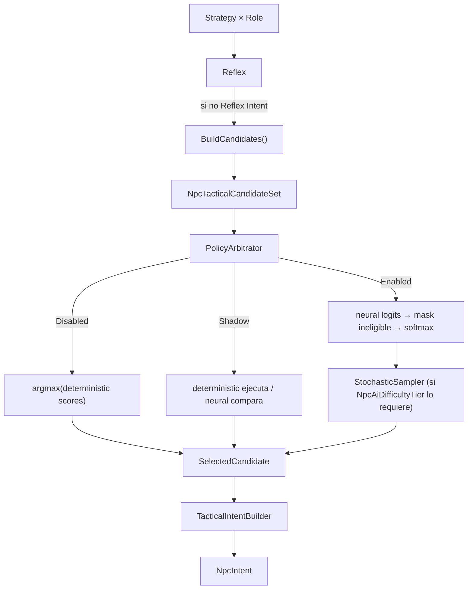

# Fase 4H — Neural / Stochastic Policy Enabled

**Estado:** Diseño  
**Fecha:** 12/08/2026

## Objetivo
Activar la ejecución real de la política neuronal e introducir un comportamiento estocástico (probabilístico) en la toma de decisiones. En esta fase, el NPC dejará de tomar siempre la decisión "óptima matemática" y utilizará muestreo probabilístico desde la distribución que genera el modelo ONNX, añadiendo variabilidad, naturalidad y un parámetro de *NpcAiDifficultyTier* sin modificar estadísticas de combate puras.

## Prerequisitos
- Fase 4F-A completada (Dataset y Behavior Cloning).
- Fase 4G completada (ONNX integrado, pipeline Shadow validado y telemetría funcionando).
- Acuerdo semántico en Phase 4G consistentemente por encima del 90%.
- Alineación con ADR-017 (Policy Arbitration Semantics).

## Diagrama de arquitectura


Ejemplo de Output Probabilístico:
```text
Attack      0.20
Skill       0.45
Reposition  0.18
Heal        0.12
Flee        0.05
```

## Piezas a crear

| Nombre | Ensamblado | Archivo Propuesto | Propósito |
|---|---|---|---|
| `StochasticSampler` | `L2Dn.Npc.Brain` | `Policies/StochasticSampler.cs` | Recibe logits neuronales, aplica temperature, y elige entre candidatos elegibles en el CandidateSet. |
| `NpcAiDifficultyTier` | `L2Dn.Npc.Contracts` | `Models/NpcAiDifficultyTier.cs` | Enum: `Novice`, `Normal`, `Veteran`, `Elite`, `Legendary`. |
| `DifficultyTierModifiers` | `L2Dn.Npc.Brain` | `Models/DifficultyTierModifiers.cs` | Tabla de mapeo de NpcAiDifficultyTier a Temperature, Advice Refresh Interval, y Action Variability. |
| `AbTestCoordinator` | `L2Dn.Npc.Brain` | `Policies/AbTestCoordinator.cs` | Asigna templates a control (determinista) o experimental (neural) en runtime. |

## Especificación detallada

### 1. Temperature y Muestreo Estocástico
El sistema ya no elige simplemente `max(acciones)`. Aplica *Temperature Scaling*:
- **Temperatura baja (ej. 0.1)**: La red se vuelve casi determinista, muy predecible y explota la mejor acción siempre.
- **Temperatura alta (ej. 0.8)**: La red explora más, tomando acciones subóptimas pero posibles, aumentando la variabilidad y simulando "errores" humanos.

### 2. Reproducibilidad
La aleatoriedad debe ser recuperable. NO usar aleatoriedad irrecuperable.
- **Seed determinista**: Se usa `NpcDecisionSeed = Hash(ServerRunSeed, NpcKey, DecisionSequence, PolicyVersion)`. NO seed dinámica.
- **Entorno de Producción**: Los jugadores perciben variabilidad y naturalidad; nosotros reproducimos la toma de decisiones en un replay.
- **Entorno de Testing**: Al ser determinista basado en el hash, una secuencia exacta reproducirá siempre el mismo muestreo, permitiendo debuggar el comportamiento y escribir unit tests deterministas sobre una política estocástica.

### 3. NpcAiDifficultyTier
Se introduce un nuevo concepto de dificultad sin "inflar" stats (HP/P.Atk). El NpcAiDifficultyTier SOLO controla en esta fase: temperature, advice refresh interval, y action variability. (NO lookahead, NO coordinación, NO retreat perfecto).
| NpcAiDifficultyTier | Temperature | Advice Refresh Interval | Action Variability |
|---|---|---|---|
| Novice | 0.80 | Lento | Alta |
| Normal | 0.50 | Normal | Media |
| Veteran | 0.30 | Rápido | Baja |
| Elite | 0.15 | Muy Rápido | Muy Baja |
| Legendary | 0.05 | Instantáneo | Mínima |

## Ownership

| Componente | Capa | Responsabilidad |
|---|---|---|
| `StochasticSampler` | Brain | Aplicar las matemáticas estocásticas (Softmax con temperatura) y PRNG sobre el CandidateSet. |
| `GameServer` | Model | Proveer el contexto si es necesario, pero sigue ciego a si la IA es neural o determinista. |

## Lo que NO incluye
- Entrenar redes dinámicamente (Online Learning).
- Políticas Multi-agente (Squad).
- Modelos LLM o generativos de texto.

## Criterios de aceptación

| ID | Criterio | Tipo | Qué demuestra |
|---|---|---|---|
| 4H-A1 | Con seed fija, misma secuencia de observaciones produce misma secuencia de decisiones | Comportamiento | Reproducibilidad para tests y replay |
| 4H-A2 | Con NpcDecisionSeed diferente (diferente NpcKey o DecisionSequence), NPC exhibe variabilidad observable | Comportamiento | Sampling produce diversidad |
| 4H-A3 | Candidato inelegible en CandidateSet NUNCA es seleccionado, independientemente de temperature | Contrato | Elegibilidad es barrera hard |
| 4H-A4 | Temperature 0.01 produce >98% decisiones = argmax | Comportamiento | Temperature baja converge a determinismo |
| 4H-A5 | Temperature 1.0 produce distribución igual a softmax(logits original) | Comportamiento | Temperature = 1.0 conserva softmax(logits original) |
| 4H-A6 | Gateway rejection ratio con Neural Enabled < 5% diferencia absoluta vs Deterministic | Integración | Policy neural no genera intent storms |
| 4H-A7 | A/B: grupo control y experimental producen métricas comparables salvo variabilidad esperada | Gameplay | Policy neural no rompe balance |

> Especificación completa de tests: [`11_Criterios_Aceptacion_y_Testing.md`](11_Criterios_Aceptacion_y_Testing.md)

## Tests requeridos

| Test | Propiedad | Input → Output esperado |
|---|---|---|
| `Sampler_FixedSeed_Deterministic` | Reproducibilidad | Seed=12345 × 100 → misma secuencia las 100 veces |
| `Sampler_DifferentSeed_VariableOutput` | Variabilidad | NpcDecisionSeeds distintas × 100 → al menos 2 acciones distintas |
| `Sampler_IneligibleCandidate_NeverSelected` | Elegibilidad inviolable | Heal inelegible en CandidateSet + Heal logit máximo + 10,000 samples → cero Heal |
| `Sampler_Temperature001_AlmostDeterministic` | Control temp | T=0.01 × 1,000 → >98% argmax |
| `Sampler_Temperature10_SoftmaxMatch` | Control temp | T=1.0 × 1,000 → distribución igual a softmax(logits original) |
| `DifficultyTier_Novice_HighTemperature` | Mapeo correcto | Novice → temperature ≥ 0.7 |
| `DifficultyTier_Legendary_LowTemperature` | Mapeo correcto | Legendary → temperature ≤ 0.1 |
| `GatewayRejections_NeuralVsDeterministic_Comparable` | Sin intent storms | 1000 ciclos cada → rejection delta < 5% |

## Telemetría

- Reutiliza telemetría de 4G.
- `l2dn.npc.policy.sampler.temperature`: Temperatura aplicada en la inferencia (Histograma segmentado por NpcAiDifficultyTier).
- `l2dn.npc.policy.abtest.assignment`: Asignación del NPC en el A/B test (Counter - Control vs Experimental).
- `l2dn.npc.combat.ttk`: Time-to-kill de NPCs (Histograma, para comparar A/B).

## Configuración

- `NPC_POLICY_MODE`: Cambiar a `Enabled`.
- `NPC_POLICY_DEFAULT_TEMP`: Float (Ej: 0.5).
- `NPC_POLICY_AB_TESTING`: Bool (True para habilitar distribución controlada en spawn).

## Rollback
- Revertir `NPC_POLICY_MODE` a `Shadow` o `Disabled`. El sistema inmediatamente cortará el paso del `NpcPolicyAdvice` al TacticalBrain, volviendo la lógica 100% determinista basada en la `StrategyBrain` legacy.

## Relación con fases adyacentes
- **Consume de:** Phase 4G (El modelo ONNX y la infraestructura de inferencia).
- **Provee a:** Phase 4I (Multi-Agent), que cambiará el entorno de un solo agente a múltiples agentes coordinados bajo el mismo pipeline estocástico.

## Experimentos / laboratorio
- **A/B Testing en Vivo:** Crear templates duplicados en una zona aislada (ej. un cuarto de catacumbas).
  - Mob A: Control (Determinista).
  - Mob B: Experimental (Neural, Temperature 0.4).
  - Medir la variabilidad de supervivencia y la percepción del jugador sin alterar las stats base del mob.
