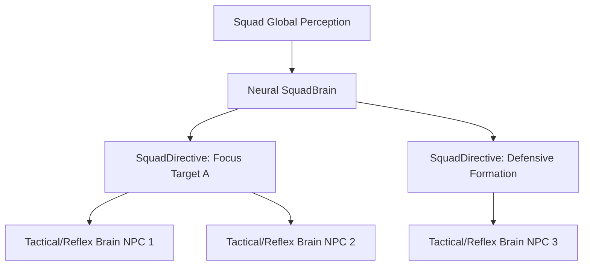

# Fase 4I-B: Learned Squad Policy

**Estado:** Diseño  
**Fecha:** 12/08/2026

## 1. Objetivo
Construir una Inteligencia Neuronal a nivel de Escuadrón (Neural SquadBrain) que actúe como un controlador jerárquico, dictando directivas de alto nivel a las políticas individuales de cada NPC.

## 2. Prerequisitos
- Fase 4I-A (MARL CTDE Individual Policies) completada.

## 3. Diagrama de arquitectura

## 4. Piezas a crear

| Nombre | Ensamblado | Archivo propuesto | Propósito |
|---|---|---|---|
| `NeuralSquadBrain` | `L2Dn.Npc.Brain` | `Squad/NeuralSquadBrain.cs` | Director neuronal de escuadrón. |
| `SquadObservation` | `L2Dn.Npc.Contracts` | `Models/SquadObservation.cs` | Percepción agregada (macro) del estado de la batalla. |

## 5. Especificación detallada

- **Jerarquía:** Diferente del CTDE de 4I-A. Aquí hay un agente central explícito (`NeuralSquadBrain`) que emite directivas (`SquadDirective`).
- **Directivas Neurales:** El SquadBrain no mueve a los NPCs directamente. Emite instrucciones de alto nivel (ej. qué enemigo priorizar, cuándo retirarse, qué formación mantener) que los NPCs individuales (usando Brains locales deterministas o redes estocásticas) ejecutarán adaptándose al contexto inmediato.

## 6. Ownership

| Componente | Responsabilidad | Equipo / Rol |
|---|---|---|
| NeuralSquadBrain | Implementar director | Core Server Dev |
| Squad Model | Entrenar modelo Macro | ML Engineer |

## 7. Lo que NO incluye
- Control de micro (eso queda en los NPCs individuales).
- Encuentros tipo Raid (eso es Fase 6).

## 8. Criterios de aceptación (Gates de completación)

| ID | Criterio | Tipo | Qué demuestra |
|---|---|---|---|
| 4IB-1 | `NeuralSquadBrain` produce directivas que los NPCs aceptan y priorizan sobre su IA individual | Comportamiento | Jerarquía funcional |
| 4IB-2 | El escuadrón exhibe formaciones coordinadas (flanqueo, kiting grupal) no codificadas a mano | Gameplay | RL aprende tácticas reales |

## 9. Tests requeridos

| Test | Propiedad | Input → Output esperado |
|---|---|---|
| `SquadBrain_IssuesDirective_OverridesLocalPriorities` | Jerarquía | Directiva: Target B → NPC localiza y ataca a B, aunque A esté más cerca |

## 10. Telemetría
- `l2dn.squad.directives_issued`

## 11. Configuración
- `L2DN_SQUAD_NEURAL_DIRECTOR_ENABLED`

## 12. Rollback
- Volver a directores de escuadrón deterministas (Scripts).

## 13. Relación con fases adyacentes
- **Consume:** 4I-A (Individual policies).
- **Provee a:** Fase 5 (Distribución) y Fase 6 (Raid Commander, que es una expansión del concepto de SquadBrain).

## 14. Experimentos / laboratorio
- Enfrentar Escuadrón con Neural Director vs Escuadrón con Independent MARL para ver si el control centralizado reduce la fricción de coordinación.
