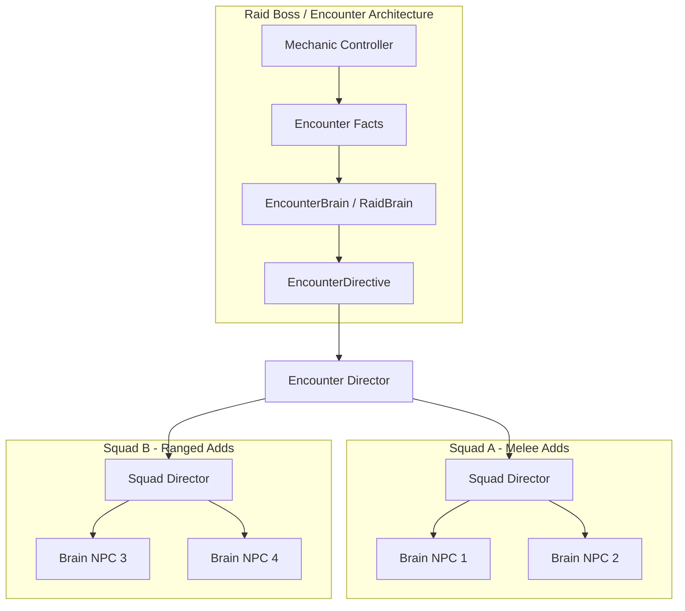

# Fase 6: Raid / Commander Intelligence

**Estado:** Visión a largo plazo
**Fecha:** 12 de Agosto de 2026

## 1. Objetivo

Expandir el alcance de la arquitectura basada en Brain + Intents para manejar eventos complejos de PVE: RaidBosses, GrandBosses, Fort/Castle Commanders. Estas entidades coordinan múltiples escuadrones bajo una inteligencia y mecánica unificadas.

## 2. Prerequisitos

- Fase 4E (Squad Intelligence) probada exhaustivamente.
- Posiblemente Fase 5 (si el cálculo es demasiado oneroso localmente).
- Aprobación técnica para expandir el `NpcBrainEligibility` más allá de `typeof(Monster)`.

## 3. Diagrama de arquitectura

## 4. Piezas a crear

| Nombre | Ensamblado | Archivo propuesto | Propósito |
|---|---|---|---|
| `EncounterBrain` | `L2Dn.Npc.Brain` | `Encounter/EncounterBrain.cs` | Orquestador principal de un encuentro (boss + adds). |
| `RaidBrain` | `L2Dn.Npc.Brain` | `Encounter/RaidBrain.cs` | Cerebro especializado para NPCs épicos y RaidBosses. |
| `CommanderBrain` | `L2Dn.Npc.Brain` | `Encounter/CommanderBrain.cs` | Cerebro para líderes de asedio o fortalezas. |
| `PhaseState` | `L2Dn.Npc.Contracts` | `Encounter/PhaseState.cs` | Modelo de estado de fases de raid (ej. "Enrage", "P2"). |

## 5. Especificación detallada

- **EncounterBrain:** Mantiene un registro de actores del encuentro. Emite directivas globales (ej. "Todos los esbirros enfoquen al curandero", "Esparcirse para evitar AoE").
- **Separación de Mechanics e Intelligence:**
  - **Mecánicas (Scripts deterministas):** Siguen controlando phase triggers, puertas, spawns, cinemáticas, rewards, quest flags, curses y ciclo de vida de la instancia. Estos NO se eliminan, son correctos.
  - **Inteligencia (RaidBrain):** Controla exclusivamente la toma de decisiones: qué escuadrón presiona, qué objetivo priorizar, qué formación usar, cuándo reagruparse.
- **NpcBrainEligibility:** Esta fase modificará el puente del IntentGateway para que `RaidBoss` pueda generar Intents para sus decisiones tácticas, mientras escucha a sus scripts para mecánicas puras.

## 6. Ownership

| Componente | Responsabilidad | Equipo / Rol |
|---|---|---|
| Encounter Logic | Diseño de mecánicas y orquestación | Content Designer / AI |
| RaidBrain & Interfaces | Pipeline de Brain para raids, transiciones | Core Server Dev |
| Eligibility Expansion | Certificar pasaje de intents en el Model | Core Server Dev |

## 7. Lo que NO incluye

- **Abolir Legacy Scripts de Raid:** Los scripts deterministas de mecánicas son correctos y deben permanecer. Solo la inteligencia de decisión de combate se moderniza.
- **Hot-switch a Legacy mid-encounter:** Si el `EncounterBrain` falla en medio de la pelea, el fallback es `DeterministicEncounterPolicy` (del nuevo sistema), NO el script Legacy. El rollback a Legacy puro solo debe hacerse antes del próximo encounter o en un restart.

## 8. Criterios de aceptación

| ID | Criterio | Tipo | Qué demuestra |
|---|---|---|---|
| 6-A1 | `NpcBrainEligibility` expandida a `RaidBoss` con su propia certificación vertical completa (no heredada de Monster) | Arquitectura | Que la expansión de eligibilidad es explícita y certificada, no accidental |
| 6-A2 | `EncounterBrain` produce `EncounterDirective` que coordina múltiples squads, pero NUNCA modifica estado del GameServer directamente | Arquitectura | Que la jerarquía de dirección respeta las mismas fronteras que el Brain individual |
| 6-A3 | Transición de fase del boss (ej: HP < 50% → phase 2) produce cambio de directiva observable sin congelar al boss | Comportamiento | Que las fases de raid no crean ventanas de inacción |
| 6-A4 | Certificación vertical completa de un boss sencillo (ej: Ant Queen) con el nuevo pipeline: spawn → engage → phase transitions → adds → death | Integración | Que el pipeline completo funciona end-to-end para un encuentro real |
| 6-A5 | Fallback: si `EncounterBrain` falla mid-fight, usa `DeterministicEncounterPolicy`, no Legacy script | Integración | Que la tolerancia a fallos en combate mantiene el nuevo pipeline activo |

> Especificación completa de tests: [`11_Criterios_Aceptacion_y_Testing.md`](11_Criterios_Aceptacion_y_Testing.md)

## 8b. Tests requeridos

| Test | Propiedad | Input → Output esperado |
|---|---|---|
| `RaidBoss_Eligibility_RequiresExplicitExpansion` | Expansión controlada | RaidBoss sin flag de expansión → `UsesIntentBrain == false` |
| `EncounterBrain_NeverModifiesWorldState` | Solo directivas | EncounterBrain evaluation → cero llamadas a mutación de GameServer |
| `PhaseTransition_HP50_ChangesDirective` | Transición reactiva | Boss HP < 50% → EncounterDirective.Phase cambia → squads reciben nuevos objetivos |
| `PhaseTransition_NoFreeze` | Sin ventana muerta | Durante transición → boss continúa produciendo intents válidos (no idle) |
| `EncounterBrain_Failure_FallbackToDeterministicPolicy` | Tolerancia | EncounterBrain throws → usa DeterministicEncounterPolicy → combate continúa en pipeline nuevo |
| `AntQueen_VerticalCertification_FullEncounter` | End-to-end | Spawn → engage → phases → adds → death → todo vía Intent pipeline |

## 9. Telemetría

- `l2dn.encounter.active_encounters` (UpDownCounter): Número de encuentros complejos vivos.
- `l2dn.encounter.phase_transitions` (Counter): Frecuencia de cambio de fase en raids.
- `l2dn.encounter.update_ms` (Histogram): Costo de actualización del EncounterBrain.

## 10. Configuración

- `L2DN_ENCOUNTER_LOGGING` (bool)
- `L2DN_RAID_ENABLE_NEW_AI` (bool) - Para encender el sistema gradualmente.

## 11. Rollback

1. Cambiar el eligibility flag o el config `L2DN_RAID_ENABLE_NEW_AI` para devolver a los `RaidBoss` al sistema de scripting/IA tradicional (Legacy).

## 12. Relación con fases adyacentes

- **Consume:** Todo lo aprendido en estrategias, colas de Single-flight (Phase 2.5) y escuadrones.
- **Provee a:** Fase 7, como bloques constructivos para un mundo completamente interconectado y dinámico.

## 13. Experimentos / laboratorio

- Diseñar un boss de prueba custom con 3 fases de HP que llame a 2 escuadrones de arqueros y coordinar su posicionamiento a través de un `EncounterBrain`.
