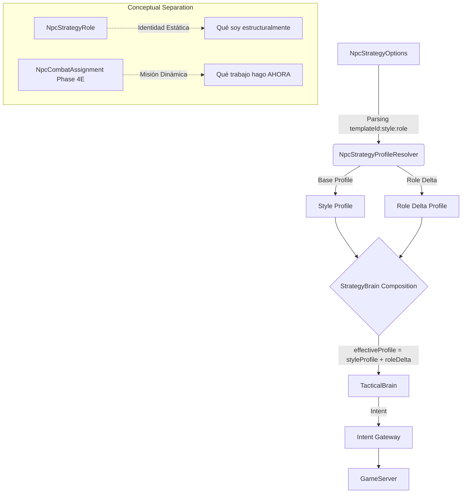

# Fase 4C — Style × Role

**Estado:** Diseño aceptado, código pendiente de implementación.
**Fecha:** Agosto 2026
**Revisión:** 2 (2026-08-13)

## 1. Objetivo
Implementar el eje de **rol** compuesto con el eje de **estilo** ya certificado en la Fase 4A/4B. Esta fase añade una dimensión estructural a los NPCs (qué son en el mundo: Mob, Elite, Minion, Commander, Raid) que, combinada con su estilo de combate, permite una diferenciación más rica del comportamiento táctico.

## 2. Prerequisitos
- Fase 4A completada y certificada.
- Fase 4B completada y certificada (Estilos de Estrategia: Balanced, AggressivePressure, RangedControl, Survival).
- Fase 4B.5 completada (Stateful Strategic Utility). La razón: Role ya no solo modifica scores tácticos; ahora también modifica PosturePriors del sistema de posturas dinámicas.
- Fase 3 completada (Pipeline Perception → ReflexBrain → TacticalBrain → NpcIntent → IntentGateway → GameServer).

## 3. Diagrama de Arquitectura



## 4. Piezas a crear

| Nombre | Ensamblado/Proyecto | Archivo propuesto | Propósito |
|---|---|---|---|
| `NpcStrategyRole` | `L2Dn.Npc.Contracts` | `NpcStrategyRole.cs` | Enum para los roles: `Mob`, `Elite`, `Minion`, `Commander`, `Raid` |
| `NpcStrategyProfileResolver` | `L2Dn.Npc.Brain` | `NpcStrategyProfileResolver.cs` | Contiene los deltas inmutables por rol y perfil base por estilo |
| `NpcStrategyOptions` | `L2Dn.Npc.Brain` | `NpcStrategyOptions.cs` | Lógica de parsing para el registro `templateId:style:role` |
| `StrategyBrain` | `L2Dn.Npc.Brain` | `StrategyBrain.cs` | Composición en tiempo de ejecución: `effectiveProfile = styleProfile + roleDelta` |
| `StrategyValidationLab` | `L2Dn.Npc.Brain.Tests` | `StrategyValidationLab.xml` | Laboratorio con lanes de pruebas |

## 5. Especificación Detallada

### Aclaración Conceptual Importante
- `NpcStrategyRole` representa **qué soy estructuralmente** (identidad estática).
- `NpcCombatAssignment` (futura fase 4E) representa **qué trabajo estoy realizando AHORA** (misión dinámica).
No deben mezclarse. Por ejemplo, un Minion con estilo `AggressivePressure` puede tener un CombatAssignment de `ProtectSupport`.

### Role afecta PosturePriors
Además de los deltas tácticos existentes (Attack, Skill, Flee, etc.), cada Role ahora incluye:

```text
Elite:
  PressurePriorDelta      = +100
  ControlRangePriorDelta  = +50
  RecoverPriorDelta       = -50
  DisengagePriorDelta     = -100
  SwitchMarginDelta       = +50    (int, utility points)
  MinDurationDelta        = +100   (int, ticks)
  + Attack +10, Skill +15, Flee -20  (tácticos existentes)

Minion:
  PressurePriorDelta      = +50
  ControlRangePriorDelta  = 0
  RecoverPriorDelta       = +50
  DisengagePriorDelta     = +100
  SwitchMarginDelta       = -30
  MinDurationDelta        = -50

Commander:
  PressurePriorDelta      = +80
  ControlRangePriorDelta  = +50
  RecoverPriorDelta       = +30
  DisengagePriorDelta     = -150
  SwitchMarginDelta       = +100
  MinDurationDelta        = +200

Raid:
  PressurePriorDelta      = +150
  ControlRangePriorDelta  = 0
  RecoverPriorDelta       = -100
  DisengagePriorDelta     = -200
  SwitchMarginDelta       = +150
  MinDurationDelta        = +300

Mob:
  Todos = 0 (identidad)
```

### Composición Completa
```text
effectivePosturePrior    = Clamp(Style.Prior + Role.PriorDelta, 0, 1000)
effectiveSwitchMargin    = Max(0, baseSwitchMargin + Role.SwitchMarginDelta)
effectiveMinDuration     = Max(0, baseMinDuration + Role.MinDurationDelta)
effectiveTacticalScore   = Clamp(Style.TacticalBase + Role.TacticalDelta + Directive.Bias, 0, 1000)
```

> **Invariante**: `effectivePosturePrior ∈ [0, 1000]`, `effectiveSwitchMargin ≥ 0`, `effectiveMinDuration ≥ 0`. Sin el clamp, combinaciones como `Raid.DisengagePriorDelta = -200` sobre `AggressivePressure.DisengagePrior = 100` producirían -100, rompiendo la garantía del weighted average.

### Deltas de Rol Propuestos
| Rol | BasicAttack | Approach | OffensiveSkill | Heal | Flee | Heal HP% |
|---|---:|---:|---:|---:|---:|---:|
| Mob | 0 | 0 | 0 | 0 | 0 | 0 |
| Elite | +10 | +5 | +15 | 0 | -20 | -10 pp |
| Minion | 0 | +15 | -5 | 0 | -30 | 0 |
| Commander | 0 | +10 | +10 | 0 | -25 | 0 |
| Raid | 0 | +5 | +20 | +10 | -40 | 0 |

### Tabla de Composición de Ejemplo
*Ejemplo para Elite + AggressivePressure (PosturePriors de 4B.5: Pressure=650, ControlRange=350, Recover=250, Disengage=100; baseSwitchMargin=100, baseMinDuration=TBD):*
- **AggressivePressure base:** BasicAttack: 75, Approach: 90, OffensiveSkill: 105, Heal: 85, Flee: 70, Heal HP%: 25 | PressurePrior: 650, ControlRangePrior: 350, RecoverPrior: 250, DisengagePrior: 100, SwitchMargin: 100, MinDuration: TBD
- **Elite delta:** BasicAttack: +10, Approach: +5, OffensiveSkill: +15, Heal: 0, Flee: -20, Heal HP%: -10 | PressurePriorDelta: +100, ControlRangePriorDelta: +50, RecoverPriorDelta: -50, DisengagePriorDelta: -100, SwitchMarginDelta: +50, MinDurationDelta: +100
- **Effective Profile (con Clamp/Max):** BasicAttack: 85, Approach: 95, OffensiveSkill: 120, Heal: 85, Flee: 50, Heal HP%: 15 | PressurePrior: Clamp(750,0,1000)=750, ControlRangePrior: Clamp(400,0,1000)=400, RecoverPrior: Clamp(200,0,1000)=200, DisengagePrior: Clamp(0,0,1000)=0, SwitchMargin: Max(0,150)=150, MinDuration: Max(0,TBD+100)

## 6. Ownership

| Componente | Equipo/Rol Responsable |
|---|---|
| `NpcStrategyRole` | Core Architecture Team |
| `NpcStrategyProfileResolver` | AI Engine Team |
| Parsing en `NpcStrategyOptions` | AI Engine Team |
| Testing (Validation Lab) | QA / AI Engine Team |

## 7. Lo que NO incluye
- Modificaciones a `NpcBrainEligibility` (permanece inalterado).
- No expande el Intent de `RaidBoss` (sigue manejándose vía Legacy para raid bosses completos que no sean Monster exacto).
- Implementación de `NpcCombatAssignment`.

## 8. Criterios de aceptación

| ID | Criterio | Tipo | Qué demuestra |
|---|---|---|---|
| 4C-A1 | Con Adaptive Disabled: `Balanced × Mob` = Phase 4B Static V1. Con Adaptive Enabled: `Balanced × Mob` = Balanced Adaptive V2 sin role delta | Comportamiento | Que el rol `Mob` es la identidad (delta cero) y no altera el baseline certificado |
| 4C-A2 | Cada combinación `style × role` produce scores deterministas e iguales en 1,000 evaluaciones idénticas | Comportamiento | Que la composición es pura y no introduce estado ni aleatoriedad |
| 4C-A3 | Un perfil con intelligence profile legacy explícito NO hereda un rol no-Balanced a menos que el registro lo declare | Comportamiento | Que scripts y tests existentes no cambian de comportamiento implícitamente |
| 4C-A4 | Una entrada de registro malformada o con rol desconocido emite warning y NO habilita silenciosamente `Balanced:Mob` | Contrato | Que errores de configuración no se esconden detrás de un default seguro |
| 4C-A5 | El rol `Raid` puede componerse en tests pero NO ejecuta a través del Gateway para actores `RaidBoss` | Integración | Que la frontera de eligibilidad no se expande accidentalmente |
| 4C-A6 | `NpcBrainEligibility` rechaza todo actor que no sea exacto `Monster` + exacto `AttackableAI`, independientemente del rol configurado | Integración | Que un Guard con rol Commander sigue en Legacy |
| 4C-A7 | R1-R5 con Strategy Enabled y roles configurados mantiene zero drops, zero overflow, max concurrent 1 | Rendimiento | Que la composición no degrada el scheduler |
| 4C-A8 | Release build sin errores nuevos | Arquitectura | Que no se introdujeron dependencias prohibidas |
| 4C-A10 | Role.PosturePriorDelta de Mob es cero para todas las posturas y SwitchMarginDelta=0 y MinDurationDelta=0 (identidad completa) | Comportamiento | Que el rol Mob no altera los priors base |
| 4C-A11 | Elite.SwitchMarginDelta > 0 AND Elite.MinDurationDelta > 0 (Elite es más persistente en postura) | Comportamiento | Que Elite es más persistente en su postura |
| 4C-A12 | `effectivePosturePrior = Clamp(Style.Prior + Role.PriorDelta, 0, 1000)` — siempre en [0,1000] | Contrato | Que la composición preserva la invariante del weighted average |
| 4C-A13 | `effectiveSwitchMargin = Max(0, ...)` y `effectiveMinDuration = Max(0, ...)` — nunca negativos | Contrato | Que deltas negativos (Minion) no producen valores inválidos |

> Especificación completa de tests: [`04_Criterios_Aceptacion_y_Testing.md`](../04_Criterios_Aceptacion_y_Testing.md)

## 8b. Tests requeridos

### Contracts (`L2Dn.Npc.Contracts.Tests`)

| Test | Propiedad | Input → Output esperado |
|---|---|---|
| `RoleDelta_Mob_IsIdentityZero` | El delta Mob no modifica ningún score | `RoleDelta.Mob` → todos los campos == 0 |
| `RoleDelta_AllRoles_AreImmutable` | Los deltas no pueden mutar después de construcción | Crear delta, intentar modificar → compilación falla o excepción |
| `RoleEnum_HasExactlyFiveValues` | Cardinalidad acotada para telemetría | `Enum.GetValues<NpcStrategyRole>()` → exactamente {Mob, Elite, Minion, Commander, Raid} |

### Brain (`L2Dn.Npc.Brain.Tests`)

| Test | Propiedad | Input → Output esperado |
|---|---|---|
| `Compose_Balanced_Mob_EqualsPhase4Balanced` | Identity: rol Mob no altera baseline | Perception + Balanced + Mob → decisión idéntica a Phase 4 Balanced sin rol |
| `Compose_AggressivePressure_Elite_ProducesExpectedScores` | Suma aritmética correcta | AP base + Elite delta → BasicAttack=85, Approach=95, OffensiveSkill=120 |
| `Compose_Survival_Commander_FleeScoreNeverNegative` | Scores negativos no rompen Tactical | Survival(Flee=115) + Commander(Flee=−25) + edge → Flee score ≥ 0 |
| `Compose_AllStyles_AllRoles_Deterministic_1000x` | Determinismo | Cada combinación × 1000 → output bit-a-bit idéntico |
| `Compose_ExplicitLegacyProfile_DefaultsToBalancedMob` | No herencia implícita | Legacy profile sin registro → Balanced scores |
| `Registry_MalformedEntry_WarnsAndRejects` | Config inválida no se esconde | `"20130:invalid:mob"` → warning, template NO en registro |
| `Registry_UnknownRole_WarnsAndRejects` | Rol desconocido no habilita Balanced | `"20130:aggressive_pressure:tank"` → warning, template NO aparece |
| `Registry_DuplicateTemplate_LastWinsWithWarning` | Duplicados explícitos | Dos entradas para 20130 → último gana, warning emitido |

### GameServer.Model (`L2Dn.GameServer.Model.Tests`)

| Test | Propiedad | Input → Output esperado |
|---|---|---|
| `Eligibility_Guard_WithCommanderRole_StaysLegacy` | Actor boundary no se expande | Guard + registro commander → `UsesIntentBrain == false` |
| `Eligibility_RaidBoss_WithRaidRole_StaysLegacy` | RaidBoss no entra en Intent | RaidBoss + rol Raid → `UsesIntentBrain == false` |
| `Eligibility_BaseMonster_WithEliteRole_UsesIntent` | Monster base sí puede tener rol | Monster + rol Elite → `UsesIntentBrain == true` |
| `RoleTelemetry_EmitsExactlyFiveCardinalityValues` | Cardinalidad acotada | Evaluaciones con todos los roles → tags solo contienen 5 valores |

## 9. Telemetría
- **Métrica:** `npc.brain.strategy.evaluation_time` (ya existente, verificar que el impacto sea mínimo)
- **Atributo/Tag propuesto:** `role` (con cardinalidad acotada a 5: `Mob`, `Elite`, `Minion`, `Commander`, `Raid`) y `style`.

## 10. Configuración
- `NPC_STRATEGY_ROLE_ENABLED` (booleano, default: `true` en el futuro)
- El registry debe ser inmutable al startup. Live tuning sería una fase independiente futura con ProfileVersion, atomic snapshot y telemetría.

## 11. Rollback
- Si se detecta inestabilidad, revertir el registro `templateId:style:role` a `templateId:style` en la configuración (la opción por defecto asume `Mob` con delta 0).
- Deshabilitar variable de entorno si se implementó un switch global. Se mantiene solo el rollback de formato de registro, sin hot override.

## 12. Relación con fases adyacentes
- **Consume de:** Fase 4A/4B (Perfiles base inmutables de estilo).
- **Provee a:** Fase 4D (Policy Foundation), que luego servirá para construir hacia la Fase 4E.

## 13. Experimentos / laboratorio
- Configurar en `StrategyValidationLab.xml` un "lane" de combate con:
  - Un Elite AggressivePressure vs Player.
  - Un Minion + Commander Survival vs Player.
  - Un Raid (solo validación de contrato) Balanced vs Player.
- Medir la divergencia de comportamiento esperada usando mocks del Intent Gateway.
