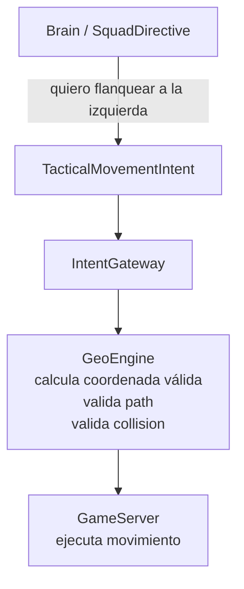

# Fase 4D.5 — Tactical Movement Primitives

**Estado:** Diseño — revisión 2
**Fecha:** 2026-08-13

## 1. Objetivo

Introducir **intents de movimiento táctico semántico** que permitan al Brain expresar intenciones de posicionamiento sin calcular coordenadas físicas. Esto es prerequisito para que Squad Intelligence (4E) pueda materializar formaciones, flanqueos y reposicionamiento.

### Por qué es necesario

Los `NpcIntentType` actuales son:

```text
AcquireTarget, ClearTarget, BasicAttack,
ApproachTarget, ReturnHome, Flee, CastSkill, StopCombat
```

No existe forma de expresar:

```text
Flanquear, mantener distancia, ocupar slot de formación,
circular enemigo, proteger posición de healer, scatter
```

Sin esto, las directivas de Squad (FlankLeft, RangedPressure, DefensiveArc) serían solo etiquetas sin efecto físico.

## 2. Prerequisitos

- Fase 4C completada (Style × Role)
- Fase 4D completada (Policy Foundation con CandidateSet)

## 3. Diagrama de arquitectura



### Regla arquitectónica

La red neuronal y el SquadBrain **nunca deciden la coordenada física final**. Solo expresan intención semántica. Gateway + GeoEngine calculan y validan la coordenada.

## 4. Piezas a crear

| Nombre | Ensamblado | Archivo propuesto | Propósito |
|---|---|---|---|
| `TacticalMovementGoal` | `L2Dn.Npc.Contracts` | `Intents/TacticalMovementGoal.cs` | Enum: MaintainRange, FlankTarget, FormationSlot, Retreat, CircleTarget, Scatter |
| `TacticalMovementIntent` | `L2Dn.Npc.Contracts` | `Intents/TacticalMovementIntent.cs` | Intent de movimiento táctico con Goal, Reference, PreferredRange, Direction/Sector |
| `TacticalMovementResolver` | `L2Dn.GameServer.Model` | `AI/Movement/TacticalMovementResolver.cs` | Traduce intent semántico a coordenada física usando GeoEngine |
| `IntentGateway` extensión | `L2Dn.GameServer.Model` | Existente | Validar y ejecutar TacticalMovementIntent |

## 5. Especificación detallada

### TacticalMovementIntent

```text
Goal:
  MaintainRange       ← mantener distancia óptima del target
  FlankTarget         ← moverse al lateral/trasera del target
  FormationSlot       ← ocupar posición asignada en formación
  Retreat             ← retroceder manteniendo cara al enemigo
  CircleTarget        ← rodear al target (para rodearlo con squad)
  Scatter             ← dispersarse del centroide

Reference:
  Target              ← el target actual (EntityKey)
  Commander           ← el líder del squad
  SquadAnchor         ← posición central del squad

PreferredRange:       ← distancia deseada (en game units)
Direction/Sector:     ← Left, Right, Behind, Any (para flank)
```

### Cómo lo resuelve GameServer

```text
TacticalMovementIntent { Goal=FlankTarget, Direction=Left, PreferredRange=150 }
    ↓
TacticalMovementResolver:
    1. Calcula posición candidata: 150 units a la izquierda del target
    2. GeoEngine.canMoveToTarget(npc, candidatePos) → válido?
    3. Si no: prueba posiciones alternativas (±30°, ±60°)
    4. Si ninguna válida: intent rechazado, NPC mantiene posición
    ↓
GameServer ejecuta movimiento a la coordenada validada
```

## 6. Ownership

| Componente | Responsabilidad |
|---|---|
| Brain/SquadBrain | Expresar intención semántica (Goal + Direction) |
| TacticalMovementResolver | Traducir semántica a coordenada usando GeoEngine |
| IntentGateway | Validar que el movimiento es legal |
| GeoEngine | Path validation, collision, line of sight |
| GameServer | Ejecución física del movimiento |

## 7. Lo que NO incluye

- Pathfinding complejo (eso sigue en GeoEngine/GameServer)
- Movimiento de grupo sincronizado (eso es 4E)
- Neural Policy para movimiento (eso es 4G+)
- Coordenadas absolutas producidas por Brain o Squad

## 8. Criterios de aceptación

| ID | Criterio | Tipo | Qué demuestra |
|---|---|---|---|
| 4D5-A1 | Un NPC con `FlankTarget(Left)` se mueve a una posición al lado izquierdo del target, validada por GeoEngine | Comportamiento | Que el intent semántico se materializa en movimiento real |
| 4D5-A2 | Si GeoEngine rechaza TODAS las posiciones candidatas, el NPC mantiene su posición actual sin congelarse | Integración | Que el fallback de movimiento funciona |
| 4D5-A3 | `MaintainRange(300)` con target a 100 → NPC retrocede; con target a 500 → NPC avanza | Comportamiento | Que MaintainRange funciona en ambas direcciones |
| 4D5-A4 | `FormationSlot` con slot asignado por SquadDirective produce movimiento al slot correcto | Integración | Que Squad + Movement se integran |
| 4D5-A5 | Brain NUNCA produce coordenadas absolutas; solo Goal + Reference + Range + Direction | Arquitectura | Que la frontera se mantiene |

## 8b. Tests requeridos

| Test | Propiedad | Input → Output esperado |
|---|---|---|
| `FlankLeft_MovesToLeftOfTarget` | Posicionamiento | FlankTarget(Left, 150) + target en (100,100) → NPC se mueve a posición izquierda validada |
| `FlankLeft_GeoBlocked_TriesAlternatives` | Resiliencia | Posición izquierda bloqueada → prueba ±30°, ±60° → encuentra alternativa |
| `FlankLeft_AllBlocked_MaintainsPosition` | Fallback | Todas las posiciones bloqueadas → NPC no se mueve, no se congela |
| `MaintainRange_TooClose_Retreats` | Rango bidireccional | Range=300, target a 100 → NPC retrocede |
| `MaintainRange_TooFar_Approaches` | Rango bidireccional | Range=300, target a 500 → NPC avanza |
| `FormationSlot_CorrectPosition` | Integración Squad | SquadDirective con slots → NPC va al slot asignado |
| `Brain_NeverProducesAbsoluteCoords` | Frontera | Inspeccionar TacticalMovementIntent → no contiene coordenadas X,Y,Z absolutas |

> Especificación completa: [`04_Criterios_Aceptacion_y_Testing.md`](../04_Criterios_Aceptacion_y_Testing.md)

## 9. Telemetría

- `l2dn.npc.movement.tactical.total` (Counter): Total de movement intents emitidos, por Goal
- `l2dn.npc.movement.tactical.rejected` (Counter): Movement intents rechazados por GeoEngine
- `l2dn.npc.movement.tactical.alternatives_tried` (Histogram): Posiciones alternativas probadas antes de éxito/rechazo

## 10. Configuración

- `NPC_TACTICAL_MOVEMENT_ENABLED`: bool (default: false)
- `NPC_TACTICAL_MOVEMENT_MAX_ALTERNATIVES`: int (default: 6, máximo de posiciones alternativas a probar)

## 11. Rollback

`NPC_TACTICAL_MOVEMENT_ENABLED=false` → NPCs usan solo ApproachTarget/Flee/ReturnHome como en Phase 4C.

## 12. Relación con fases adyacentes

- **Consume de:** Fase 4D (CandidateSet puede incluir Reposition como candidato)
- **Provee a:** Fase 4E (Squad puede materializar formaciones y flanqueos), Fase 4G+ (Neural Policy puede aprender reposicionamiento)
