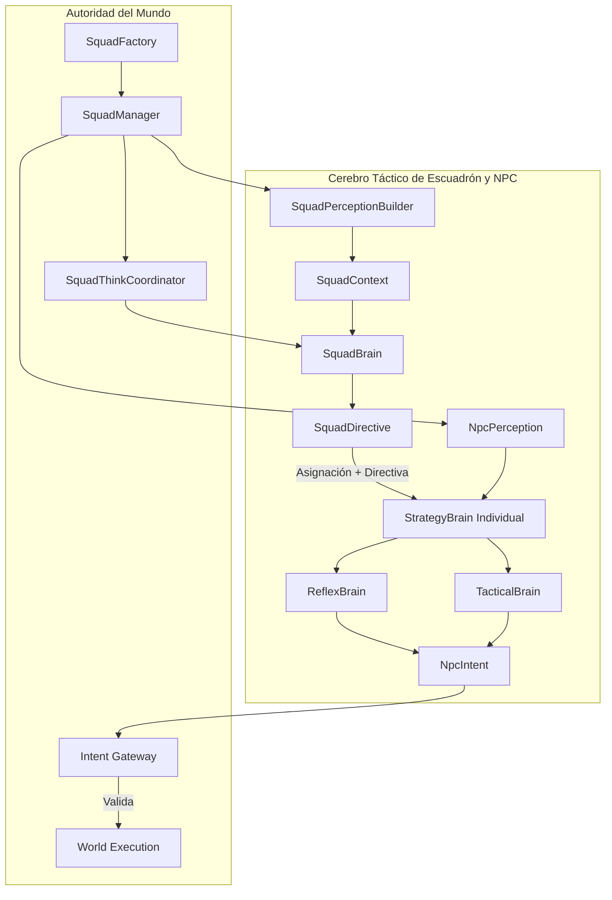

# Fase 4E — Squad Intelligence Foundation

## 1. Encabezado
**Estado:** Diseño
**Fecha:** Agosto 2026

## 2. Objetivo
Introducir la **inteligencia de escuadrón** para dotar a los grupos de NPCs de la capacidad de coordinar sus acciones como una unidad táctica cohesionada. El objetivo principal es reutilizar y transformar las agrupaciones ya existentes (como master/minion y asistencia de clan/facción del Legacy) en un contexto formal de escuadrón, evitando construir un sistema de grupos paralelo.

## 3. Prerequisitos
- **Fase 3** (ReflexBrain + TacticalBrain)
- **Fase 4A/4B** (Estilos de Estrategia Certificados)
- **Fase 4C** (Diseño e Implementación de Roles)
- **Fase 4D.5** (Tactical Movement Primitives)

## 4. Diagrama de arquitectura


## 5. Piezas a crear
| Nombre de la pieza | Ensamblado / Proyecto | Archivo Propuesto | Propósito |
|---|---|---|---|
| `SquadId` | `L2Dn.Npc.Contracts` | `Squads/SquadId.cs` | Identificador fuertemente tipado de escuadrón. |
| `SquadMember` | `L2Dn.Npc.Contracts` | `Squads/SquadMember.cs` | Representa un miembro del escuadrón (NpcKey, Role, Style, State). |
| `SquadSnapshot` | `L2Dn.Npc.Contracts` | `Squads/SquadSnapshot.cs` | Contexto inmutable del escuadrón (reemplaza SquadContext). |
| `SquadBrainState` | `L2Dn.Npc.Brain` | `Squads/SquadBrainState.cs` | Estado privado del escuadrón (`internal`), maneja generación y última directiva. |
| `SquadDirective` | `L2Dn.Npc.Contracts` | `Squads/SquadDirective.cs` | Directiva generada por el SquadBrain. |
| `NpcCombatAssignment` | `L2Dn.Npc.Contracts` | `Squads/NpcCombatAssignment.cs` | Enum de roles de combate asignados dinámicamente. |
| `SquadWakeReason` | `L2Dn.Npc.Contracts` | `Squads/SquadWakeReason.cs` | Flags que determinan la razón del despertar del escuadrón. |
| `SquadBrain` | `L2Dn.Npc.Brain` | `Squads/SquadBrain.cs` | Cerebro de escuadrón determinista que produce SquadDirectives. |
| `SquadThinkCoordinator` | `L2Dn.GameServer.Model` | `AI/Squads/SquadThinkCoordinator.cs` | Coordinador single-flight de procesamiento de escuadrones con colas de prioridad. |
| `SquadPerceptionBuilder` | `L2Dn.Npc.Brain` | `Squads/SquadPerceptionBuilder.cs` | Agrega percepciones individuales para construir el SquadSnapshot. |
| `SquadManager` | `L2Dn.GameServer.Model` | `AI/Squads/SquadManager.cs` | Gestiona el ciclo de vida de todos los escuadrones en el mundo. |
| `SquadFactory` | `L2Dn.GameServer.Model` | `AI/Squads/SquadFactory.cs` | Crea los dos tipos de escuadrón soportados: (1) Master + MinionList, (2) Escuadrones explícitos de laboratorio. |

## 6. Especificación detallada

### Estructuras inmutables
- **`SquadSnapshot`**: Contendrá el resumen vital del escuadrón: HP promedio, composición viva/muerta, estado del Commander, amenazas consolidadas, posición del centroide y la formación actualmente observada.
- **`SquadDirective`**: Salida inmutable del `SquadBrain`. Incluye campos de causalidad: `SquadKey`, `SquadGeneration`, `MembershipRevision`, `DirectiveSequence`, `BasedOnSquadRevision`, `IssuedAtWorldTick`, `ExpiresAtWorldTick`. Además incluye el `Objective` (PressureHealer, DefendCommander, FocusTarget, Regroup, Retreat, HoldPosition), `Formation` requerida (Line, Arc, DefensiveArc, Surround, Scatter), un `PriorityTarget` (opcional), y el `AssignmentMap` (mapeo `NpcKey` → `NpcCombatAssignment`).
- **`NpcCombatAssignment`**: Valores válidos: Frontline, FlankLeft, FlankRight, RangedPressure, ProtectSupport, ProtectCommander, Regroup, Retreat, FreeAgent.
- **`SquadWakeReason`**: Enum de flags: CombatStarted, MemberDied, CommanderDied, SupportThreatened, EnemyCompositionChanged, TargetLost, FormationBroken, MemberLowHealth, NumericalAdvantageChanged, PeriodicReevaluate.

### Coordinador y Cerebro Táctico
- **`SquadThinkCoordinator`**: Mantiene un máximo de concurrencia `MaximumConcurrentSquadThinkPerSquad = 1`. Maneja colas con prioridades según los `SquadWakeReason`.
- **Frecuencias de Think propuestas**:
  - **Local Reflex**: Event-driven / inmediato.
  - **Tactical**: 50–100 ms.
  - **Individual Policy**: 100–250 ms.
  - **Squad Brain**: 250–500 ms (reactivo a eventos del grupo).
  - **Encounter Strategy**: 500 ms–2 s (planificado a futuro).
- **Procesamiento Individual**: El cerebro del NPC recibe su `SquadDirective` y extrae su propio `CombatAssignment`. Este asignamiento modifica los umbrales o heurísticas dentro del `StrategyBrain`.

## 7. Ownership
| Componente | Responsabilidad |
|---|---|
| **SquadBrain** | Definir composición de roles tácticos, objetivos a nivel de grupo, posicionamiento abstracto (Formation) y asignación de tareas. |
| **Individual Brain** | Traducir el CombatAssignment y SquadDirective a acciones concretas en el mundo. Seguir ejecutando Intent Generation. |
| **GameServer** | Spawn de minions, mecánicas de follow del líder, propagación de agresividad, ciclo de vida de los escuadrones y `SquadThinkCoordinator` para control de colas, backpressure y ciclo de vida de workers. |
| **Legacy** | Todo el comportamiento y estado duro que SquadBrain no reemplace de forma explícita. |

### Tabla de transición Legacy vs Squad
| Mecanismo | Shadow | Enabled inicial |
|---|---|---|
| Minion spawn | Legacy/GameServer | GameServer |
| Leader follow | Legacy/GameServer | GameServer |
| Hate propagation | Legacy | GameServer como threat source |
| Squad objective | Observado | SquadBrain |
| Concrete skill/action | Individual Brain | Individual Brain |
| Movement physical | GameServer | GameServer |

## 8. Lo que NO incluye
- Políticas neuronales a nivel de escuadrón (Fase 4I).
- Lógica específica de Raids.
- Inferencia gRPC o servidores de IA externos.
- Integración con LLMs en combate.
- World Director (control de zona total).

## 8b. Issues conocidos — resolver ANTES de implementar 4E

> [!WARNING]
> Estos problemas fueron identificados en auditoría. No bloquean 4B.5 ni 4C pero deben resolverse antes de comenzar 4E.

### P1-1: SquadSnapshot vs SquadContext — unificar

El documento usa simultáneamente `SquadSnapshot` y `SquadContext` para referirse al mismo concepto. Elegir uno y eliminar el otro. Recomendación: **`SquadContext`** (inmutable, construido por `SquadPerceptionBuilder`).

### P1-2: FreeAgent es Assignment, no Objective

Actualmente el documento dice:

```text
Commander dies → Objective ∈ {Retreat, FreeAgent}
```

Pero `FreeAgent` es una **asignación individual** (`NpcCombatAssignment.FreeAgent`), no un objetivo del escuadrón. Corrección:

```text
Squad Objective:  Retreat / Regroup / HoldPosition  (qué hace el grupo)
NPC Assignment:   FreeAgent                          (qué hace el individuo)
```

Cuando el Commander muere, el **Objective** del squad debe ser `Retreat` o `Regroup`. Cada NPC individual puede recibir **Assignment** `FreeAgent` si el squad se disuelve.

### P1-3: Ownership Leader Follow vs Squad Movement

El Legacy tiene `Monster.master` con follow behavior. Squad puede emitir directivas de movimiento táctico (flanquear, rodear). Sin resolver quién gana:

```text
Squad: "ve al flanco izquierdo"
Legacy: "vuelve a seguir al master"
Squad: "ve al flanco izquierdo"
Legacy: "vuelve..."
```

Resolver con ownership explícito: cuando un NPC tiene `CombatAssignment != FreeAgent`, Squad Movement tiene prioridad sobre Leader Follow. Fuera de combate, Leader Follow se restaura.


## 9. Criterios de aceptación

| ID | Criterio | Tipo | Qué demuestra |
|---|---|---|---|
| 4E-A1 | Escuadrón desde Master + MinionList contiene exactamente los miembros que `MinionList` reporta | Integración | Que SquadFactory no inventa ni pierde miembros |
| 4E-A2 | `SquadContext` refleja correctamente: HP promedio, composición viva/muerta, estado del commander, centroide | Contrato | Que el snapshot de escuadrón es correcto |
| 4E-A3 | `SquadThinkCoordinator` garantiza `MaxConcurrent = 1` bajo carga concurrente | Comportamiento | Que single-flight aplica a escuadrones |
| 4E-A4 | Muerte del Commander produce cambio de Objective observable (Retreat o Regroup); NPCs individuales pueden recibir Assignment=FreeAgent si squad se disuelve | Comportamiento | Que el SquadBrain reacciona a eventos críticos |
| 4E-A5 | NPC sin SquadDirective se comporta exactamente como Phase 4C | Integración | Que ausencia de squad = fallback limpio |
| 4E-A6 | `NpcCombatAssignment` modifica scores de `StrategyBrain` de forma consistente | Comportamiento | Que Frontline/RangedPressure/ProtectSupport producen diferencias observables |
| 4E-A7 | SquadBrain no modifica directamente ningún estado del GameServer | Arquitectura | Que solo produce directivas |

> Especificación completa de tests: [`04_Criterios_Aceptacion_y_Testing.md`](../04_Criterios_Aceptacion_y_Testing.md)

## 9b. Tests requeridos

### Contracts

| Test | Propiedad | Input → Output esperado |
|---|---|---|
| `SquadContext_IsImmutable` | Sin mutación | Modificar SquadContext → fallo |
| `SquadDirective_IsImmutable` | Sin mutación | Modificar SquadDirective → fallo |
| `CombatAssignment_HasExpectedValues` | Enum completo | Exactamente 9 valores esperados |
| `SquadContext_DeadMember_ReflectedInComposition` | Snapshot correcto | 5 miembros, 2 muertos → Alive=3, Dead=2 |
| `SquadContext_CentroidCalculation_Correct` | Geometría correcta | 3 posiciones conocidas → centroide = promedio |

### Brain

| Test | Propiedad | Input → Output esperado |
|---|---|---|
| `SquadBrain_CommanderDied_EmitsRetreatOrRegroup` | Reacción a pérdida | CommanderAlive=false → Objective ∈ {Retreat, Regroup}; NPCs individuales pueden recibir Assignment=FreeAgent si squad se disuelve |
| `SquadBrain_AllMembersHealthy_NoFormationChange` | Estabilidad | Contexto estable → directiva no cambia |
| `SquadBrain_SupportThreatened_EmitsProtectDirective` | Protección | Support bajo ataque → al menos un ProtectSupport |
| `SquadBrain_NumericalDisadvantage_EmitsRegroup` | Adaptación | 2/5 vivos vs 4 enemigos → Regroup o Retreat |
| `SquadThink_SingleFlight_UnderConcurrency` | Concurrencia | 1000 wakeups simultáneos → MaxConcurrent=1, zero drops |
| `Assignment_Frontline_IncreasesApproachScore` | Efecto observable | Con/sin Frontline → Approach score mayor |
| `NoSquad_FallbackToIndividualBrain` | Degradación limpia | Sin SquadDirective → misma decisión que Phase 4C |

### GameServer.Model

| Test | Propiedad | Input → Output esperado |
|---|---|---|
| `SquadFactory_FromMinionList_CorrectMembers` | Mapeo fiel | Monster + 4 minions → Squad con 5 members |
| `SquadFactory_EmptyMinionList_NoSquadCreated` | Sin squad vacío | Sin minions → no se crea Squad |
| `SquadManager_AllMembersDead_SquadDissolved` | Limpieza | Todos mueren → Squad removido |

## 10. Telemetría
- `l2dn.squad.think_time_ms` (Histogram): Tiempo que toma generar una directiva.
- `l2dn.squad.active_count` (Gauge): Cantidad de escuadrones vivos en memoria.
- `l2dn.squad.directives_issued` (Counter): Cantidad de directivas generadas, etiquetadas por `Objective`.
- `l2dn.squad.coordinator_queue_depth` (Gauge): Tareas en espera dentro del `SquadThinkCoordinator`.

## 11. Configuración
- `NPC_SQUAD_MODE`: Valores `Disabled` (fase 4C exacta), `Shadow` (SquadBrain produce directivas pero NO se consumen), `Enabled` (directivas consumidas por NPC individual).
- `L2DN_NPC_SQUAD_THINK_MAX_CONCURRENT`: Hilos máximos permitidos para computación global de escuadrones (default: 2).
- `L2DN_NPC_SQUAD_MIN_THINK_INTERVAL_MS`: Intervalo de throttle para recálculo de directiva general (default: 250).
- `L2DN_NPC_SQUAD_LAB_ENABLED`: Permite spawnear escuadrones experimentales usando comandos admin (default: false).

## 12. Rollback
Deshabilitar la inyección de `SquadManager` estableciendo una configuración de bypass.
Revertir el `SquadFactory` en el inicio del mundo.
El cerebro individual ignorará asignaciones si `SquadDirective` es nulo, comportándose como IA individual estricta (Fase 4B/4C).

## 13. Relación con fases adyacentes
- **Consume de:** Las métricas tácticas y estilos individuales definidos en las Fases 4A, 4B y 4C.
- **Provee a:** Será el proveedor del `SquadContext` y pipeline unificado para las políticas neuronales de escuadrón en la futura Fase 4I. Modula los umbrales de las estrategias actuales.

## 14. Experimentos / laboratorio
Desplegar un escuadrón específico en una zona aislada de Talking Island para pruebas manuales rigurosas:
- **Composición del Lab**: 1 Commander (líder/master), 2 Frontliners, 1 Archer, 1 Shaman.
- **Casos de prueba**:
  - Pull individual al Archer: debe triggear una Formación Defensiva del equipo, con Frontliners cubriendo el hueco.
  - Ataque a Ranged con AoE: debe resultar en un Scatter de formación.
  - Eliminar al Commander: el escuadrón debe transicionar a modo Retreat o FreeAgent según el `SquadBrain`.
