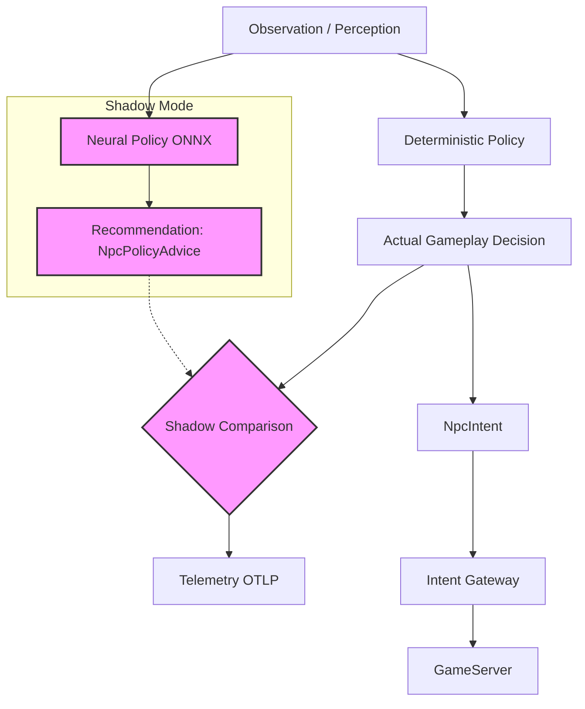
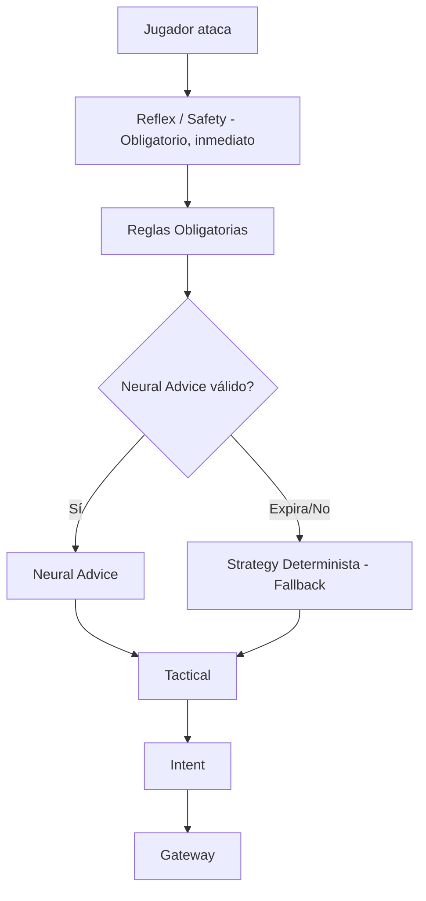

# Fase 4G — Neural Policy Shadow

**Estado:** Diseño  
**Fecha:** 12/08/2026

## Objetivo
Introducir la primera integración real de redes neuronales en el pipeline de IA de NPCs. Utilizaremos ONNX Runtime en C# para ejecutar un modelo entrenado mediante Behavior Cloning (Clonación de Comportamiento) en modo *Shadow*. El modelo propondrá acciones (NpcPolicyAdvice) en paralelo a las decisiones del sistema determinista, pero **NO** alterará el gameplay. Su única finalidad en esta fase es medir el acuerdo semántico (Semantic Match) respecto al sistema actual para validar su precisión antes de darle autoridad.

## Prerequisitos
- Fase 3 completada (Brain + Intents en producción).
- Fase 4A/4B completadas (Estilos de estrategia certificados).
- Fase 4F-A completada (Entrenamiento Offline en PyTorch y modelo exportado a ONNX).
- Conformidad con **ADR-017** (Policy Arbitration Semantics).

## Diagrama de arquitectura

Jerarquía completa de decisión (el modelo no está en el Hot Path):

## Piezas a crear

| Nombre | Ensamblado | Archivo Propuesto | Propósito |
|---|---|---|---|
| `Microsoft.ML.OnnxRuntime` | `L2Dn.Npc.Policy.Onnx` | `L2Dn.Npc.Policy.Onnx.csproj` | Paquete NuGet para inferencia (CPU). Mantiene Brain independiente. |
| `INpcPolicy` | `L2Dn.Npc.Contracts` | `INpcPolicy.cs` | Interfaz base para políticas de decisión (determinista o neural). |
| `OnnxNpcPolicy` | `L2Dn.Npc.Policy.Onnx` | `Policies/OnnxNpcPolicy.cs` | Implementación de `INpcPolicy` que carga y ejecuta el modelo ONNX. |
| `NpcPolicyAdvice` | `L2Dn.Npc.Contracts` | `Policies/NpcPolicyAdvice.cs` | Contrato (struct) con la recomendación probabilística del modelo. |
| `ShadowPolicyComparer` | `L2Dn.Npc.Brain` | `Policies/ShadowPolicyComparer.cs` | Evalúa si la acción ejecutada coincide semánticamente con la recomendada. |
| `OrtValueExtensions` | `L2Dn.Npc.Policy.Onnx` | `Policies/OrtValueExtensions.cs` | Métodos de extensión para manipulación zero-allocation de `OrtValue`. |

## Especificación detallada

### 1. Inferencia con ONNX Runtime (Best Practices)
- **Thread Safety & Oversubscription**: ONNX Runtime tiene su propio threading. Debemos evitar el oversubscription de la CPU. NO usar `Task.Run()` de manera indiscriminada; se debe usar un **Bounded Inference Coordinator** con un número fijo de consumers.
- **Sesión de Inferencia**: Se debe instanciar una **Shared InferenceSession per model version** (long-lived). **NO** instanciar `new InferenceSession()` por cada NPC ni por cada Think.
- **Memoria**: Uso intensivo de la API `OrtValue` para minimizar allocations. Todo `OrtValue` debe ser disposed correctamente.
- **Carga de Modelo**: El archivo `.onnx` se carga al iniciar el servidor (startup). **NUNCA** se lee de disco durante el ciclo `Think`.
- **Exportación**: El script `export_onnx.py` debe utilizar `torch.onnx.export(..., dynamo=True)`.
- **Arquitectura de Red**: Para esta fase inicial de validación, usamos una red MLP ligera (MLP (architecture determined by training, not by contract)).
- **GPU**: Desactivado por ahora. Para redes de este tamaño, CPU es más que suficiente y evita overheads de transferencia. Batch inference y GPU se evaluarán más adelante.

### 2. Behavior Cloning y Shadow Mode
- El modelo de Behavior Cloning debe entrenarse contra el **ExpertSelectedCandidate** (el candidato ganador determinista de `TacticalActionEvaluator`), NO contra `StrategyBrain`. La `StrategyBrain` no selecciona la acción final (el pipeline es Strategy → Reflex → Tactical). El experto es el ganador de Tactical cuando Reflex no tomó autoridad.
- Criterio de éxito: >95% de coincidencia semántica en el dataset de validación.
- **Shadow debe ignorar Thinks resueltos por Reflex**: Si Reflex produce un intent (ej. target dead, leash, etc.), NO se genera evaluación de policy para ese Think. No tiene sentido preguntar "Attack o Heal?" si Reflex ya dijo "ClearTarget". Esto reduce inferencias innecesarias.
- **Comparación por Paired Evaluation IDs**: Al encolar solicitud neural, se guarda `PolicyEvaluationId` + `ObservationRevision` + `ExpertAction`. Neural responde con mismo `PolicyEvaluationId`. Se compara el expert action guardado contra el neural advice, asegurando 123 vs 123.

### 3. Estrategia de Saturación
- La cola de inferencia debe ser una **bounded queue**.
- Máximo 1 inferencia corriendo por NPC (running inference) + 1 observación pendiente más reciente por NPC (latest pending observation).
- **Latest wins**: Si llega una nueva observación mientras otra está en cola, se descarta la vieja (stale drop). El encolado es non-blocking.

### 4. Fallback y Confiabilidad
- Si la recomendación neural toma mucho tiempo y expira, o falla, el sistema cae de manera segura al pipeline determinista.
- El Reflex Brain intercepta amenazas inmediatas sin esperar a la red neuronal.

## Ownership

| Componente | Capa | Responsabilidad |
|---|---|---|
| `OnnxNpcPolicy` | Policy.Onnx | Cargar el modelo, parsear la percepción a tensores, ejecutar ONNX y generar el `NpcPolicyAdvice`. |
| `ShadowPolicyComparer` | Brain | Comparar `NpcIntent` real vs `NpcPolicyAdvice` y emitir telemetría OTLP. |
| `GameServer` | Model | Ninguna. Totalmente agnóstico a ONNX o IA. Recibe Intents puros. |

## Lo que NO incluye
- Ejecutar las recomendaciones de la IA en el mundo real.
- Modelos complejos (Transformers, RNNs). Solo MLP simple.
- Inferencia en GPU.
- Entrenamiento Online (solo inferencia de un modelo estático).

## Criterios de aceptación

| ID | Criterio | Tipo | Qué demuestra |
|---|---|---|---|
| 4G-A1 | ONNX Runtime cargado al startup, modelo en memoria, CERO lecturas de disco durante Think | Rendimiento | Sin I/O en hot path |
| 4G-A2 | Inferencia neural NO aparece en Critical reaction path: ataque recibe respuesta Reflex ANTES de completar inferencia | Comportamiento | Neural Policy es advisory, no blocking |
| 4G-A3 | Acuerdo semántico ≥ 90% en 1,000 ciclos de combate con modelo behavior-cloned | Integración | Modelo reproduce razonablemente el comportamiento certificado |
| 4G-A4 | P99 de inferencia ONNX < 5ms para la arquitectura actual en CPU | Rendimiento | Inferencia individual es rápida |
| 4G-A5 | Cero inferencias alteran gameplay: TODAS las decisiones ejecutadas son del pipeline determinista | Comportamiento | Shadow es realmente shadow |
| 4G-A6 | Si `OnnxNpcPolicy` falla, NPC usa Strategy determinista sin interrupción | Integración | Fallback funciona en condiciones reales |
| 4G-A7 | Memory stable después de 24h de inferencia continua | Rendimiento | Sin memory leak |
| 4G-A8 | Paridad PyTorch ↔ ONNX: En 1000 validation observations, max_abs_error < ε y argmax agreement = 100% (salvo empates exactos) | Integración | El modelo exportado es idéntico al entrenado |

> Especificación completa de tests: [`04_Criterios_Aceptacion_y_Testing.md`](../04_Criterios_Aceptacion_y_Testing.md)

## Tests requeridos

| Test | Propiedad | Input → Output esperado |
|---|---|---|
| `OnnxPolicy_LoadsAtStartup_NoLaterDiskRead` | Sin I/O en hot path | Mock filesystem → cero lecturas durante 1000 inferencias |
| `OnnxPolicy_InferenceOutput_MatchesExpectedShape` | Shape correcta | FeatureSchemaV1.Dimension floats → NpcPolicyActionCount logits |
| `OnnxPolicy_Exception_FallsBackCleanly` | Tolerancia a fallos | OrtException → fallback → decisión válida |
| `OnnxPolicy_Timeout_FallsBackCleanly` | Tolerancia a latencia | Sleep 100ms → advice stale → fallback |
| `Shadow_NeverExecutesNeuralDecision` | Shadow puro | 1000 ciclos → TODAS intents del pipeline determinista |
| `Shadow_Comparison_EmitsCorrectMetrics` | Telemetría funcional | Comparaciones → counters incrementados correctamente |
| `Reflex_RespondsBeforeInference` | Independencia Reflex | Target muere + inferencia pendiente → ClearTarget sin esperar |
| `OnnxRuntime_NoManagedLeak_1000Inferences` | Sin memory leak | 1000 inferencias → GC.GetTotalMemory estable ±5% |

## Telemetría

- `l2dn.npc.policy.inference.duration`: Latencia de inferencia (Histograma).
- `l2dn.npc.policy.inference.total`: Total de inferencias (Counter).
- `l2dn.npc.policy.fallback.total`: Fallbacks por advice vencido/error (Counter).
- `l2dn.npc.policy.advice.age`: Edad del advice en ticks al ser evaluado (Histograma).
- `l2dn.npc.policy.action.selected`: Acción seleccionada por la policy (Counter segmentado por acción).
- `l2dn.npc.policy.shadow.comparison`: Resultado de comparación Shadow (Counter segmentado por Exact/Semantic/Miss).
- `l2dn.npc.policy.model.version`: Versión del modelo cargado (Atributo de contexto).
- `l2dn.npc.policy.batch.size`: Tamaño del batch de inferencia, 1 por defecto (Histograma).
- `l2dn.npc.policy.queue.depth`: Profundidad de cola de inferencia (Gauge).
- `l2dn.npc.policy.request.coalesced`: Solicitudes combinadas/actualizadas con nueva observación (Counter).
- `l2dn.npc.policy.request.dropped_stale`: Solicitudes descartadas por stale drop (Counter).
- `l2dn.npc.policy.invalid_action_masked`: Acciones enmascaradas o inválidas (Counter).
- `l2dn.npc.policy.entropy`: Entropía de la distribución probabilística (Histograma).

## Configuración

- `NPC_POLICY_MODE`: Enum (`Disabled`, `Shadow`).
- `NPC_POLICY_MODEL_PATH`: String (Ruta al archivo `.onnx`).
- `NPC_POLICY_INFERENCE_TIMEOUT_MS`: Int (Ej: 10ms, máximo tiempo antes de fallback).

## Rollback
- Modificar `NPC_POLICY_MODE=Disabled`. El sistema dejará de invocar la inferencia y cerrará los threads de ONNX. Si hay crash grave al cargar ONNX, remover el DLL/NuGet.

## Relación con fases adyacentes
- **Consume de:** Phase 3 (Pipeline de Intents) y Phase 4A/4B (Estilos, que el modelo de clonación busca imitar).
- **Provee a:** Phase 4H (Stochastic Policy), que tomará este mismo pipeline pero conectará el Advice al actuador real.

## Experimentos / laboratorio
- **Laboratorio Shadow Orc:** Colocar un Orc en un entorno cerrado contra un jugador bot. Medir el acuerdo semántico (ExactMatch y SemanticMatch) a lo largo de 1,000 ciclos de combate (engage, melee, persecución, huida). El objetivo es calibrar el threshold de la red neuronal para comportamiento determinista.
